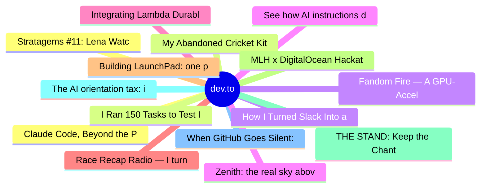

# dev.to Top 15 (2026-07-12)

## 思维导图

## 列表（15 条）

### 1. Stratagems #11: Lena Watched Her Own AI Platform Get Cut. An Ember Stayed.
- **链接**: [https://dev.to/xulingfeng/stratagems-11-lena-watched-her-own-ai-platform-get-cut-an-ember-stayed-3j59](https://dev.to/xulingfeng/stratagems-11-lena-watched-her-own-ai-platform-get-cut-an-ember-stayed-3j59)
- **作者**: xulingfeng | **阅读**: 9min
- **反应**: 50 | **评论**: 14
- **标签**: `discuss`, `ai`, `career`, `programming`
- **简介**: Better to sacrifice a part to preserve the whole. — The 36 Stratagems, Sacrifice the Plum Tree to...

### 2. My Abandoned Cricket Kit Confronted Me. So I Built It a Voice
- **链接**: [https://dev.to/himanshu_748/my-abandoned-cricket-kit-confronted-me-so-i-built-it-a-voice-ph1](https://dev.to/himanshu_748/my-abandoned-cricket-kit-confronted-me-so-i-built-it-a-voice-ph1)
- **作者**: Himanshu Kumar | **阅读**: 4min
- **反应**: 15 | **评论**: 10
- **标签**: `devchallenge`, `weekendchallenge`, `ai`, `solana`
- **简介**: This is a submission for the DEV Weekend Challenge: Passion Edition.           What I...

### 3. How I Turned Slack Into an AI Teammate That Opens Pull Requests
- **链接**: [https://dev.to/marrouchi/how-i-turned-slack-into-an-ai-teammate-that-opens-pull-requests-b4p](https://dev.to/marrouchi/how-i-turned-slack-into-an-ai-teammate-that-opens-pull-requests-b4p)
- **作者**: Med Marrouchi | **阅读**: 2min
- **反应**: 24 | **评论**: 11
- **标签**: `devchallenge`, `weekendchallenge`, `ai`, `webdev`
- **简介**: This is a submission for Weekend Challenge: Passion Edition  While talking about AI workflow...

### 4. See how AI instructions decay, then write ones that hold
- **链接**: [https://dev.to/cleverhoods/see-how-ai-instructions-decay-then-write-ones-that-hold-k9](https://dev.to/cleverhoods/see-how-ai-instructions-decay-then-write-ones-that-hold-k9)
- **作者**:  Gábor Mészáros | **阅读**: 4min
- **反应**: 8 | **评论**: 11
- **标签**: `devchallenge`, `weekendchallenge`, `ai`, `learning`
- **简介**: This is a submission for Weekend Challenge: Passion Edition               What I Built   I told an...

### 5. Integrating Lambda Durable Functions into a Step Functions Workflow
- **链接**: [https://dev.to/aws-heroes/integrating-lambda-durable-functions-into-a-step-functions-workflow-3c7o](https://dev.to/aws-heroes/integrating-lambda-durable-functions-into-a-step-functions-workflow-3c7o)
- **作者**: Monica Colangelo | **阅读**: 13min
- **反应**: 5 | **评论**: 0
- **标签**: `cdk`, `serverless`, `lambda`, `stepfunctions`
- **简介**: At re:Invent 2025, AWS announced Lambda Durable Functions. The feature introduces a checkpoint/replay...

### 6. Race Recap Radio — I turned my 10K into a hype sports broadcast
- **链接**: [https://dev.to/imkarthikeyan/race-recap-radio-i-turned-my-10k-into-a-hype-sports-broadcast-260j](https://dev.to/imkarthikeyan/race-recap-radio-i-turned-my-10k-into-a-hype-sports-broadcast-260j)
- **作者**: Karthikeyan | **阅读**: 5min
- **反应**: 0 | **评论**: 0
- **标签**: `devchallenge`, `weekendchallenge`, `ai`, `elevenlabs`
- **简介**: This is a submission for Weekend Challenge: Passion Edition           What I Built   Why do I like...

### 7. Building LaunchPad: one product brief, 42 launch channels, and the bugs that almost sank it
- **链接**: [https://dev.to/mohanvenkatakrishnan/building-launchpad-one-product-brief-42-launch-channels-and-the-bugs-that-almost-sank-it-3ii7](https://dev.to/mohanvenkatakrishnan/building-launchpad-one-product-brief-42-launch-channels-and-the-bugs-that-almost-sank-it-3ii7)
- **作者**: Mohan | **阅读**: 6min
- **反应**: 6 | **评论**: 4
- **标签**: `webdev`, `javascript`, `ai`, `showdev`
- **简介**: Launching a Product: A Translation Problem   Launching a product is a translation problem....

### 8. MLH x DigitalOcean Hackathon: Jury Duty, Explained
- **链接**: [https://dev.to/earlgreyhot1701d/mlh-x-digitalocean-hackathon-jury-duty-explained-1e8p](https://dev.to/earlgreyhot1701d/mlh-x-digitalocean-hackathon-jury-duty-explained-1e8p)
- **作者**: L. Cordero | **阅读**: 9min
- **反应**: 1 | **评论**: 0
- **标签**: `digitalocean`, `mlh`, `showdev`, `socialgood`
- **简介**: Justicia Clew: what a hackathon build teaches you that a tutorial never will   This was my...

### 9. THE STAND: Keep the Chant Alive!
- **链接**: [https://dev.to/asynchronope/the-stand-keep-the-chant-alive-25hb](https://dev.to/asynchronope/the-stand-keep-the-chant-alive-25hb)
- **作者**: Bramandia G Adam | **阅读**: 4min
- **反应**: 0 | **评论**: 0
- **标签**: `devchallenge`, `weekendchallenge`
- **简介**: This is a submission for Weekend Challenge: Passion Edition           What I Built   THE STAND is a...

### 10. The AI orientation tax: it's missing context, not discipline
- **链接**: [https://dev.to/idnk_2203/the-orientation-tax-its-missing-context-not-discipline-4ii9](https://dev.to/idnk_2203/the-orientation-tax-its-missing-context-not-discipline-4ii9)
- **作者**: Ese Idukpaye | **阅读**: 7min
- **反应**: 2 | **评论**: 4
- **标签**: `ai`, `productivity`, `claude`, `agents`
- **简介**: You have eleven things in flight. Three of them are "almost done." You can't remember which three....

### 11. When GitHub Goes Silent: A Security Researcher's Account Suspension Story
- **链接**: [https://dev.to/toxy4ny/when-github-goes-silent-a-security-researchers-account-suspension-story-p4f](https://dev.to/toxy4ny/when-github-goes-silent-a-security-researchers-account-suspension-story-p4f)
- **作者**: KL3FT3Z | **阅读**: 3min
- **反应**: 2 | **评论**: 0
- **标签**: `github`, `cybersecurity`, `redteam`, `gitlab`
- **简介**: On the evening of July 8, 2026, I tried to log into my GitHub account and found myself completely...

### 12. Claude Code, Beyond the Prompt — Part 4: Your First MCP Server (Give Claude Safe Hands on Your Own Tools)
- **链接**: [https://dev.to/gde03/claude-code-beyond-the-prompt-part-4-your-first-mcp-server-give-claude-safe-hands-on-your-own-b8p](https://dev.to/gde03/claude-code-beyond-the-prompt-part-4-your-first-mcp-server-give-claude-safe-hands-on-your-own-b8p)
- **作者**: Gde | **阅读**: 5min
- **反应**: 3 | **评论**: 10
- **标签**: `ai`, `claude`, `mcp`, `programming`
- **简介**: Part 4 of Claude Code, Beyond the Prompt — patterns from running a live automated trading system on...

### 13. I Ran 150 Tasks to Test If AI Agents Follow Rules — The Answer Surprised Me
- **链接**: [https://dev.to/yuhaolin2005/i-ran-150-tasks-to-test-if-ai-agents-follow-rules-the-answer-surprised-me-2670](https://dev.to/yuhaolin2005/i-ran-150-tasks-to-test-if-ai-agents-follow-rules-the-answer-surprised-me-2670)
- **作者**: YuhaoLin2005 | **阅读**: 2min
- **反应**: 2 | **评论**: 1
- **标签**: `ai`, `programming`, `devops`, `testing`
- **简介**: 6 sessions, 150 standardized tasks, 2 rule formats. The mechanical gate won. Everything else was...

### 14. Fandom Fire — A GPU-Accelerated, AI-Powered Roast Battle Engine
- **链接**: [https://dev.to/kaushikcoderpy/fandom-fire-a-gpu-accelerated-ai-powered-roast-battle-engine-5a4e](https://dev.to/kaushikcoderpy/fandom-fire-a-gpu-accelerated-ai-powered-roast-battle-engine-5a4e)
- **作者**: Kaushikcoderpy | **阅读**: 5min
- **反应**: 3 | **评论**: 3
- **标签**: `weekendchallenge`, `ai`, `webgl`, `javascript`
- **简介**: This is a submission for Weekend Challenge: Passion Edition           What I Built   Fandom Fire is a...

### 15. Zenith: the real sky above you, right now
- **链接**: [https://dev.to/rgerjeki/zenith-the-real-sky-above-you-right-now-3k45](https://dev.to/rgerjeki/zenith-the-real-sky-above-you-right-now-3k45)
- **作者**: Reese Gerjekian | **阅读**: 4min
- **反应**: 3 | **评论**: 2
- **标签**: `devchallenge`, `weekendchallenge`, `googleai`, `elevenlabs`
- **简介**: This is a submission for Weekend Challenge: Passion Edition           What I Built   The theme was...
