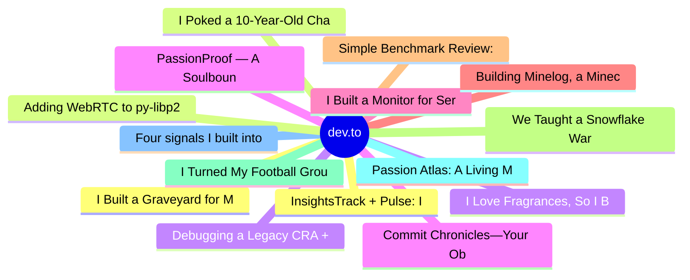

# dev.to Top 15 (2026-07-13)

## 思维导图

## 列表（15 条）

### 1. I Built a Graveyard for My Dead Side Projects - With AI Eulogies & a 3D Cemetery
- **链接**: [https://dev.to/varshithvhegde/i-built-a-graveyard-for-my-dead-side-projects-with-ai-eulogies-a-3d-cemetery-5g0e](https://dev.to/varshithvhegde/i-built-a-graveyard-for-my-dead-side-projects-with-ai-eulogies-a-3d-cemetery-5g0e)
- **作者**: Varshith V Hegde | **阅读**: 5min
- **反应**: 26 | **评论**: 18
- **标签**: `devchallenge`, `weekendchallenge`
- **简介**: This is a submission for Weekend Challenge: Passion Edition           What I Built   Every developer...

### 2. I Poked a 10-Year-Old Chat Protocol With a Stick
- **链接**: [https://dev.to/lovestaco/i-poked-a-10-year-old-chat-protocol-with-a-stick-2g4h](https://dev.to/lovestaco/i-poked-a-10-year-old-chat-protocol-with-a-stick-2g4h)
- **作者**: Athreya aka Maneshwar | **阅读**: 6min
- **反应**: 19 | **评论**: 2
- **标签**: `webdev`, `programming`, `go`, `beginners`
- **简介**: Hello, I'm Maneshwar. I'm building git-lrc, a Micro AI code reviewer that runs on every commit. It is...

### 3. I Love Fragrances, So I Built a 6-Game Arcade + Concierge About My Obsession
- **链接**: [https://dev.to/miawab/i-love-fragrances-so-i-built-a-6-game-arcade-concierge-about-my-obsession-a6g](https://dev.to/miawab/i-love-fragrances-so-i-built-a-6-game-arcade-concierge-about-my-obsession-a6g)
- **作者**: Ibrahim Awab | **阅读**: 5min
- **反应**: 21 | **评论**: 9
- **标签**: `weekendchallenge`, `googleai`, `webdev`, `showdev`
- **简介**: Hi, my name's Ibrahim, I'm a university student, and I have a problem: I love fragrances way more...

### 4. Commit Chronicles—Your Obsession Leaves a Trail. Mine Gives It a Plot.
- **链接**: [https://dev.to/anchildress1/commit-chronicles-your-obsession-leaves-a-trail-mine-gives-it-a-plot-h8j](https://dev.to/anchildress1/commit-chronicles-your-obsession-leaves-a-trail-mine-gives-it-a-plot-h8j)
- **作者**: Ashley Childress | **阅读**: 13min
- **反应**: 8 | **评论**: 0
- **标签**: `devchallenge`, `weekendchallenge`, `snowflake`, `ai`
- **简介**: Snowflake fetches a repo's commit history, finds the one story in it with plain SQL, and narrates that single thread with Cortex. Six storylines. One card.

### 5. I Built a Monitor for Servers. Then Pointed It at Myself.
- **链接**: [https://dev.to/dannwaneri/i-built-a-monitor-for-servers-then-pointed-it-at-myself-g5](https://dev.to/dannwaneri/i-built-a-monitor-for-servers-then-pointed-it-at-myself-g5)
- **作者**: Daniel Nwaneri | **阅读**: 4min
- **反应**: 8 | **评论**: 1
- **标签**: `devchallenge`, `weekendchallenge`, `ai`
- **简介**: This is a submission for Weekend Challenge: Passion Edition           What I Built   I'm in Port...

### 6. Building Minelog, a Minecraft Travel Log Web App
- **链接**: [https://dev.to/erikaheidi/building-minelog-a-minecraft-travel-log-web-app-6mj](https://dev.to/erikaheidi/building-minelog-a-minecraft-travel-log-web-app-6mj)
- **作者**: Erika Heidi | **阅读**: 3min
- **反应**: 3 | **评论**: 0
- **标签**: `devchallenge`, `weekendchallenge`, `showdev`, `php`
- **简介**: This is a submission for Weekend Challenge: Passion Edition  When I saw the prompt about "Passion", I...

### 7. Simple Benchmark Review: Ollama on Jetson Nano
- **链接**: [https://dev.to/annavi11arrea1/simple-benchmark-review-ollama-on-jetson-nano-5gee](https://dev.to/annavi11arrea1/simple-benchmark-review-ollama-on-jetson-nano-5gee)
- **作者**: Anna Villarreal | **阅读**: 4min
- **反应**: 13 | **评论**: 9
- **标签**: `ai`, `webdev`, `nvidia`, `productivity`
- **简介**: Previous Related Post: Part 1      This particular rabbit hole was created due to a previous...

### 8. We Taught a Snowflake Warehouse to Judge World Cup Conviction and Write the Verdict Back to Solana
- **链接**: [https://dev.to/soumyadeepdey/we-taught-a-snowflake-warehouse-to-judge-world-cup-conviction-and-write-the-verdict-back-to-solana-305i](https://dev.to/soumyadeepdey/we-taught-a-snowflake-warehouse-to-judge-world-cup-conviction-and-write-the-verdict-back-to-solana-305i)
- **作者**: Soumyadeep Dey  | **阅读**: 16min
- **反应**: 6 | **评论**: 2
- **标签**: `devchallenge`, `weekendchallenge`, `snowflake`
- **简介**: This is a submission for Weekend Challenge: Passion Edition  Target categories: Best use of Snowflake...

### 9. I Turned My Football Group Chat Arguments Into an Actual Scoreboard!
- **链接**: [https://dev.to/muhammad_ayaan_12954eb4fd/i-turned-my-football-group-chat-arguments-into-an-actual-scoreboard-2pn7](https://dev.to/muhammad_ayaan_12954eb4fd/i-turned-my-football-group-chat-arguments-into-an-actual-scoreboard-2pn7)
- **作者**: Muhammad Ayaan | **阅读**: 5min
- **反应**: 10 | **评论**: 0
- **标签**: `devchallenge`, `weekendchallenge`
- **简介**: This is a submission for Weekend Challenge: Passion Edition           What I Built   Called It! is a...

### 10. Passion Atlas: A Living Map of Human Curiosity
- **链接**: [https://dev.to/ujja/passion-atlas-a-living-map-of-human-curiosity-298h](https://dev.to/ujja/passion-atlas-a-living-map-of-human-curiosity-298h)
- **作者**: ujja | **阅读**: 4min
- **反应**: 10 | **评论**: 3
- **标签**: `devchallenge`, `weekendchallenge`, `gemini`, `webdev`
- **简介**: This is a submission for Weekend Challenge: Passion Edition           What I Built   I built Passion...

### 11. Four signals I built into an OSS decision score instead of fabricating reviews
- **链接**: [https://dev.to/morinaga/four-signals-i-built-into-an-oss-decision-score-instead-of-fabricating-reviews-3i15](https://dev.to/morinaga/four-signals-i-built-into-an-oss-decision-score-instead-of-fabricating-reviews-3i15)
- **作者**: MORINAGA | **阅读**: 4min
- **反应**: 5 | **评论**: 3
- **标签**: `opensource`, `webdev`, `typescript`, `indiehackers`
- **简介**: AlternativeTo has UGC reviews. My OSS directory launched two months ago with none. Here's the objective-data scoring approach I used instead.

### 12. InsightsTrack + Pulse: I taught Claude Desktop to read my web analytics (via MCP)
- **链接**: [https://dev.to/nishikantaray/insightstrack-pulse-i-taught-claude-desktop-to-read-my-web-analytics-via-mcp-13bd](https://dev.to/nishikantaray/insightstrack-pulse-i-taught-claude-desktop-to-read-my-web-analytics-via-mcp-13bd)
- **作者**: Nishikanta Ray | **阅读**: 4min
- **反应**: 10 | **评论**: 1
- **标签**: `mcp`, `ai`, `webdev`, `opensource`
- **简介**: This is a submission for Weekend Challenge: Passion Edition           What I Built   InsightsTrack is...

### 13. Adding WebRTC to py-libp2p: Two Runtimes, Three Specs, and One Unforgiving Private Slot
- **链接**: [https://dev.to/yashksaini/adding-webrtc-to-py-libp2p-two-runtimes-three-specs-and-one-unforgiving-private-slot-3n22](https://dev.to/yashksaini/adding-webrtc-to-py-libp2p-two-runtimes-three-specs-and-one-unforgiving-private-slot-3n22)
- **作者**: Yash Kumar Saini | **阅读**: 19min
- **反应**: 3 | **评论**: 0
- **标签**: `libp2p`, `webrtc`, `python`, `networking`
- **简介**: TL;DR — py-libp2p PR #1309 adds an experimental WebRTC transport (/webrtc-direct and /webrtc) as a...

### 14. Debugging a Legacy CRA + Django Deployment Pipeline: A DevOps Postmortem
- **链接**: [https://dev.to/saint_vandora/debugging-a-legacy-cra-django-deployment-pipeline-a-devops-postmortem-2epd](https://dev.to/saint_vandora/debugging-a-legacy-cra-django-deployment-pipeline-a-devops-postmortem-2epd)
- **作者**: FOLASAYO SAMUEL OLAYEMI | **阅读**: 8min
- **反应**: 5 | **评论**: 0
- **标签**: `tutorial`, `python`, `devops`, `programming`
- **简介**: A few weeks ago I was handed two deployment tasks that looked routine on paper: containerize and ship...

### 15. PassionProof — A Soulbound NFT for Consistent Open Source Contribution
- **链接**: [https://dev.to/lymah/passionproof-a-soulbound-nft-for-consistent-open-source-contribution-667](https://dev.to/lymah/passionproof-a-soulbound-nft-for-consistent-open-source-contribution-667)
- **作者**: Lymah | **阅读**: 4min
- **反应**: 1 | **评论**: 0
- **标签**: `devchallenge`, `weekendchallenge`
- **简介**: This is a submission for Weekend Challenge: Passion Edition           What I Built   PassionProof is...
