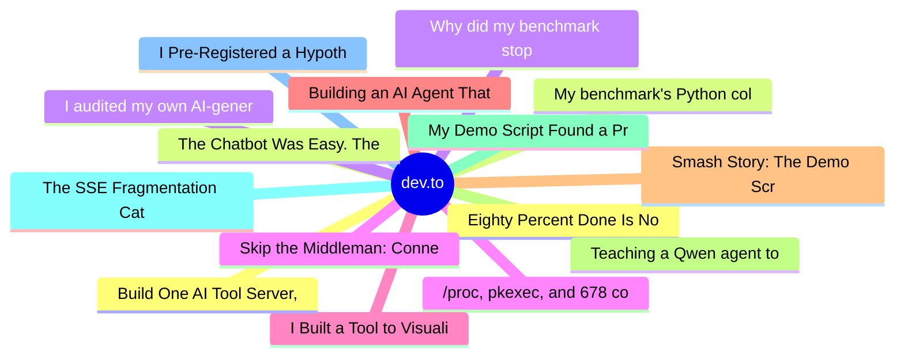

# dev.to Top 15 (2026-07-16)

## 思维导图

## 列表（15 条）

### 1. Eighty Percent Done Is Not a Real Number
- **链接**: [https://dev.to/pascal_cescato_692b7a8a20/eighty-percent-done-is-not-a-real-number-54nf](https://dev.to/pascal_cescato_692b7a8a20/eighty-percent-done-is-not-a-real-number-54nf)
- **作者**: Pascal CESCATO | **阅读**: 10min
- **反应**: 9 | **评论**: 2
- **标签**: `devchallenge`, `bugsmash`, `postgres`, `database`
- **简介**: This is a submission for DEV's Summer Bug Smash: Smash Stories powered by Sentry.           Why this...

### 2. My benchmark's Python column was N/A for a year — CPython's 4300-digit limit, and eight other bugs
- **链接**: [https://dev.to/gde/my-benchmarks-python-column-was-na-for-a-year-cpythons-4300-digit-limit-and-eight-other-bugs-1hgk](https://dev.to/gde/my-benchmarks-python-column-was-na-for-a-year-cpythons-4300-digit-limit-and-eight-other-bugs-1hgk)
- **作者**: xbill | **阅读**: 4min
- **反应**: 6 | **评论**: 0
- **标签**: `bugsmash`, `python`, `go`, `debugging`
- **简介**: Submission for DEV's Summer Bug Smash — Clear the Lineup track.           The...

### 3. Why did my benchmark stop at N=22? A debugging story in nine bugs
- **链接**: [https://dev.to/gde/why-did-my-benchmark-stop-at-n22-a-debugging-story-in-nine-bugs-3m2l](https://dev.to/gde/why-did-my-benchmark-stop-at-n22-a-debugging-story-in-nine-bugs-3m2l)
- **作者**: xbill | **阅读**: 4min
- **反应**: 6 | **评论**: 0
- **标签**: `bugsmash`, `debugging`, `ai`, `python`
- **简介**: Submission for DEV's Summer Bug Smash — Smash Stories track.  There was a file in my repo called...

### 4. /proc, pkexec, and 678 commits
- **链接**: [https://dev.to/lovestaco/proc-pkexec-and-678-commits-1gig](https://dev.to/lovestaco/proc-pkexec-and-678-commits-1gig)
- **作者**: Athreya aka Maneshwar | **阅读**: 7min
- **反应**: 15 | **评论**: 1
- **标签**: `programming`, `webdev`, `beginners`, `linux`
- **简介**: Hello, I'm Maneshwar. I'm building git-lrc, a Micro AI code reviewer that runs on every commit. It is...

### 5. I Built a Tool to Visualize DSA. Let’s Learn Together! (DSA View View 👀👀)
- **链接**: [https://dev.to/nyaomaru/i-built-a-tool-to-visualize-dsa-lets-learn-together-dsa-view-view--djo](https://dev.to/nyaomaru/i-built-a-tool-to-visualize-dsa-lets-learn-together-dsa-view-view--djo)
- **作者**: nyaomaru | **阅读**: 7min
- **反应**: 18 | **评论**: 3
- **标签**: `showdev`, `typescript`, `dsa`, `react`
- **简介**: Hoi hoi!  I’m @nyaomaru, a frontend engineer currently fighting the intense European heatwave by...

### 6. Building an AI Agent That Knows When Not to Guess (Qwen + MCP)
- **链接**: [https://dev.to/dannwaneri/building-an-ai-agent-that-knows-when-not-to-guess-qwen-mcp-19kl](https://dev.to/dannwaneri/building-an-ai-agent-that-knows-when-not-to-guess-qwen-mcp-19kl)
- **作者**: Daniel Nwaneri | **阅读**: 3min
- **反应**: 21 | **评论**: 10
- **标签**: `ai`, `webdev`, `hackathon`, `llm`
- **简介**: A payment landed for exactly half an invoice's value. The payer's email matched the customer on file....

### 7. Smash Story: The Demo Script That Out-Debugged My Test Suite
- **链接**: [https://dev.to/gde/smash-story-the-demo-script-that-out-debugged-my-test-suite-430k](https://dev.to/gde/smash-story-the-demo-script-that-out-debugged-my-test-suite-430k)
- **作者**: xbill | **阅读**: 4min
- **反应**: 0 | **评论**: 0
- **标签**: `devchallenge`, `bugsmash`, `ai`, `debugging`
- **简介**: A green 10-test suite, a broken production default, and the 10-minute smash — how a live demo caught an API-contract bug that mocks never could.

### 8. Teaching a Qwen agent to forget
- **链接**: [https://dev.to/prasadt1/teaching-a-qwen-agent-to-forget-5bgb](https://dev.to/prasadt1/teaching-a-qwen-agent-to-forget-5bgb)
- **作者**: PRASAD TILLOO | **阅读**: 4min
- **反应**: 5 | **评论**: 4
- **标签**: `agents`, `ai`, `devchallenge`, `showdev`
- **简介**: Every AI photo tool today is an amnesiac critic. Lightroom edits, culling apps, and...

### 9. My Demo Script Found a Production Bug on Its First Run: A Tiny Post-Mortem
- **链接**: [https://dev.to/xbill/my-demo-script-found-a-production-bug-on-its-first-run-a-tiny-post-mortem-k35](https://dev.to/xbill/my-demo-script-found-a-production-bug-on-its-first-run-a-tiny-post-mortem-k35)
- **作者**: xbill | **阅读**: 5min
- **反应**: 0 | **评论**: 1
- **标签**: `testing`, `ai`, `python`, `debugging`
- **简介**: How a narrated demo for an MCP image server caught an API-contract drift that 10 passing unit tests never could — root cause, fix, and lessons about mocked tests.

### 10. The SSE Fragmentation Catastrophe That Took Down CareerPilot AI
- **链接**: [https://dev.to/aashitanegii/the-sse-fragmentation-catastrophe-that-took-down-careerpilot-ai-smash-stories-16f2](https://dev.to/aashitanegii/the-sse-fragmentation-catastrophe-that-took-down-careerpilot-ai-smash-stories-16f2)
- **作者**: Aashita | **阅读**: 6min
- **反应**: 2 | **评论**: 0
- **标签**: `devchallenge`, `bugsmash`
- **简介**: This is a submission for DEV's Summer Bug Smash: Smash Stories powered by Sentry.     It was 11:14...

### 11. I Pre-Registered a Hypothesis. 600 API Calls Later, the Data Killed It.
- **链接**: [https://dev.to/yuhaolin2005/i-pre-registered-a-hypothesis-600-api-calls-later-the-data-killed-it-1aec](https://dev.to/yuhaolin2005/i-pre-registered-a-hypothesis-600-api-calls-later-the-data-killed-it-1aec)
- **作者**: YuhaoLin2005 | **阅读**: 5min
- **反应**: 3 | **评论**: 2
- **标签**: `ai`, `machinelearning`, `python`, `datascience`
- **简介**: A stranger on DEV.to said "run this experiment." I ran it at n=600. Here's what happened — including...

### 12. Build One AI Tool Server, Call It From Three Different Agents (MCP Explained)
- **链接**: [https://dev.to/gde/build-one-ai-tool-server-call-it-from-three-different-agents-mcp-explained-22l2](https://dev.to/gde/build-one-ai-tool-server-call-it-from-three-different-agents-mcp-explained-22l2)
- **作者**: xbill | **阅读**: 6min
- **反应**: 1 | **评论**: 3
- **标签**: `ai`, `python`, `rust`, `beginners`
- **简介**: A beginner-friendly tour of the Model Context Protocol: one Python server that generates images with Gemini, called by Claude Code, a Google ADK agent, and a Rust CLI.

### 13. The Chatbot Was Easy. The Engineering Wasn't.
- **链接**: [https://dev.to/surajrkhonde/the-chatbot-was-easy-the-engineering-wasnt-3cod](https://dev.to/surajrkhonde/the-chatbot-was-easy-the-engineering-wasnt-3cod)
- **作者**: surajrkhonde | **阅读**: 8min
- **反应**: 11 | **评论**: 0
- **标签**: `ai`, `computerscience`, `programming`, `productivity`
- **简介**: Part 1 of a series on building a production banking AI chatbot.     When our team kicked off the...

### 14. I audited my own AI-generated refactor and found 46 bugs. Here's what that taught me.
- **链接**: [https://dev.to/cesarbr2025/i-audited-my-own-ai-generated-refactor-and-found-46-bugs-heres-what-that-taught-me-14ah](https://dev.to/cesarbr2025/i-audited-my-own-ai-generated-refactor-and-found-46-bugs-heres-what-that-taught-me-14ah)
- **作者**: CESARBR2025 | **阅读**: 5min
- **反应**: 2 | **评论**: 2
- **标签**: `opencode`, `ai`, `javascript`, `opensource`
- **简介**: How a 1,920-line file turned into 410 lines, why "it works" was a lie twice, and why the fix wasn't a...

### 15. Skip the Middleman: Connecting Your UI Directly to an AI Agent via WebSocket
- **链接**: [https://dev.to/aws-builders/skip-the-middleman-connecting-your-ui-directly-to-an-ai-agent-via-websocket-29f7](https://dev.to/aws-builders/skip-the-middleman-connecting-your-ui-directly-to-an-ai-agent-via-websocket-29f7)
- **作者**: Andres Moreno | **阅读**: 7min
- **反应**: 6 | **评论**: 1
- **标签**: `aws`, `serverless`, `amazonbedrock`, `agentcore`
- **简介**: Learn how to connect your browser directly to an AI agent over WebSocket using Amazon Bedrock AgentCore, skipping the traditional Lambda proxy and enabling real-time token streaming.
