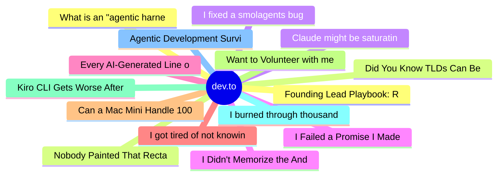

# dev.to Top 15 (2026-07-17)

## 思维导图

## 列表（15 条）

### 1. What is an "agentic harness," actually?
- **链接**: [https://dev.to/googleai/what-is-an-agentic-harness-actually-4oie](https://dev.to/googleai/what-is-an-agentic-harness-actually-4oie)
- **作者**: Tilde A. Thurium | **阅读**: 1min
- **反应**: 15 | **评论**: 1
- **标签**: `ai`, `agents`, `discuss`, `llm`
- **简介**: I've been hearing the word "harness" thrown around a lot lately. I assumed it just meant "the IDE" or...

### 2. Did You Know TLDs Can Be Websites?
- **链接**: [https://dev.to/aws/did-you-know-tlds-can-be-websites-2j13](https://dev.to/aws/did-you-know-tlds-can-be-websites-2j13)
- **作者**: Sean Boult | **阅读**: 2min
- **反应**: 23 | **评论**: 5
- **标签**: `aws`, `infrastructure`, `networking`, `webdev`
- **简介**: You've probably registered a domain with Route53 or another popular registrar.  You pick something...

### 3. Claude might be saturating your machine
- **链接**: [https://dev.to/sidhantpanda/claude-might-be-saturating-your-machine-3h07](https://dev.to/sidhantpanda/claude-might-be-saturating-your-machine-3h07)
- **作者**: Sidhant Panda | **阅读**: 5min
- **反应**: 10 | **评论**: 1
- **标签**: `ai`, `programming`, `claude`, `llm`
- **简介**: My laptop was sitting idle with the fan at full tilt. Nothing was running that I knew of. The culprit...

### 4. I Failed a Promise I Made to Myself
- **链接**: [https://dev.to/konark_13/i-failed-a-promise-i-made-to-myself-4abj](https://dev.to/konark_13/i-failed-a-promise-i-made-to-myself-4abj)
- **作者**: Konark Sharma | **阅读**: 5min
- **反应**: 8 | **评论**: 0
- **标签**: `beginners`, `career`, `discuss`, `learning`
- **简介**: It was 2:07 a.m.  The room was quiet, but my mind wasn't.  Like many nights before, I was scrolling...

### 5. Every AI-Generated Line of Code Is a Small Loan — And Eventually, You Have to Pay It Back
- **链接**: [https://dev.to/harsh2644/every-ai-generated-line-of-code-is-a-small-loan-and-eventually-you-have-to-pay-it-back-30a6](https://dev.to/harsh2644/every-ai-generated-line-of-code-is-a-small-loan-and-eventually-you-have-to-pay-it-back-30a6)
- **作者**: Harsh  | **阅读**: 5min
- **反应**: 15 | **评论**: 5
- **标签**: `ai`, `career`, `discuss`, `productivity`
- **简介**: A bug showed up in my personal project last month. Nothing dramatic - a value wasn't updating the way...

### 6. I got tired of not knowing what my AI agents were doing, so I built a tiny observability tool
- **链接**: [https://dev.to/remdore/i-got-tired-of-not-knowing-what-my-ai-agents-were-doing-so-i-built-a-tiny-observability-tool-3p67](https://dev.to/remdore/i-got-tired-of-not-knowing-what-my-ai-agents-were-doing-so-i-built-a-tiny-observability-tool-3p67)
- **作者**: Remdore | **阅读**: 6min
- **反应**: 11 | **评论**: 3
- **标签**: `ai`, `opensource`, `go`, `selfhosted`
- **简介**: I build small LLM agents. Not the impressive kind you see in demos, just practical little things that...

### 7. Can a Mac Mini Handle 100 Million Rows?
- **链接**: [https://dev.to/kitarp29/can-a-mac-mini-handle-100-million-rows-3cpb](https://dev.to/kitarp29/can-a-mac-mini-handle-100-million-rows-3cpb)
- **作者**: Pratik Singh | **阅读**: 7min
- **反应**: 13 | **评论**: 4
- **标签**: `database`, `performance`, `postgres`, `ai`
- **简介**: I made ClickHouse and Postgres Fight to Find Out 🥊  One Mac Mini. Two databases. 100 million rows of...

### 8. Want to Volunteer with me as a Full-Stack Developer? Join me at CALEC!
- **链接**: [https://dev.to/devengers/want-to-volunteer-with-me-as-a-full-stack-developer-join-me-at-calec-2hne](https://dev.to/devengers/want-to-volunteer-with-me-as-a-full-stack-developer-join-me-at-calec-2hne)
- **作者**: FrancisTRᴅᴇᴠ (っ◔◡◔)っ | **阅读**: 2min
- **反应**: 20 | **评论**: 4
- **标签**: `discuss`, `community`, `career`, `hiring`
- **简介**: Hey everyone!  I don't want to steal @hemapriya_kanagala series. This is more of a DEV opportunity...

### 9. Kiro CLI Gets Worse After an Hour. Here's How I Fixed It.
- **链接**: [https://dev.to/aws-builders/kiro-cli-gets-worse-after-an-hour-heres-how-i-fixed-it-1l7g](https://dev.to/aws-builders/kiro-cli-gets-worse-after-an-hour-heres-how-i-fixed-it-1l7g)
- **作者**: Sarvar Nadaf | **阅读**: 11min
- **反应**: 9 | **评论**: 0
- **标签**: `aws`, `kiro`, `productivity`, `devops`
- **简介**: Why Kiro CLI degrades in long sessions and the context management techniques that fixed it for my daily AWS workflow.

### 10. I burned through thousands of AI tokens. Then a friend did it for free
- **链接**: [https://dev.to/phalkmin/i-burned-through-thousands-of-ai-tokens-then-a-friend-did-it-for-free-31m8](https://dev.to/phalkmin/i-burned-through-thousands-of-ai-tokens-then-a-friend-did-it-for-free-31m8)
- **作者**: Paulo Henrique | **阅读**: 4min
- **反应**: 0 | **评论**: 2
- **标签**: `ai`, `career`, `design`
- **简介**: (yep, kinda clickbait, just for the funsies 😊)  At the beginning of the year, I relaunched my...

### 11. Agentic Development Survival Guide
- **链接**: [https://dev.to/valeriavg/agentic-development-survival-guide-3bhc](https://dev.to/valeriavg/agentic-development-survival-guide-3bhc)
- **作者**: Valeria | **阅读**: 7min
- **反应**: 1 | **评论**: 0
- **标签**: `ai`, `devrel`, `discuss`
- **简介**: When was the last time when you were in the state of flow? Where hours passed by unnoticed as you...

### 12. Founding Lead Playbook: Running Product, Architect & Engineering with AI Agents + 2 Humans
- **链接**: [https://dev.to/kheai/founding-lead-playbook-running-product-architect-engineering-with-ai-agents-2-humans-295d](https://dev.to/kheai/founding-lead-playbook-running-product-architect-engineering-with-ai-agents-2-humans-295d)
- **作者**: Khe Ai | **阅读**: 9min
- **反应**: 6 | **评论**: 1
- **标签**: `kheai`, `management`, `ai`, `devjournal`
- **简介**: There are a lot of shallow "10x with AI" threads out there. This isn't one of them. This is the...

### 13. Nobody Painted That Rectangle Black
- **链接**: [https://dev.to/lovestaco/nobody-painted-that-rectangle-black-a3](https://dev.to/lovestaco/nobody-painted-that-rectangle-black-a3)
- **作者**: Athreya aka Maneshwar | **阅读**: 4min
- **反应**: 10 | **评论**: 0
- **标签**: `android`, `security`, `mobile`, `programming`
- **简介**: Hello, I'm Maneshwar. I'm building git-lrc, a Micro AI code reviewer that runs on every commit. It is...

### 14. I fixed a smolagents bug that confused everyone who hit it (with Sentry watching the whole time)
- **链接**: [https://dev.to/himanshu_748/i-fixed-a-smolagents-bug-that-confused-everyone-who-hit-it-with-sentry-watching-the-whole-time-1im](https://dev.to/himanshu_748/i-fixed-a-smolagents-bug-that-confused-everyone-who-hit-it-with-sentry-watching-the-whole-time-1im)
- **作者**: Himanshu Kumar | **阅读**: 4min
- **反应**: 7 | **评论**: 2
- **标签**: `devchallenge`, `bugsmash`, `python`, `ai`
- **简介**: This is a submission for DEV's Summer Bug Smash: Clear the Lineup powered by Sentry.          ...

### 15. I Didn't Memorize the Android ViewModel, I Derived It From 8 Problems( Interview Prep)
- **链接**: [https://dev.to/itsaalaa7/i-didnt-memorize-the-android-viewmodel-i-derived-it-from-8-problems-interview-prep-23el](https://dev.to/itsaalaa7/i-didnt-memorize-the-android-viewmodel-i-derived-it-from-8-problems-interview-prep-23el)
- **作者**: Aalaa Fahiem  | **阅读**: 6min
- **反应**: 3 | **评论**: 0
- **标签**: `programming`, `mobile`, `beginners`, `interview`
- **简介**: Every ViewModel tutorial I read handed me the finished file: @HiltViewModel, a private...
