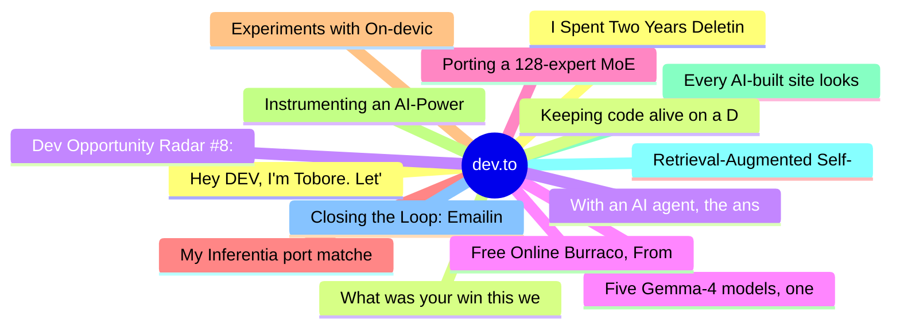

# dev.to Top 15 (2026-07-18)

## 思维导图

## 列表（15 条）

### 1. Hey DEV, I'm Tobore. Let's actually connect.
- **链接**: [https://dev.to/toboreeee/hey-dev-im-tobore-lets-actually-connect-1m02](https://dev.to/toboreeee/hey-dev-im-tobore-lets-actually-connect-1m02)
- **作者**: Laurina Ayarah | **阅读**: 1min
- **反应**: 28 | **评论**: 17
- **标签**: `community`, `webdev`, `discuss`, `career`
- **简介**: Hey DEV, I'm Tobore. Let's actually connect.  I've been on here for a while now, mostly writing and...

### 2. What was your win this week!?
- **链接**: [https://dev.to/devteam/what-was-your-win-this-week-amo](https://dev.to/devteam/what-was-your-win-this-week-amo)
- **作者**: Jess Lee | **阅读**: 1min
- **反应**: 23 | **评论**: 19
- **标签**: `discuss`, `weeklyretro`
- **简介**: 👋👋👋👋 Looking back on your week -- what was something you're proud of? All wins count -- big or small...

### 3. Dev Opportunity Radar #8: $100K OpenAI Build Week, $12K AI Fellowship, Founder Residency & Free AI Dev Course
- **链接**: [https://dev.to/devengers/dev-opportunity-radar-8-openai-build-week-aiaf-fellowship-the-residency-ai-dev-tools-zoomcamp-5bpc](https://dev.to/devengers/dev-opportunity-radar-8-openai-build-week-aiaf-fellowship-the-residency-ai-dev-tools-zoomcamp-5bpc)
- **作者**: Hemapriya Kanagala | **阅读**: 10min
- **反应**: 28 | **评论**: 2
- **标签**: `discuss`, `community`, `opportunities`, `resources`
- **简介**: TL;DR  Welcome back to Dev Opportunity Radar.  This is a weekly series where I share opportunities,...

### 4. Five Gemma-4 models, one accelerator: what porting E2B 31B to AWS Inferentia2 taught me
- **链接**: [https://dev.to/gde/five-gemma-4-models-one-accelerator-what-porting-e2b-31b-to-aws-inferentia2-taught-me-2gf5](https://dev.to/gde/five-gemma-4-models-one-accelerator-what-porting-e2b-31b-to-aws-inferentia2-taught-me-2gf5)
- **作者**: xbill | **阅读**: 6min
- **反应**: 7 | **评论**: 0
- **标签**: `gemma`, `aws`, `infrastructure`
- **简介**: I ported the whole Gemma-4 family — E2B, E4B, 12B, 31B, and the 26B-A4B MoE — to run on...

### 5. Porting a 128-expert MoE (Gemma-4 26B-A4B) to AWS Inferentia2 — where every rank weighted the wrong experts
- **链接**: [https://dev.to/xbill/porting-a-128-expert-moe-gemma-4-26b-a4b-to-aws-inferentia2-where-every-rank-weighted-the-wrong-2ege](https://dev.to/xbill/porting-a-128-expert-moe-gemma-4-26b-a4b-to-aws-inferentia2-where-every-rank-weighted-the-wrong-2ege)
- **作者**: xbill | **阅读**: 6min
- **反应**: 2 | **评论**: 0
- **标签**: `machinelearning`, `aws`, `ai`, `python`
- **简介**: The MoE was the hard one: a dual-path FFN, a sparse expert loop that won't trace, and a bug where the device output was empty while the CPU reference was perfect and every unit test passed.

### 6. My Inferentia port matched its reference token-for-token — and still output garbage
- **链接**: [https://dev.to/xbill/my-inferentia-port-matched-its-reference-token-for-token-and-still-output-garbage-16d4](https://dev.to/xbill/my-inferentia-port-matched-its-reference-token-for-token-and-still-output-garbage-16d4)
- **作者**: xbill | **阅读**: 8min
- **反应**: 1 | **评论**: 0
- **标签**: `machinelearning`, `aws`, `ai`, `python`
- **简介**: Porting Gemma-4 31B (dense) to AWS Inferentia2: the tensor-parallel recipe that worked at 12B collapses at 31B, NxD ModelBuilder saves it — and then a passing validation lies to your face.

### 7. Experiments with On-device AI — What building on Gemini Nano actually teaches you
- **链接**: [https://dev.to/mohanvenkatakrishnan/experiments-with-on-device-ai-what-building-on-gemini-nano-actually-teaches-you-5deo](https://dev.to/mohanvenkatakrishnan/experiments-with-on-device-ai-what-building-on-gemini-nano-actually-teaches-you-5deo)
- **作者**: Mohan | **阅读**: 6min
- **反应**: 21 | **评论**: 4
- **标签**: `ai`, `webdev`, `javascript`, `showdev`
- **简介**: Chrome ships a real LLM inside the browser now — Gemini Nano, exposed through a handful of built-in...

### 8. Instrumenting an AI-Powered GitHub Analyzer with OpenTelemetry and SigNoz
- **链接**: [https://dev.to/divyasinghdev/instrumenting-an-ai-powered-github-analyzer-with-opentelemetry-and-signoz-55l3](https://dev.to/divyasinghdev/instrumenting-an-ai-powered-github-analyzer-with-opentelemetry-and-signoz-55l3)
- **作者**: Divya | **阅读**: 18min
- **反应**: 9 | **评论**: 6
- **标签**: `opentelemetry`, `signoz`, `observability`, `ai`
- **简介**: This article is my submission for the Agents of SigNoz Hackathon: Blog Track, where participants...

### 9. Every AI-built site looks the same, so I built a skill that locks taste before any code is written
- **链接**: [https://dev.to/codeswithroh/every-ai-built-site-looks-the-same-so-i-built-a-skill-that-locks-taste-before-any-code-is-written-4f6d](https://dev.to/codeswithroh/every-ai-built-site-looks-the-same-so-i-built-a-skill-that-locks-taste-before-any-code-is-written-4f6d)
- **作者**: Rohit Purkait | **阅读**: 4min
- **反应**: 11 | **评论**: 12
- **标签**: `webdev`, `ai`, `css`, `opensource`
- **简介**: I build a lot of side projects with AI coding tools. Mostly Claude Code. A few months ago I noticed...

### 10. Retrieval-Augmented Self-Recall: The RAG Problem Nobody Talks About
- **链接**: [https://dev.to/gde03/retrieval-augmented-self-recall-the-rag-problem-nobody-talks-about-2n0n](https://dev.to/gde03/retrieval-augmented-self-recall-the-rag-problem-nobody-talks-about-2n0n)
- **作者**: Giulio D'Erme | **阅读**: 5min
- **反应**: 6 | **评论**: 8
- **标签**: `ai`, `rag`, `llm`, `programming`
- **简介**: Part 1 of Retrieval-Augmented Self-Recall — the research track behind Claude Code, Beyond the Prompt....

### 11. Closing the Loop: Emailing Myself When My Resume Gets Downloaded
- **链接**: [https://dev.to/highcenburg/closing-the-loop-emailing-myself-when-my-resume-gets-downloaded-h8j](https://dev.to/highcenburg/closing-the-loop-emailing-myself-when-my-resume-gets-downloaded-h8j)
- **作者**: Vicente G. Reyes | **阅读**: 5min
- **反应**: 0 | **评论**: 0
- **标签**: `django`, `python`, `testing`, `webdev`
- **简介**: I already had a resume download gate — email required, signed link, 15-minute expiry, presigned S3...

### 12. I Spent Two Years Deleting My Backend. This Is What's Left
- **链接**: [https://dev.to/vbilopav/i-spent-two-years-deleting-my-backend-this-is-whats-left-500a](https://dev.to/vbilopav/i-spent-two-years-deleting-my-backend-this-is-whats-left-500a)
- **作者**: vbilopav | **阅读**: 5min
- **反应**: 1 | **评论**: 0
- **标签**: `postgres`, `showdev`, `opensource`, `webdev`
- **简介**: What happens when you stop writing controllers, services, repositories and mappers - and let...

### 13. Keeping code alive on a DOM you don't own: 12-year Chrome extension story
- **链接**: [https://dev.to/svyatov/keeping-code-alive-on-a-dom-you-dont-own-12-year-chrome-extension-story-2g3o](https://dev.to/svyatov/keeping-code-alive-on-a-dom-you-dont-own-12-year-chrome-extension-story-2g3o)
- **作者**: Leonid Svyatov | **阅读**: 16min
- **反应**: 2 | **评论**: 0
- **标签**: `webdev`, `showdev`, `javascript`, `sideprojects`
- **简介**: In April 2014 I wanted to sort posts on the Hacker News front page by points, by time, or by...

### 14. With an AI agent, the answer is the last place the bug shows up
- **链接**: [https://dev.to/sara_bezjak/with-an-ai-agent-the-answer-is-the-last-place-the-bug-shows-up-4kgb](https://dev.to/sara_bezjak/with-an-ai-agent-the-answer-is-the-last-place-the-bug-shows-up-4kgb)
- **作者**: Sara Bezjak | **阅读**: 6min
- **反应**: 4 | **评论**: 2
- **标签**: `agents`, `ai`, `security`, `testing`
- **简介**: I built a pytest suite for a small AI agent - not a model that answers once, but one that plans,...

### 15. Free Online Burraco, From Scratch: Rules, Wildcards, and a Three-Tier AI in Vanilla JavaScript
- **链接**: [https://dev.to/androve2k/free-online-burraco-from-scratch-rules-wildcards-and-a-three-tier-ai-in-vanilla-javascript-5fp](https://dev.to/androve2k/free-online-burraco-from-scratch-rules-wildcards-and-a-three-tier-ai-in-vanilla-javascript-5fp)
- **作者**: Andrea Roversi | **阅读**: 6min
- **反应**: 2 | **评论**: 0
- **标签**: `javascript`, `gamedev`, `webdev`, `pwa`
- **简介**: I wanted a real burraco game, playable right away against the computer, with no sign-up and none of...
