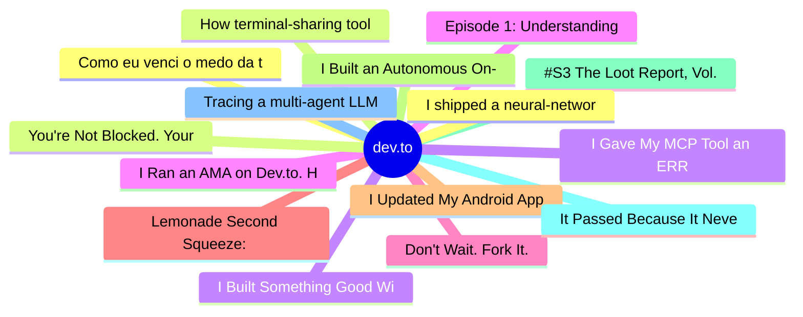

# dev.to Top 15 (2026-07-27)

## 思维导图

## 列表（15 条）

### 1. Como eu venci o medo da transição de carreira
- **链接**: [https://dev.to/he4rt/como-eu-venci-o-medo-da-transicao-de-carreira-4b3c](https://dev.to/he4rt/como-eu-venci-o-medo-da-transicao-de-carreira-4b3c)
- **作者**: Bárbara Martins da Silveira | **阅读**: 3min
- **反应**: 91 | **评论**: 7
- **标签**: `carreira`, `aprendizado`, `networking`, `braziliandevs`
- **简介**: Migrar de carreira para a área de tecnologia pode parecer difícil no início. O mercado está cada vez...

### 2. How terminal-sharing tools put your shell in a browser
- **链接**: [https://dev.to/lovestaco/how-terminal-sharing-tools-put-your-shell-in-a-browser-328](https://dev.to/lovestaco/how-terminal-sharing-tools-put-your-shell-in-a-browser-328)
- **作者**: Athreya aka Maneshwar | **阅读**: 9min
- **反应**: 42 | **评论**: 2
- **标签**: `webdev`, `programming`, `productivity`, `cli`
- **简介**: Hello, I'm Maneshwar. I'm building git-lrc, a Micro AI code reviewer that runs on every commit. It is...

### 3. I Built Something Good With AI. Now Some Developer Communities Don't Want to See It.
- **链接**: [https://dev.to/madsendev/i-built-something-good-with-ai-now-some-developer-communities-dont-want-to-see-it-20mo](https://dev.to/madsendev/i-built-something-good-with-ai-now-some-developer-communities-dont-want-to-see-it-20mo)
- **作者**: Christoffer Madsen | **阅读**: 6min
- **反应**: 17 | **评论**: 16
- **标签**: `ai`, `opensource`, `programming`, `discuss`
- **简介**: I recently tried to share an open-source project I've been working on called Open Vectorizer.  It's a...

### 4. I Ran an AMA on Dev.to. Here Are My Favorite Questions
- **链接**: [https://dev.to/canro91/i-ran-an-ama-on-devto-here-are-my-favorite-questions-56o8](https://dev.to/canro91/i-ran-an-ama-on-devto-here-are-my-favorite-questions-56o8)
- **作者**: Cesar Aguirre | **阅读**: 7min
- **反应**: 1 | **评论**: 1
- **标签**: `coding`, `beginners`, `career`, `top7`
- **简介**: This month, my personal blog turned 8 years old...and my dev.to account turned 7.  To celebrate it, I...

### 5. Don't Wait. Fork It.
- **链接**: [https://dev.to/arjunagiarehman/dont-wait-fork-it-5dcj](https://dev.to/arjunagiarehman/dont-wait-fork-it-5dcj)
- **作者**: Abdul Rehman | **阅读**: 10min
- **反应**: 9 | **评论**: 2
- **标签**: `ai`, `opensource`, `code`, `developertools`
- **简介**: Nobody has ever asked you to upstream your dotfiles.  For thirty years that was the deal with every...

### 6. Lemonade Second Squeeze: Model Archeology on 2019's GPT-2XL
- **链接**: [https://dev.to/earlgreyhot1701d/lemonade-second-squeeze-model-archeology-on-2019s-gpt-2xl-32jm](https://dev.to/earlgreyhot1701d/lemonade-second-squeeze-model-archeology-on-2019s-gpt-2xl-32jm)
- **作者**: L. Cordero | **阅读**: 4min
- **反应**: 20 | **评论**: 1
- **标签**: `ai`, `showdev`, `buildinpublic`, `lemonade`
- **简介**: Two weeks ago I had never run an AI model on my own machine. Every project I had ever built phoned a...

### 7. I Updated My Android App From a Restaurant. My Laptop Was Off.
- **链接**: [https://dev.to/juandastic/i-updated-my-android-app-from-a-restaurant-my-laptop-was-off-283k](https://dev.to/juandastic/i-updated-my-android-app-from-a-restaurant-my-laptop-was-off-283k)
- **作者**: Juan David Gómez | **阅读**: 8min
- **反应**: 2 | **评论**: 0
- **简介**: Recently, I was sitting in a restaurant with my MacBook Air powered off inside my backpack. I opened...

### 8. I Built an Autonomous On-Chain Agent on Solana: Here's the Documentation I Wish I Had Earlier
- **链接**: [https://dev.to/lymah/i-built-an-autonomous-on-chain-agent-on-solana-heres-the-documentation-i-wish-i-had-earlier-2hge](https://dev.to/lymah/i-built-an-autonomous-on-chain-agent-on-solana-heres-the-documentation-i-wish-i-had-earlier-2hge)
- **作者**: Lymah | **阅读**: 5min
- **反应**: 2 | **评论**: 0
- **标签**: `100daysofcode`, `solana`, `mcp`, `ai`
- **简介**: The last few days of the #100DaysOfSolana challenge have been some of the most exciting and humbling...

### 9. #S3 The Loot Report, Vol. 2: Four Lines That Fixed the Boring Parts
- **链接**: [https://dev.to/fromzerotoship/s3-the-loot-report-vol-2-four-lines-that-fixed-the-boring-parts-1ajb](https://dev.to/fromzerotoship/s3-the-loot-report-vol-2-four-lines-that-fixed-the-boring-parts-1ajb)
- **作者**: FromZeroToShip | **阅读**: 4min
- **反应**: 3 | **评论**: 0
- **标签**: `beginners`, `ai`, `productivity`, `community`
- **简介**: Last Loot Report was a single day's haul. This one is slower — four lines I lifted over a few weeks,...

### 10. It Passed Because It Never Looked
- **链接**: [https://dev.to/henry_dan_81513dd35a2f540/it-passed-because-it-never-looked-552l](https://dev.to/henry_dan_81513dd35a2f540/it-passed-because-it-never-looked-552l)
- **作者**: Ted | **阅读**: 5min
- **反应**: 2 | **评论**: 3
- **标签**: `typescript`, `webdev`, `programming`, `debugging`
- **简介**: I ran the typechecker. It passed. I ran the build. It passed. I pushed, and a page that carries a...

### 11. Tracing a multi-agent LLM system: otel-swarm and a SigNoz dashboard pack
- **链接**: [https://dev.to/himanshu_748/tracing-a-multi-agent-llm-system-otel-swarm-and-a-signoz-dashboard-pack-4m85](https://dev.to/himanshu_748/tracing-a-multi-agent-llm-system-otel-swarm-and-a-signoz-dashboard-pack-4m85)
- **作者**: Himanshu Kumar | **阅读**: 6min
- **反应**: 8 | **评论**: 2
- **标签**: `opentelemetry`, `observability`, `ai`, `showdev`
- **简介**: The problem   A single LLM call is easy to reason about. You send a prompt, you get tokens...

### 12. I shipped a neural-network opponent into the browser: no backend, no accounts, 120 ms per move
- **链接**: [https://dev.to/selectany/i-shipped-a-neural-network-opponent-into-the-browser-no-backend-no-accounts-120-ms-per-move-3l09](https://dev.to/selectany/i-shipped-a-neural-network-opponent-into-the-browser-no-backend-no-accounts-120-ms-per-move-3l09)
- **作者**: Stefan Stefanov | **阅读**: 6min
- **反应**: 1 | **评论**: 0
- **标签**: `webassembly`, `machinelearning`, `javascript`, `gamedev`
- **简介**: I have a side project: a four-in-a-row board game where the opponent is a neural network I trained...

### 13. You're Not Blocked. Your Work Is.
- **链接**: [https://dev.to/richarddillman/youre-not-blocked-your-work-is-1f77](https://dev.to/richarddillman/youre-not-blocked-your-work-is-1f77)
- **作者**: Richard Dillman | **阅读**: 8min
- **反应**: 2 | **评论**: 0
- **标签**: `productivity`, `programming`, `career`, `beginners`
- **简介**: What my grandfather understood about being indispensable, and the half of his advice I misread for twenty years.

### 14. I Gave My MCP Tool an ERROR: Convention. I Only Taught It to One of Its Two Failure Paths.
- **链接**: [https://dev.to/enjoy_kumawat/i-gave-my-mcp-tool-an-error-convention-i-only-taught-it-to-one-of-its-two-failure-paths-4619](https://dev.to/enjoy_kumawat/i-gave-my-mcp-tool-an-error-convention-i-only-taught-it-to-one-of-its-two-failure-paths-4619)
- **作者**: Enjoy Kumawat | **阅读**: 4min
- **反应**: 1 | **评论**: 2
- **标签**: `mcp`, `python`, `debugging`, `ai`
- **简介**: Two days ago I found and fixed a real gap in generate_commit_message, the MCP tool in server.py that...

### 15. Episode 1: Understanding Requirements
- **链接**: [https://dev.to/surajrkhonde/episode-1-understanding-requirements-415h](https://dev.to/surajrkhonde/episode-1-understanding-requirements-415h)
- **作者**: surajrkhonde | **阅读**: 6min
- **反应**: 4 | **评论**: 0
- **标签**: `beginners`, `software`, `webdev`, `programming`
- **简介**: This series follows a fictional conversation between an experienced engineer and his nephew. Every...
