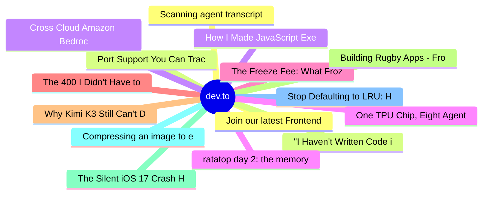

# dev.to Top 15 (2026-07-30)

## 思维导图

## 列表（15 条）

### 1. Join our latest Frontend Challenge: Comfort Food Edition 🍲
- **链接**: [https://dev.to/devteam/join-our-latest-frontend-challenge-comfort-food-edition-28a0](https://dev.to/devteam/join-our-latest-frontend-challenge-comfort-food-edition-28a0)
- **作者**: Jess Lee | **阅读**: 4min
- **反应**: 30 | **评论**: 6
- **标签**: `devchallenge`, `frontendchallenge`, `css`, `javascript`
- **简介**: We're back with another Frontend Challenge, and this time we're hungry! 🍜🥧  Running through August...

### 2. "I Haven't Written Code in 8 Months. I've Never Built More."
- **链接**: [https://dev.to/auth0/i-havent-written-code-in-8-months-ive-never-built-more-3k9i](https://dev.to/auth0/i-havent-written-code-in-8-months-ive-never-built-more-3k9i)
- **作者**: Carla Urrea Stabile | **阅读**: 3min
- **反应**: 17 | **评论**: 1
- **标签**: `ai`, `webdev`, `productivity`, `podcast`
- **简介**: I've been having the same conversation with my colleagues for months. What does it mean to create...

### 3. How I Made JavaScript Execution Visual and Rewindable (DSA View View 👀👀)
- **链接**: [https://dev.to/nyaomaru/how-i-made-javascript-execution-visual-and-rewindable-dsa-view-view--42k4](https://dev.to/nyaomaru/how-i-made-javascript-execution-visual-and-rewindable-dsa-view-view--42k4)
- **作者**: nyaomaru | **阅读**: 10min
- **反应**: 31 | **评论**: 2
- **标签**: `javascript`, `typescript`, `webdev`, `opensource`
- **简介**: Hoi hoi!  I'm @nyaomaru, a frontend engineer who was recently knocked off my feet by how good the...

### 4. ratatop day 2: the memory box, and the lie in `free -h`
- **链接**: [https://dev.to/lovestaco/ratatop-day-2-the-memory-box-and-the-lie-in-free-h-h67](https://dev.to/lovestaco/ratatop-day-2-the-memory-box-and-the-lie-in-free-h-h67)
- **作者**: Athreya aka Maneshwar | **阅读**: 6min
- **反应**: 5 | **评论**: 0
- **标签**: `programming`, `rust`, `cli`, `beginners`
- **简介**: Hello, I'm Maneshwar. I'm building git-lrc, a Micro AI code reviewer that runs on every commit. It is...

### 5. The Freeze Fee: What FrozenDictionary Charges and When It Pays
- **链接**: [https://dev.to/ssukhpinder/the-freeze-fee-what-frozendictionary-charges-and-when-it-pays-14ih](https://dev.to/ssukhpinder/the-freeze-fee-what-frozendictionary-charges-and-when-it-pays-14ih)
- **作者**: Sukhpinder Singh | **阅读**: 4min
- **反应**: 5 | **评论**: 1
- **标签**: `csharp`, `dotnet`, `programming`, `webdev`
- **简介**: There's a static lookup table in every service I've ever worked on. A thousand-ish feature flags, or...

### 6. The 400 I Didn't Have to Write
- **链接**: [https://dev.to/ssukhpinder/the-400-i-didnt-have-to-write-2gho](https://dev.to/ssukhpinder/the-400-i-didnt-have-to-write-2gho)
- **作者**: Sukhpinder Singh | **阅读**: 4min
- **反应**: 5 | **评论**: 0
- **标签**: `aspnetcore`, `dotnet`, `csharp`, `webdev`
- **简介**: Every POST handler I've written in a minimal API for the last four years opens with the same liturgy:...

### 7. Why Kimi K3 Still Can't Do What Einstein Did
- **链接**: [https://dev.to/dannwaneri/why-kimi-k3-still-cant-do-what-einstein-did-2l6d](https://dev.to/dannwaneri/why-kimi-k3-still-cant-do-what-einstein-did-2l6d)
- **作者**: Daniel Nwaneri | **阅读**: 4min
- **反应**: 17 | **评论**: 11
- **标签**: `ai`, `llm`, `rag`, `discuss`
- **简介**: In geophysics you almost never get to see the thing you're studying. You get a seismic trace, a...

### 8. Building Rugby Apps - From Fan Tools To Training Platforms
- **链接**: [https://dev.to/opango_timmy14/building-rugby-apps-from-fan-tools-to-training-platforms-1o2p](https://dev.to/opango_timmy14/building-rugby-apps-from-fan-tools-to-training-platforms-1o2p)
- **作者**: Timothy Opango | **阅读**: 3min
- **反应**: 10 | **评论**: 0
- **标签**: `programming`, `webdev`, `rugby`, `sports`
- **简介**: In Post 3 we looked at the data that now powers professional rugby - GPS load, tackle metrics, video...

### 9. The Silent iOS 17 Crash Hiding in `@Dependency` and `withTaskGroup`
- **链接**: [https://dev.to/emadbeyrami/the-silent-ios-17-crash-hiding-in-dependency-and-withtaskgroup-g8c](https://dev.to/emadbeyrami/the-silent-ios-17-crash-hiding-in-dependency-and-withtaskgroup-g8c)
- **作者**: Emad Beyrami | **阅读**: 5min
- **反应**: 5 | **评论**: 0
- **标签**: `pointfree`, `ios`, `dependencyinjection`, `swift`
- **简介**: A subtle Swift Concurrency pitfall for developers using Point-Free's swift-dependencies.   I...

### 10. Compressing an image to exactly 50KB in the browser, with no server
- **链接**: [https://dev.to/toolzo/compressing-an-image-to-exactly-50kb-in-the-browser-with-no-server-6fg](https://dev.to/toolzo/compressing-an-image-to-exactly-50kb-in-the-browser-with-no-server-6fg)
- **作者**: Manoj Pathak | **阅读**: 4min
- **反应**: 1 | **评论**: 0
- **标签**: `javascript`, `webdev`, `showdev`
- **简介**: Indian government exam portals have a rule that has quietly shaped a lot of my code: your photo must...

### 11. Stop Defaulting to LRU: How I Built a 15.5M ops/sec S3-FIFO Cache for Node.js by Hacking V8
- **链接**: [https://dev.to/jeongseop_byeon_9d8f61627/stop-defaulting-to-lru-how-i-built-a-155m-opssec-s3-fifo-cache-for-nodejs-by-hacking-v8-36pb](https://dev.to/jeongseop_byeon_9d8f61627/stop-defaulting-to-lru-how-i-built-a-155m-opssec-s3-fifo-cache-for-nodejs-by-hacking-v8-36pb)
- **作者**: JeongSeop Byeon | **阅读**: 4min
- **反应**: 5 | **评论**: 0
- **标签**: `algorithms`, `javascript`, `node`, `performance`
- **简介**: Whenever we need an in-memory cache in Node.js, 99% of us do the exact same thing: npm install...

### 12. Scanning agent transcripts for secrets, without sending them anywhere
- **链接**: [https://dev.to/2nji/scanning-agent-transcripts-for-secrets-without-sending-them-anywhere-k0k](https://dev.to/2nji/scanning-agent-transcripts-for-secrets-without-sending-them-anywhere-k0k)
- **作者**: Tunji | **阅读**: 7min
- **反应**: 1 | **评论**: 2
- **标签**: `swift`, `machinelearning`, `privacy`, `macos`
- **简介**: Originally published on the Oye Collective blog.  You paste a .env into a Claude Code session to...

### 13. Port Support You Can Trace Back to a Green Test
- **链接**: [https://dev.to/codenameone/port-support-you-can-trace-back-to-a-green-test-54in](https://dev.to/codenameone/port-support-you-can-trace-back-to-a-green-test-54in)
- **作者**: Shai Almog | **阅读**: 5min
- **反应**: 5 | **评论**: 0
- **标签**: `java`, `mobile`, `android`, `ios`
- **简介**: The Codename One port status page maps 49 feature groups across 10 targets to current conformance reports, environment details, skip explanations, and dated CI evidence instead of a manually maintaine

### 14. Cross Cloud Amazon Bedrock AgentCore with Microsoft Foundry over A2A
- **链接**: [https://dev.to/aws-builders/can-amazon-bedrock-agentcore-talk-to-microsoft-foundry-over-a2a-241h](https://dev.to/aws-builders/can-amazon-bedrock-agentcore-talk-to-microsoft-foundry-over-a2a-241h)
- **作者**: xbill | **阅读**: 6min
- **反应**: 1 | **评论**: 0
- **标签**: `aws`, `azure`, `aiagents`, `a2a`
- **简介**: I wanted to test one specific path:    Amazon Bedrock AgentCore (AWS)     |     +-- MCP --&gt; live...

### 15. One TPU Chip, Eight Agents: Serving Small Agent Workloads with Raw JAX
- **链接**: [https://dev.to/xbill/one-tpu-chip-eight-agents-serving-small-agent-workloads-with-raw-jax-2cc4](https://dev.to/xbill/one-tpu-chip-eight-agents-serving-small-agent-workloads-with-raw-jax-2cc4)
- **作者**: xbill | **阅读**: 15min
- **反应**: 2 | **评论**: 0
- **标签**: `tpu`, `llm`, `jax`, `agents`
- **简介**: Cloud TPU v6e-1 (ct6e-standard-1t, one v6e chip, 32 GB HBM), GCE flex-start, europe-west4-a. vLLM...
