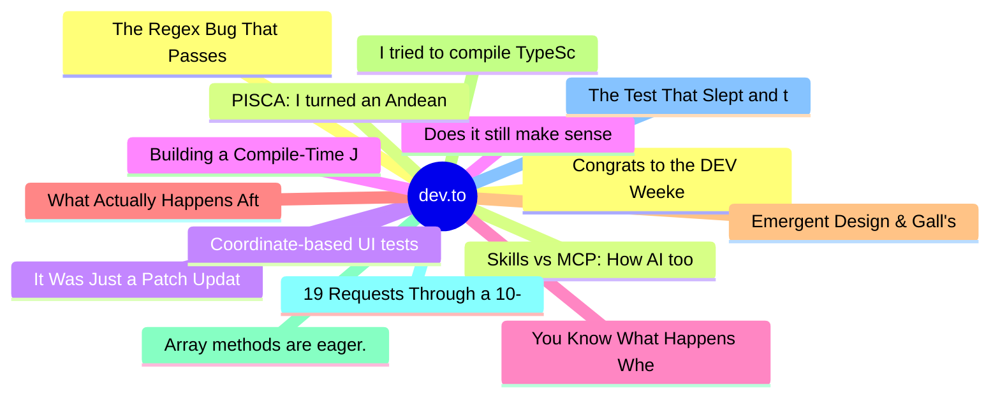

# dev.to Top 15 (2026-07-31)

## 思维导图

## 列表（15 条）

### 1. Congrats to the DEV Weekend Challenge: Passion Edition Winners!
- **链接**: [https://dev.to/devteam/congrats-to-the-dev-weekend-challenge-passion-edition-winners-30ne](https://dev.to/devteam/congrats-to-the-dev-weekend-challenge-passion-edition-winners-30ne)
- **作者**: Jess Lee | **阅读**: 4min
- **反应**: 34 | **评论**: 10
- **标签**: `devchallenge`, `weekendchallenge`
- **简介**: We are excited to announce the winners of our DEV Weekend Challenge: Passion Edition!  The prompt was...

### 2. Skills vs MCP: How AI tools have evolved
- **链接**: [https://dev.to/googleai/skills-vs-mcp-how-ai-tools-have-evolved-3pmk](https://dev.to/googleai/skills-vs-mcp-how-ai-tools-have-evolved-3pmk)
- **作者**: Tilde A. Thurium | **阅读**: 1min
- **反应**: 29 | **评论**: 4
- **标签**: `ai`, `agents`, `mcp`, `agentskills`
- **简介**: Eighteen months ago, MCP was the thing. Every demo and chatbot connector was running on MCP under the...

### 3. It Was Just a Patch Update. What Could Possibly Go Wrong?
- **链接**: [https://dev.to/sylwia-lask/it-was-just-a-patch-update-what-could-possibly-go-wrong-3be3](https://dev.to/sylwia-lask/it-was-just-a-patch-update-what-could-possibly-go-wrong-3be3)
- **作者**: Sylwia Laskowska | **阅读**: 6min
- **反应**: 39 | **评论**: 19
- **标签**: `devchallenge`, `bugsmash`, `angular`, `javascript`
- **简介**: This is a submission for DEV's Summer Bug Smash: Smash Stories powered by Sentry.  You know those...

### 4. Does it still make sense to learn how to code?
- **链接**: [https://dev.to/robertobutti/does-it-still-make-sense-to-learn-how-to-code-3g7g](https://dev.to/robertobutti/does-it-still-make-sense-to-learn-how-to-code-3g7g)
- **作者**: Roberto B. | **阅读**: 2min
- **反应**: 17 | **评论**: 8
- **标签**: `ai`, `learning`, `mentorship`, `beginners`
- **简介**: Does it still make sense to learn how to code?   This is a question I’ve been thinking about a lot...

### 5. You Know What Happens When There's a Bug in Authentication? Absolutely Nothing.
- **链接**: [https://dev.to/ujja/you-know-what-happens-when-theres-a-bug-in-authentication-absolutely-nothing-g0m](https://dev.to/ujja/you-know-what-happens-when-theres-a-bug-in-authentication-absolutely-nothing-g0m)
- **作者**: ujja | **阅读**: 4min
- **反应**: 14 | **评论**: 2
- **标签**: `devchallenge`, `bugsmash`, `webdev`, `react`
- **简介**: This is a submission for DEV's Summer Bug Smash: Smash Stories powered by Sentry.          ...

### 6. What Actually Happens After You Send a Webhook
- **链接**: [https://dev.to/devopsdaily/what-actually-happens-after-you-send-a-webhook-fao](https://dev.to/devopsdaily/what-actually-happens-after-you-send-a-webhook-fao)
- **作者**: DevOps Daily | **阅读**: 6min
- **反应**: 16 | **评论**: 4
- **标签**: `webdev`, `devops`, `javascript`, `security`
- **简介**: The first version of a webhook is always the same four lines:    await fetch(customer.webhookUrl, {  ...

### 7. Emergent Design & Gall's Law: When Complex Coding Problems Dissolve Instead of Being Solved
- **链接**: [https://dev.to/remojansen/emergent-design-galls-law-when-complex-coding-problems-dissolve-instead-of-being-solved-3lok](https://dev.to/remojansen/emergent-design-galls-law-when-complex-coding-problems-dissolve-instead-of-being-solved-3lok)
- **作者**: Remo H. Jansen | **阅读**: 5min
- **反应**: 7 | **评论**: 2
- **标签**: `architecture`, `programming`, `productivity`, `discuss`
- **简介**: I recently read an article by the main maintainer of InversifyJS describing the journey of rebuilding...

### 8. I tried to compile TypeScript into a native binary with scriptc
- **链接**: [https://dev.to/remojansen/i-tried-to-compile-typescript-into-a-native-binary-with-scriptc-5d07](https://dev.to/remojansen/i-tried-to-compile-typescript-into-a-native-binary-with-scriptc-5d07)
- **作者**: Remo H. Jansen | **阅读**: 6min
- **反应**: 5 | **评论**: 0
- **标签**: `typescript`, `tooling`, `node`, `scriptc`
- **简介**: TL;DR: I tried to compile the TypeScript 6 compiler into a native binary with scriptc, and I failed...

### 9. Array methods are eager. Iterator helpers are lazy. Here's why that matters.
- **链接**: [https://dev.to/parsajiravand/array-methods-are-eager-iterator-helpers-are-lazy-heres-why-that-matters-58li](https://dev.to/parsajiravand/array-methods-are-eager-iterator-helpers-are-lazy-heres-why-that-matters-58li)
- **作者**: Parsa Jiravand | **阅读**: 5min
- **反应**: 15 | **评论**: 0
- **标签**: `javascript`, `webdev`, `frontend`, `performance`
- **简介**: Every time you chain .filter() and .map() on an array, JavaScript creates two new arrays. For small...

### 10. 19 Requests Through a 10-Request Limit
- **链接**: [https://dev.to/ssukhpinder/19-requests-through-a-10-request-limit-59g9](https://dev.to/ssukhpinder/19-requests-through-a-10-request-limit-59g9)
- **作者**: Sukhpinder Singh | **阅读**: 4min
- **反应**: 5 | **评论**: 1
- **标签**: `aspnetcore`, `dotnet`, `csharp`, `webdev`
- **简介**: I shipped a rate limiter recently and told the team the endpoint was now capped at 10 requests per 10...

### 11. The Test That Slept and the Test That Never Woke Up
- **链接**: [https://dev.to/ssukhpinder/the-test-that-slept-and-the-test-that-never-woke-up-1i6j](https://dev.to/ssukhpinder/the-test-that-slept-and-the-test-that-never-woke-up-1i6j)
- **作者**: Sukhpinder Singh | **阅读**: 5min
- **反应**: 5 | **评论**: 0
- **标签**: `dotnet`, `csharp`, `programming`, `webdev`
- **简介**: My retry tests took seven seconds each. Not because they did seven seconds of work — because they did...

### 12. The Regex Bug That Passes Code Review, Passes Tests, and Takes Down Prod
- **链接**: [https://dev.to/just-a-guy360/the-regex-bug-that-passes-code-review-passes-tests-and-takes-down-prod-4gf1](https://dev.to/just-a-guy360/the-regex-bug-that-passes-code-review-passes-tests-and-takes-down-prod-4gf1)
- **作者**: Tyler Francis | **阅读**: 6min
- **反应**: 3 | **评论**: 0
- **标签**: `javascript`, `security`, `regex`, `node`
- **简介**: Here's a regex. It validates that a string is a list of comma-separated words. Twelve characters....

### 13. PISCA: I turned an Andean breakfast soup into an interactive landscape
- **链接**: [https://dev.to/terrizoaguimor/pisca-i-turned-an-andean-breakfast-soup-into-an-interactive-landscape-18j8](https://dev.to/terrizoaguimor/pisca-i-turned-an-andean-breakfast-soup-into-an-interactive-landscape-18j8)
- **作者**: Mario Gutierrez | **阅读**: 4min
- **反应**: 2 | **评论**: 0
- **标签**: `devchallenge`, `frontendchallenge`, `webdev`, `javascript`
- **简介**: A bilingual, accessible landing page where steam becomes mountains and one control warms a Venezuelan Andean morning.

### 14. Coordinate-based UI tests break. So we read the accessibility tree instead — from inside the simulator.
- **链接**: [https://dev.to/joduchan/coordinate-based-ui-tests-break-so-we-read-the-accessibility-tree-instead-from-inside-the-3gl7](https://dev.to/joduchan/coordinate-based-ui-tests-break-so-we-read-the-accessibility-tree-instead-from-inside-the-3gl7)
- **作者**: Duchan | **阅读**: 6min
- **反应**: 5 | **评论**: 0
- **标签**: `webdev`, `testing`, `opensource`, `ios`
- **简介**: Every recorded mobile test I have ever inherited died the same way: someone moved a button.  The...

### 15. Building a Compile-Time JavaScript Framework from Scratch
- **链接**: [https://dev.to/heberalmeida/building-a-compile-time-javascript-framework-from-scratch-206l](https://dev.to/heberalmeida/building-a-compile-time-javascript-framework-from-scratch-206l)
- **作者**: Heber Almeida | **阅读**: 3min
- **反应**: 1 | **评论**: 0
- **标签**: `frontend`, `javascript`, `softwaredevelopment`
- **简介**: Every few years someone asks:   "Do we really need another JavaScript framework?"   The honest answer...
