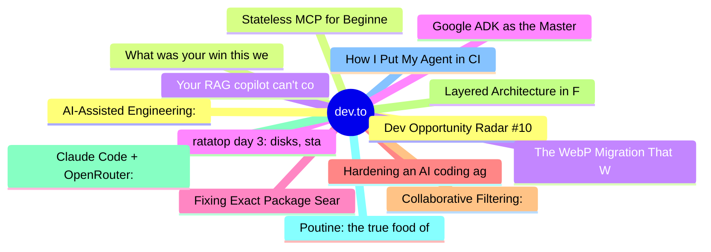

# dev.to Top 15 (2026-08-01)

## 思维导图

## 列表（15 条）

### 1. Dev Opportunity Radar #10: OpenAI Student Collective, Develop for Good, MLH Global Hack Week & Learning How to Learn
- **链接**: [https://dev.to/devengers/dev-opportunity-radar-10-openai-student-collective-develop-for-good-mlh-global-hack-week--4kh2](https://dev.to/devengers/dev-opportunity-radar-10-openai-student-collective-develop-for-good-mlh-global-hack-week--4kh2)
- **作者**: Hemapriya Kanagala | **阅读**: 11min
- **反应**: 51 | **评论**: 14
- **标签**: `discuss`, `community`, `opportunities`, `resources`
- **简介**: TL;DR  Welcome back to Dev Opportunity Radar.  This is a weekly series where I share opportunities,...

### 2. What was your win this week?
- **链接**: [https://dev.to/devteam/what-was-your-win-this-week-1ed](https://dev.to/devteam/what-was-your-win-this-week-1ed)
- **作者**: Jess Lee | **阅读**: 1min
- **反应**: 33 | **评论**: 15
- **标签**: `discuss`, `weeklyretro`
- **简介**: 👋👋👋👋 Looking back on your week -- what was something you're proud of? All wins count -- big or small...

### 3. Your RAG copilot can't count — stop letting it try
- **链接**: [https://dev.to/rdiegoss/your-rag-copilot-cant-count-stop-letting-it-try-2ie3](https://dev.to/rdiegoss/your-rag-copilot-cant-count-stop-letting-it-try-2ie3)
- **作者**: Rodrigo Diego | **阅读**: 6min
- **反应**: 6 | **评论**: 5
- **标签**: `rag`, `ai`, `llm`, `bedrock`
- **简介**: Your RAG copilot can't count — stop letting it try   A user asked our document-search...

### 4. ratatop day 3: disks, statvfs, and my first unsafe block
- **链接**: [https://dev.to/lovestaco/ratatop-day-3-disks-statvfs-and-my-first-unsafe-block-496e](https://dev.to/lovestaco/ratatop-day-3-disks-statvfs-and-my-first-unsafe-block-496e)
- **作者**: Athreya aka Maneshwar | **阅读**: 8min
- **反应**: 25 | **评论**: 1
- **标签**: `cli`, `beginners`, `programming`, `rust`
- **简介**: Hello, I'm Maneshwar. I'm building git-lrc, a Micro AI code reviewer that runs on every commit. It is...

### 5. Fixing Exact Package Search Relevance in npmx
- **链接**: [https://dev.to/anilloutombam/fixing-exact-package-search-relevance-in-npmx-34c7](https://dev.to/anilloutombam/fixing-exact-package-search-relevance-in-npmx-34c7)
- **作者**: Anil Loutombam | **阅读**: 2min
- **反应**: 4 | **评论**: 0
- **标签**: `devchallenge`, `bugsmash`, `typescript`, `opensource`
- **简介**: This is a submission for DEV's Summer Bug Smash: Clear the Lineup powered by Sentry.          ...

### 6. Hardening an AI coding agent: the failures, and the code that fixed them
- **链接**: [https://dev.to/joebuckle-dev/hardening-an-ai-coding-agent-the-failures-and-the-code-that-fixed-them-g3c](https://dev.to/joebuckle-dev/hardening-an-ai-coding-agent-the-failures-and-the-code-that-fixed-them-g3c)
- **作者**: Joe Buckle | **阅读**: 27min
- **反应**: 4 | **评论**: 9
- **标签**: `ai`, `llm`, `rag`, `agents`
- **简介**: At Univoco we build retrieval-augmented assistants over a customer's own documentation. One of them...

### 7. Collaborative Filtering: How Computers Find Your Next Favourite Thing
- **链接**: [https://dev.to/ale3oula/collaborative-filtering-how-computers-find-your-next-favourite-thing-22em](https://dev.to/ale3oula/collaborative-filtering-how-computers-find-your-next-favourite-thing-22em)
- **作者**: Alexandra | **阅读**: 5min
- **反应**: 4 | **评论**: 0
- **标签**: `algorithms`, `ai`, `machinelearning`, `recommendations`
- **简介**: 🎯 Finding Your Taste Twin   Imagine walking into a party where you don't know...

### 8. Layered Architecture in Flutter with BlocSignal: Bringing BLoC Discipline and Signals Speed to CodeWithAndrea’s Pattern
- **链接**: [https://dev.to/gde/layered-architecture-in-flutter-with-blocsignal-bringing-bloc-discipline-and-signals-speed-to-2c25](https://dev.to/gde/layered-architecture-in-flutter-with-blocsignal-bringing-bloc-discipline-and-signals-speed-to-2c25)
- **作者**: Randal L. Schwartz | **阅读**: 8min
- **反应**: 1 | **评论**: 0
- **标签**: `flutter`, `dart`, `architecture`, `statemanagement`
- **简介**: Learn how to adapt CodeWithAndrea's classic 4-layer Flutter architecture (Domain, Data, Application, Presentation) using BlocSignal for synchronous reactivity, instant hydration, and clean code.

### 9. Claude Code + OpenRouter: The Setup Guide That Actually Explains Things
- **链接**: [https://dev.to/shreshthgoyal/claude-code-openrouter-the-setup-guide-that-actually-explains-things-1d6o](https://dev.to/shreshthgoyal/claude-code-openrouter-the-setup-guide-that-actually-explains-things-1d6o)
- **作者**: Shreshth Goyal | **阅读**: 3min
- **反应**: 16 | **评论**: 5
- **标签**: `ai`, `claude`, `agents`, `programming`
- **简介**: So you have heard people rave about Claude Code. Maybe you have also heard people mention OpenRouter...

### 10. Poutine: the true food of the gods
- **链接**: [https://dev.to/xbill/poutine-the-true-food-of-the-gods-5fep](https://dev.to/xbill/poutine-the-true-food-of-the-gods-5fep)
- **作者**: xbill | **阅读**: 6min
- **反应**: 0 | **评论**: 0
- **标签**: `frontendchallenge`, `devchallenge`, `css`, `webdev`
- **简介**: 50 fries, 13 curds and 11 patches of gravy, with no images, no SVG and no canvas — plus the three mistakes that taught me the most.

### 11. How I Put My Agent in CI to Automate Release Notes
- **链接**: [https://dev.to/blackgirlbytes/how-i-put-my-agent-in-ci-to-automate-release-notes-2c2h](https://dev.to/blackgirlbytes/how-i-put-my-agent-in-ci-to-automate-release-notes-2c2h)
- **作者**: Rizèl Scarlett | **阅读**: 7min
- **反应**: 0 | **评论**: 0
- **标签**: `agents`, `ci`, `devops`, `goose`
- **简介**: I Put goose in CI to Draft Entire’s Weekly Release Notes   When I joined Entire, I noticed...

### 12. AI-Assisted Engineering: Faster to Build Isn't Cheaper to Own
- **链接**: [https://dev.to/debashish_ghosal/ai-assisted-engineering-faster-to-build-isnt-cheaper-to-own-1lh](https://dev.to/debashish_ghosal/ai-assisted-engineering-faster-to-build-isnt-cheaper-to-own-1lh)
- **作者**: Debashish Ghosal | **阅读**: 6min
- **反应**: 9 | **评论**: 3
- **标签**: `ai`, `leadership`, `llm`, `agentskills`
- **简介**: I like AI coding tools. I use them myself, and my teams use them too. That is probably the most...

### 13. Stateless MCP for Beginners
- **链接**: [https://dev.to/blackgirlbytes/stateless-mcp-for-beginners-23dg](https://dev.to/blackgirlbytes/stateless-mcp-for-beginners-23dg)
- **作者**: Rizèl Scarlett | **阅读**: 4min
- **反应**: 0 | **评论**: 1
- **标签**: `mcp`, `ai`, `agents`, `programming`
- **简介**: I've been seeing news everywhere that MCP just went stateless, but I had no clue what it means. So I...

### 14. The WebP Migration That Wasn't About WebP
- **链接**: [https://dev.to/highcenburg/the-webp-migration-that-wasnt-about-webp-3n90](https://dev.to/highcenburg/the-webp-migration-that-wasnt-about-webp-3n90)
- **作者**: Vicente G. Reyes | **阅读**: 11min
- **反应**: 0 | **评论**: 0
- **标签**: `wordpress`, `woocommerce`, `php`
- **简介**: Nobody asked me to do this.  I maintain a WooCommerce store bolted to LearnDash courses on a Divi...

### 15. Google ADK as the Master Agent, Calling Amazon Bedrock over A2A
- **链接**: [https://dev.to/gde/google-adk-as-the-master-agent-calling-amazon-bedrock-over-a2a-4ahc](https://dev.to/gde/google-adk-as-the-master-agent-calling-amazon-bedrock-over-a2a-4ahc)
- **作者**: xbill | **阅读**: 6min
- **反应**: 1 | **评论**: 0
- **标签**: `agents`, `googleadk`, `a2aprotocol`, `aws`
- **简介**: This is the third run of the same cross-cloud currency benchmark, and the first with the arrow...
