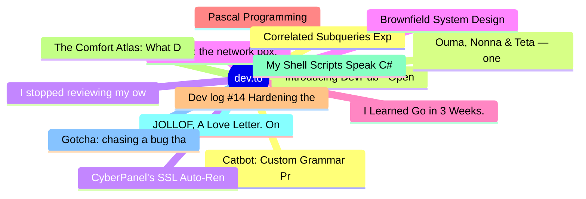

# dev.to Top 15 (2026-08-02)

## 思维导图

## 列表（15 条）

### 1. Catbot: Custom Grammar Problem Fixed
- **链接**: [https://dev.to/annavi11arrea1/catbot-custom-grammar-problem-fixed-oc5](https://dev.to/annavi11arrea1/catbot-custom-grammar-problem-fixed-oc5)
- **作者**: Anna Villarreal | **阅读**: 10min
- **反应**: 21 | **评论**: 3
- **标签**: `devchallenge`, `bugsmash`, `catbot`, `ai`
- **简介**: This is a submission for DEV's Summer Bug Smash: Smash Stories powered by Sentry.          ...

### 2. Introducing DevPub - Open Source Dev.to CLI Tool
- **链接**: [https://dev.to/sarvar_04/introducing-devpub-open-source-devto-cli-tool-49jf](https://dev.to/sarvar_04/introducing-devpub-open-source-devto-cli-tool-49jf)
- **作者**: Sarvar Nadaf | **阅读**: 6min
- **反应**: 14 | **评论**: 4
- **标签**: `devto`, `opensource`, `showdev`, `discuss`
- **简介**: Most Dev.to tools only publish articles. devpub does publishing, analytics, semantic search, trend discovery, and validation.

### 3. CyberPanel's SSL Auto-Renewal Can Silently Fail — Here's the Fix
- **链接**: [https://dev.to/pascal_cescato_692b7a8a20/cyberpanels-ssl-auto-renewal-can-silently-fail-heres-the-fix-5g1o](https://dev.to/pascal_cescato_692b7a8a20/cyberpanels-ssl-auto-renewal-can-silently-fail-heres-the-fix-5g1o)
- **作者**: Pascal CESCATO | **阅读**: 4min
- **反应**: 26 | **评论**: 2
- **标签**: `cybersecurity`, `devops`, `infrastructure`, `linux`
- **简介**: Last week I was doing a routine check on a CyberPanel server and noticed something that didn't add...

### 4. ratatop: the network box, and why your ISP lies with units
- **链接**: [https://dev.to/lovestaco/ratatop-the-network-box-and-why-your-isp-lies-with-units-4lpo](https://dev.to/lovestaco/ratatop-the-network-box-and-why-your-isp-lies-with-units-4lpo)
- **作者**: Athreya aka Maneshwar | **阅读**: 7min
- **反应**: 13 | **评论**: 0
- **标签**: `programming`, `productivity`, `cli`, `rust`
- **简介**: Hello, I'm Maneshwar. I'm building git-lrc, a Micro AI code reviewer that runs on every commit. It is...

### 5. I Learned Go in 3 Weeks. Yesterday, My Code Merged into k9s.
- **链接**: [https://dev.to/le_beltagy/i-learned-go-in-3-weeks-yesterday-my-code-merged-into-k9s-2dg4](https://dev.to/le_beltagy/i-learned-go-in-3-weeks-yesterday-my-code-merged-into-k9s-2dg4)
- **作者**: Le Beltagy | **阅读**: 8min
- **反应**: 21 | **评论**: 5
- **标签**: `go`, `kubernetes`, `opensource`, `beginners`
- **简介**: I Learned Go in 3 Weeks. Yesterday, My Code Merged into k9s.   From zero Go experience to a...

### 6. Pascal Programming
- **链接**: [https://dev.to/bekbrace/pascal-programming-146](https://dev.to/bekbrace/pascal-programming-146)
- **作者**: Bek Brace | **阅读**: 2min
- **反应**: 4 | **评论**: 1
- **标签**: `pascal`, `vintage`, `programming`, `watercooler`
- **简介**: One small confession before we begin.  The first programming language I ever used was not Pascal. It...

### 7. Dev log #14 Hardening the DHT against Eclipse attacks and the endless battle with flaky p2p tests
- **链接**: [https://dev.to/yashksaini/dev-log-14-hardening-the-dht-against-eclipse-attacks-and-the-endless-battle-with-flaky-p2p-tests-593j](https://dev.to/yashksaini/dev-log-14-hardening-the-dht-against-eclipse-attacks-and-the-endless-battle-with-flaky-p2p-tests-593j)
- **作者**: Yash Kumar Saini | **阅读**: 4min
- **反应**: 10 | **评论**: 0
- **标签**: `programming`, `opensource`, `networking`, `python`
- **简介**: Dived deep into libp2p security this week with a new IP subnet diversity feature for the Kad-DHT,...

### 8. The Comfort Atlas: What Does Home Taste Like?
- **链接**: [https://dev.to/ale3oula/the-comfort-atlas-what-does-home-taste-like-3a6i](https://dev.to/ale3oula/the-comfort-atlas-what-does-home-taste-like-3a6i)
- **作者**: Alexandra | **阅读**: 2min
- **反应**: 3 | **评论**: 0
- **标签**: `devchallenge`, `frontendchallenge`, `webdev`, `javascript`
- **简介**: This is a submission for Frontend Challenge - Comfort Food Edition, Perfect Landing           What I...

### 9. My Shell Scripts Speak C# Now
- **链接**: [https://dev.to/ssukhpinder/my-shell-scripts-speak-c-now-hka](https://dev.to/ssukhpinder/my-shell-scripts-speak-c-now-hka)
- **作者**: Sukhpinder Singh | **阅读**: 4min
- **反应**: 6 | **评论**: 0
- **标签**: `dotnet`, `csharp`, `programming`, `webdev`
- **简介**: Every couple of weeks I need a twenty-line program. Find what's bloating a build agent's disk, dedupe...

### 10. JOLLOF, A Love Letter. One Pot, Zero Photographs, All CSS
- **链接**: [https://dev.to/ndcodes/jollof-a-love-letter-one-pot-zero-photographs-all-css-4b8i](https://dev.to/ndcodes/jollof-a-love-letter-one-pot-zero-photographs-all-css-4b8i)
- **作者**: Nnamdi Felix Ibe | **阅读**: 2min
- **反应**: 8 | **评论**: 1
- **标签**: `devchallenge`, `frontendchallenge`, `webdev`, `javascript`
- **简介**: This is a submission for Frontend Challenge - Comfort Food Edition, Perfect Landing           What I...

### 11. Gotcha: chasing a bug that was never in my code
- **链接**: [https://dev.to/earlgreyhot1701d/gotcha-chasing-a-bug-that-was-never-in-my-code-59cc](https://dev.to/earlgreyhot1701d/gotcha-chasing-a-bug-that-was-never-in-my-code-59cc)
- **作者**: L. Cordero | **阅读**: 11min
- **反应**: 1 | **评论**: 0
- **标签**: `devchallenge`, `bugsmash`, `aws`, `nextjs`
- **简介**: This is a submission for DEV's Summer Bug Smash: Smash Stories powered by Sentry.  The build was...

### 12. Correlated Subqueries Explained: From Confusing to Intuitive
- **链接**: [https://dev.to/saamiabbaskhan/correlated-subqueries-explained-from-confusing-to-intuitive-32jn](https://dev.to/saamiabbaskhan/correlated-subqueries-explained-from-confusing-to-intuitive-32jn)
- **作者**: Saami abbas Khan | **阅读**: 12min
- **反应**: 5 | **评论**: 0
- **标签**: `sql`, `database`, `mysql`, `leetcode`
- **简介**: Hey everyone! 👋  It's been a while since I posted here. Over the past few days, I've been revisiting...

### 13. Ouma, Nonna & Teta — one table, three kitchens
- **链接**: [https://dev.to/piwe/ouma-nonna-teta-one-table-three-kitchens-1ibo](https://dev.to/piwe/ouma-nonna-teta-one-table-three-kitchens-1ibo)
- **作者**: Simphiwe Twala | **阅读**: 6min
- **反应**: 0 | **评论**: 0
- **标签**: `frontendchallenge`, `css`, `a11y`, `webdev`
- **简介**: This is a submission for the Frontend Challenge: Comfort Food Edition, Perfect Landing prompt.       ...

### 14. I stopped reviewing my own code. Here's what had to be true first.
- **链接**: [https://dev.to/isamu/i-stopped-reviewing-my-own-code-heres-what-had-to-be-true-first-4nh0](https://dev.to/isamu/i-stopped-reviewing-my-own-code-heres-what-had-to-be-true-first-4nh0)
- **作者**: Isamu Arimoto | **阅读**: 5min
- **反应**: 2 | **评论**: 0
- **标签**: `ai`, `webdev`, `programming`, `productivity`
- **简介**: Most days now, I merge pull requests without reading the diff.  That sentence used to describe...

### 15. Brownfield System Design Interviews: How to Answer Migration and Legacy Questions
- **链接**: [https://dev.to/atlantean_2491f7a3c49cea7/brownfield-system-design-interviews-how-to-answer-migration-and-legacy-questions-3k8c](https://dev.to/atlantean_2491f7a3c49cea7/brownfield-system-design-interviews-how-to-answer-migration-and-legacy-questions-3k8c)
- **作者**: Atlantean | **阅读**: 10min
- **反应**: 9 | **评论**: 3
- **标签**: `systemdesigninterview`, `microservices`, `architecture`, `career`
- **简介**: The Prompt That Filters Greenfield Preparation   Somewhere in the middle of many senior...
