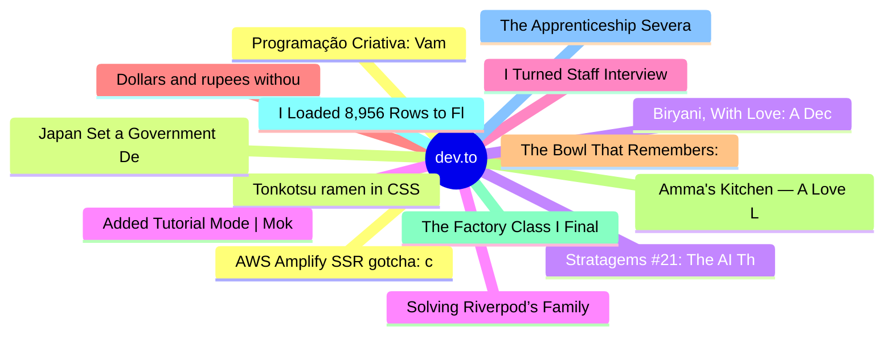

# dev.to Top 15 (2026-08-03)

## 思维导图

## 列表（15 条）

### 1. Programação Criativa: Vamos desenhar com código?
- **链接**: [https://dev.to/he4rt/programacao-criativa-vamos-desenhar-com-codigo-4a1](https://dev.to/he4rt/programacao-criativa-vamos-desenhar-com-codigo-4a1)
- **作者**: Sara Aniceto | **阅读**: 4min
- **反应**: 71 | **评论**: 4
- **标签**: `creativecoding`, `p5js`, `braziliandevs`
- **简介**: Quem acha que a discussão entre arte gerada por computadores começou com a popularização das...

### 2. Tonkotsu ramen in CSS
- **链接**: [https://dev.to/naman_dhakad/tonkotsu-ramen-in-css-3081](https://dev.to/naman_dhakad/tonkotsu-ramen-in-css-3081)
- **作者**: Naman Dhakad | **阅读**: 3min
- **反应**: 3 | **评论**: 1
- **标签**: `css`, `frontendchallenge`, `devchallenge`, `design`
- **简介**: This is a submission for Frontend Challenge - Comfort Food Edition, CSS Art.          ...

### 3. Stratagems #21: The AI Thought P Was Still Alive. P Was Already Gone.
- **链接**: [https://dev.to/xulingfeng/stratagems-21-the-ai-thought-p-was-still-alive-p-was-already-gone-59h7](https://dev.to/xulingfeng/stratagems-21-the-ai-thought-p-was-still-alive-p-was-already-gone-59h7)
- **作者**: xulingfeng | **阅读**: 9min
- **反应**: 31 | **评论**: 6
- **标签**: `ai`, `discuss`, `career`, `programming`
- **简介**: Keep the shell. Preserve the presence. The ally doesn't suspect; the enemy doesn't move. — The 36...

### 4. Solving Riverpod’s Family Provider Cache Dilemma with Signals & mapSignal
- **链接**: [https://dev.to/gde/solving-riverpods-family-provider-cache-dilemma-with-signals-mapsignal-474](https://dev.to/gde/solving-riverpods-family-provider-cache-dilemma-with-signals-mapsignal-474)
- **作者**: Randal L. Schwartz | **阅读**: 5min
- **反应**: 2 | **评论**: 0
- **标签**: `flutter`, `dart`, `riverpod`, `architecture`
- **简介**: When separate family providers store parameterized network queries as isolated state silos, updating an entity in one subset creates stale data across others. Here is how a normalized mapSignal store 

### 5. I Turned Staff Interview Prep Into a Midnight Ramen Bowl 🍜
- **链接**: [https://dev.to/numb_code_07/i-turned-staff-interview-prep-into-a-midnight-ramen-bowl-3g68](https://dev.to/numb_code_07/i-turned-staff-interview-prep-into-a-midnight-ramen-bowl-3g68)
- **作者**: Numb Code | **阅读**: 3min
- **反应**: 29 | **评论**: 9
- **标签**: `devchallenge`, `frontendchallenge`, `webdev`, `javascript`
- **简介**: This is a submission for Frontend Challenge - Comfort Food Edition, CSS Art.          ...

### 6. Dollars and rupees without Stripe: what building Skill Exchange's checkout taught me (PayPal + UPI)
- **链接**: [https://dev.to/mohanvenkatakrishnan/dollars-and-rupees-without-stripe-what-building-skill-exchanges-checkout-taught-me-paypal-upi-3i8p](https://dev.to/mohanvenkatakrishnan/dollars-and-rupees-without-stripe-what-building-skill-exchanges-checkout-taught-me-paypal-upi-3i8p)
- **作者**: Mohan | **阅读**: 5min
- **反应**: 15 | **评论**: 0
- **标签**: `aws`, `webdev`, `saas`, `ai`
- **简介**: "Just add Stripe" is the default advice for a solo dev who needs to charge money. It works right up...

### 7. The Bowl That Remembers: 3D CSS Art Edition 🥣
- **链接**: [https://dev.to/pawar-shivam7/the-bowl-that-remembers-3d-css-art-edition-54p9](https://dev.to/pawar-shivam7/the-bowl-that-remembers-3d-css-art-edition-54p9)
- **作者**: Pawar Shivam | **阅读**: 2min
- **反应**: 3 | **评论**: 2
- **标签**: `devchallenge`, `frontendchallenge`, `webdev`, `javascript`
- **简介**: This is a submission for Frontend Challenge - Comfort Food Edition, CSS Art           🍲 The Bowl That...

### 8. Amma's Kitchen — A Love Letter to South Indian Comfort Food 🍛
- **链接**: [https://dev.to/karthik_n/ammas-kitchen-a-love-letter-to-south-indian-comfort-food-2g7g](https://dev.to/karthik_n/ammas-kitchen-a-love-letter-to-south-indian-comfort-food-2g7g)
- **作者**: karthikeyan | **阅读**: 3min
- **反应**: 4 | **评论**: 0
- **标签**: `devchallenge`, `frontendchallenge`, `webdev`, `javascript`
- **简介**: This is a submission for Frontend Challenge - Comfort Food Edition, Perfect Landing           What I...

### 9. The Factory Class I Finally Deleted
- **链接**: [https://dev.to/ssukhpinder/the-factory-class-i-finally-deleted-3oap](https://dev.to/ssukhpinder/the-factory-class-i-finally-deleted-3oap)
- **作者**: Sukhpinder Singh | **阅读**: 4min
- **反应**: 6 | **评论**: 0
- **标签**: `dotnet`, `csharp`, `aspnetcore`, `webdev`
- **简介**: The PR added a WhatsApp notification channel. Three changes: a new WhatsAppSender class, fair. Its...

### 10. I Loaded 8,956 Rows to Flip One Boolean
- **链接**: [https://dev.to/ssukhpinder/i-loaded-8956-rows-to-flip-one-boolean-596e](https://dev.to/ssukhpinder/i-loaded-8956-rows-to-flip-one-boolean-596e)
- **作者**: Sukhpinder Singh | **阅读**: 4min
- **反应**: 6 | **评论**: 0
- **标签**: `dotnet`, `csharp`, `webdev`, `programming`
- **简介**: Every system I've worked on has a nightly job shaped like this: archive delivered orders older than...

### 11. The Apprenticeship Severance
- **链接**: [https://dev.to/rawveg/the-apprenticeship-severance-5m](https://dev.to/rawveg/the-apprenticeship-severance-5m)
- **作者**: Tim Green | **阅读**: 21min
- **反应**: 0 | **评论**: 0
- **标签**: `humanintheloop`, `apprenticeshipseverance`, `tacitknowledgeloss`, `expertisepipeline`
- **简介**: In a Davos meeting room in January 2026, a panel of chief executives, labour economists, and...

### 12. AWS Amplify SSR gotcha: chasing a bug that was never in my code
- **链接**: [https://dev.to/earlgreyhot1701d/gotcha-chasing-a-bug-that-was-never-in-my-code-59cc](https://dev.to/earlgreyhot1701d/gotcha-chasing-a-bug-that-was-never-in-my-code-59cc)
- **作者**: L. Cordero | **阅读**: 11min
- **反应**: 3 | **评论**: 0
- **标签**: `devchallenge`, `bugsmash`, `aws`, `nextjs`
- **简介**: This is a submission for DEV's Summer Bug Smash: Smash Stories powered by Sentry.  The build was...

### 13. Japan Set a Government Deadline for Its Legacy Code. It Was Last Year.
- **链接**: [https://dev.to/jun_f_kirk/japan-set-a-government-deadline-for-its-legacy-code-it-was-last-year-18p5](https://dev.to/jun_f_kirk/japan-set-a-government-deadline-for-its-legacy-code-it-was-last-year-18p5)
- **作者**: June | **阅读**: 6min
- **反应**: 2 | **评论**: 0
- **标签**: `legacy`, `japan`, `career`, `watercooler`
- **简介**: Every engineer has met a cursed codebase. The file nobody edits without a small prayer. The function...

### 14. Biryani, With Love: A Deccan-Inspired Interactive Atlas
- **链接**: [https://dev.to/adityawaslost/biryani-with-love-a-deccan-inspired-interactive-atlas-4amb](https://dev.to/adityawaslost/biryani-with-love-a-deccan-inspired-interactive-atlas-4amb)
- **作者**: Aditya | **阅读**: 3min
- **反应**: 1 | **评论**: 1
- **标签**: `devchallenge`, `frontendchallenge`, `webdev`, `javascript`
- **简介**: This is a submission for Frontend Challenge - Comfort Food Edition, Perfect Landing.           What I...

### 15. Added Tutorial Mode | Moksha
- **链接**: [https://dev.to/weirdcodesofficial/added-tutorial-mode-moksha-17af](https://dev.to/weirdcodesofficial/added-tutorial-mode-moksha-17af)
- **作者**: Weird Codes | **阅读**: 3min
- **反应**: 1 | **评论**: 0
- **标签**: `javascript`, `gamedev`, `webdev`, `tutorial`
- **简介**: 🕉️ Devlog — गुरु-दीक्षा: Teaching Karma Without Breaking Immersion    "गुरु बिना ज्ञान...
