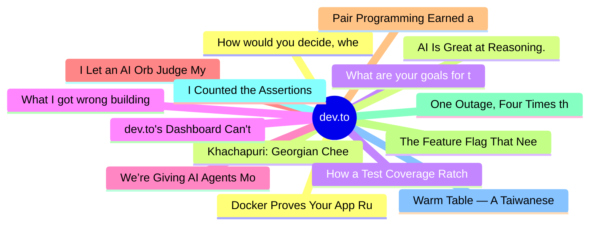

# dev.to Top 15 (2026-08-04)

## 思维导图

## 列表（15 条）

### 1. How would you decide, whether the content is good or bad?
- **链接**: [https://dev.to/francistrdev/how-would-you-decide-whether-the-content-is-good-or-bad-295p](https://dev.to/francistrdev/how-would-you-decide-whether-the-content-is-good-or-bad-295p)
- **作者**: FrancisTRᴅᴇᴠ (っ◔◡◔)っ | **阅读**: 9min
- **反应**: 46 | **评论**: 23
- **标签**: `discuss`, `community`, `ai`, `writing`
- **简介**: I want to talk about what I have notice on the platform and want to address what we all have been...

### 2. Khachapuri: Georgian Cheese Bread in Pure CSS
- **链接**: [https://dev.to/highflyer910/khachapuri-georgian-cheese-bread-in-pure-css-47o7](https://dev.to/highflyer910/khachapuri-georgian-cheese-bread-in-pure-css-47o7)
- **作者**: Thea | **阅读**: 2min
- **反应**: 11 | **评论**: 5
- **标签**: `frontendchallenge`, `devchallenge`, `css`
- **简介**: This is a submission for Frontend Challenge - Comfort Food Edition, CSS Art.          ...

### 3. What are your goals for the week? #190
- **链接**: [https://dev.to/jarvisscript/what-are-your-goals-for-the-week-190-d5p](https://dev.to/jarvisscript/what-are-your-goals-for-the-week-190-d5p)
- **作者**: Chris Jarvis | **阅读**: 2min
- **反应**: 15 | **评论**: 0
- **标签**: `discuss`
- **简介**: Last full week of Summer vacation for students. Been so busy, I missed the new announcement of a new...

### 4. dev.to's Dashboard Can't Count Its Own Posts
- **链接**: [https://dev.to/dannwaneri/devtos-dashboard-cant-count-its-own-posts-3fci](https://dev.to/dannwaneri/devtos-dashboard-cant-count-its-own-posts-3fci)
- **作者**: Daniel Nwaneri | **阅读**: 4min
- **反应**: 30 | **评论**: 21
- **标签**: `bugsmash`, `devchallenge`, `ai`
- **简介**: This is a submission for DEV's Summer Bug Smash: Clear the Lineup powered by Sentry.          ...

### 5. We’re Giving AI Agents More Tools. What Happens When the Boundaries Fail?
- **链接**: [https://dev.to/hemapriya_kanagala/were-giving-ai-agents-more-tools-what-happens-when-the-boundaries-fail-46gh](https://dev.to/hemapriya_kanagala/were-giving-ai-agents-more-tools-what-happens-when-the-boundaries-fail-46gh)
- **作者**: Hemapriya Kanagala | **阅读**: 21min
- **反应**: 35 | **评论**: 19
- **标签**: `discuss`, `security`, `agents`, `ai`
- **简介**: 📌 TL;DR  AI agents are becoming useful because we're giving them the ability to do more than just...

### 6. I Let an AI Orb Judge My Facial Expressions While I Code, and Here's What Happened
- **链接**: [https://dev.to/trojanmocx/i-let-an-ai-orb-judge-my-facial-expressions-while-i-code-and-heres-what-happened-45a0](https://dev.to/trojanmocx/i-let-an-ai-orb-judge-my-facial-expressions-while-i-code-and-heres-what-happened-45a0)
- **作者**: TROJAN  | **阅读**: 7min
- **反应**: 13 | **评论**: 1
- **标签**: `ai`, `tooling`, `programming`, `discuss`
- **简介**: A deep dive into AURA, the desktop AR companion that watches your face, reads your hand gestures, and...

### 7. Pair Programming Earned a Lighter Code Review. AI Hasn't.
- **链接**: [https://dev.to/pixel-wraith/pair-programming-earned-a-lighter-code-review-ai-hasnt-2e4f](https://dev.to/pixel-wraith/pair-programming-earned-a-lighter-code-review-ai-hasnt-2e4f)
- **作者**: Jake Lundberg | **阅读**: 4min
- **反应**: 0 | **评论**: 1
- **标签**: `codereview`, `ai`, `engineeringmanagement`, `programming`
- **简介**: Is writing code with an agent the same thing as pair programming?  That question has been going...

### 8. The Feature Flag That Needed a Restart
- **链接**: [https://dev.to/ssukhpinder/the-feature-flag-that-needed-a-restart-306g](https://dev.to/ssukhpinder/the-feature-flag-that-needed-a-restart-306g)
- **作者**: Sukhpinder Singh | **阅读**: 4min
- **反应**: 6 | **评论**: 2
- **标签**: `aspnetcore`, `dotnet`, `csharp`, `webdev`
- **简介**: I flipped a feature flag in appsettings.json on a running service, curled the endpoint, and got the...

### 9. One Outage, Four Times the Traffic
- **链接**: [https://dev.to/ssukhpinder/one-outage-four-times-the-traffic-5374](https://dev.to/ssukhpinder/one-outage-four-times-the-traffic-5374)
- **作者**: Sukhpinder Singh | **阅读**: 4min
- **反应**: 5 | **评论**: 0
- **标签**: `dotnet`, `csharp`, `aspnetcore`, `webdev`
- **简介**: The graph that kicked this off: a downstream inventory service wobbled for about two seconds, and our...

### 10. I Counted the Assertions in Our Test Suite. I Wish I Hadn't.
- **链接**: [https://dev.to/henry_messiahtmt_099ca84/i-counted-the-assertions-in-our-test-suite-i-wish-i-hadnt-49gi](https://dev.to/henry_messiahtmt_099ca84/i-counted-the-assertions-in-our-test-suite-i-wish-i-hadnt-49gi)
- **作者**: henry messiah tmt | **阅读**: 5min
- **反应**: 12 | **评论**: 4
- **标签**: `ai`, `webdev`, `devops`, `agents`
- **简介**: I wrote the script on a Friday afternoon because I was procrastinating on something worse.  It was...

### 11. Warm Table — A Taiwanese Comfort Soup Landing Page
- **链接**: [https://dev.to/zoe_lin_0653/warm-table-a-taiwanese-comfort-soup-landing-page-fnl](https://dev.to/zoe_lin_0653/warm-table-a-taiwanese-comfort-soup-landing-page-fnl)
- **作者**: Zoe Lin | **阅读**: 3min
- **反应**: 3 | **评论**: 1
- **标签**: `devchallenge`, `frontendchallenge`, `webdev`, `javascript`
- **简介**: What I Built   I built Warm Table, a fictional Taiwanese comfort-soup house inspired by the...

### 12. Docker Proves Your App Runs. Kubernetes Proves It's Operable.
- **链接**: [https://dev.to/arbythecoder/docker-proves-your-app-runs-kubernetes-proves-its-operable-439i](https://dev.to/arbythecoder/docker-proves-your-app-runs-kubernetes-proves-its-operable-439i)
- **作者**: Arbythecoder | **阅读**: 9min
- **反应**: 0 | **评论**: 0
- **标签**: `devops`, `docker`, `kubernetes`, `containers`
- **简介**: It's 2:47 AM. The pod says Running. The logs are clean, no stack trace, no red text, nothing you...

### 13. AI Is Great at Reasoning. Stop Using It for Workflows.
- **链接**: [https://dev.to/aws-builders/ai-is-great-at-reasoning-stop-using-it-for-workflows-313c](https://dev.to/aws-builders/ai-is-great-at-reasoning-stop-using-it-for-workflows-313c)
- **作者**: Orel Bello | **阅读**: 5min
- **反应**: 3 | **评论**: 4
- **标签**: `ai`, `devops`, `aws`, `automation`
- **简介**: More than a year ago, which is practically ancient history in the AI years, I wrote a blog about...

### 14. How a Test Coverage Ratchet Finally Fixed the Codebase Everyone Was Afraid to Touch
- **链接**: [https://dev.to/mnvasil/how-a-test-coverage-ratchet-finally-fixed-the-codebase-everyone-was-afraid-to-touch-2pb5](https://dev.to/mnvasil/how-a-test-coverage-ratchet-finally-fixed-the-codebase-everyone-was-afraid-to-touch-2pb5)
- **作者**: Menshikov Vasil | **阅读**: 7min
- **反应**: 1 | **评论**: 0
- **标签**: `javascript`, `softwareengineering`, `testing`, `typescript`
- **简介**: I have never seen a metric sit as stubbornly still as our test coverage did. Twenty-five percent. For...

### 15. What I got wrong building a browser extension with an AI assistant
- **链接**: [https://dev.to/tryclicked/what-i-got-wrong-building-a-browser-extension-with-an-ai-assistant-3n8d](https://dev.to/tryclicked/what-i-got-wrong-building-a-browser-extension-with-an-ai-assistant-3n8d)
- **作者**: Tryclicked | **阅读**: 5min
- **反应**: 3 | **评论**: 2
- **标签**: `ai`, `webdev`, `startup`, `productivity`
- **简介**: First hour with Claude's browser extension: I pointed it at our LLC registration and watched it work...
