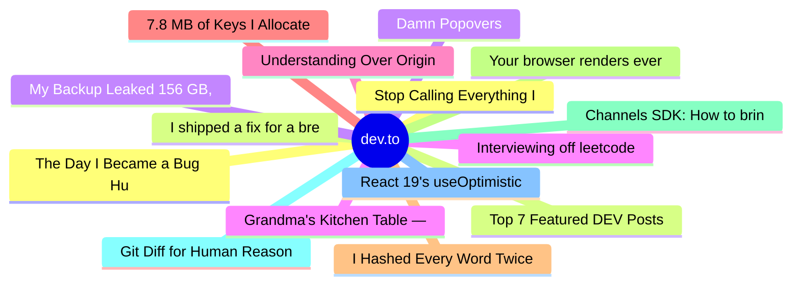

# dev.to Top 15 (2026-08-05)

## 思维导图

## 列表（15 条）

### 1. Stop Calling Everything Impostor Syndrome: The Myth of "Just Push Harder"
- **链接**: [https://dev.to/sylwia-lask/stop-calling-everything-impostor-syndrome-the-myth-of-just-push-harder-1dmm](https://dev.to/sylwia-lask/stop-calling-everything-impostor-syndrome-the-myth-of-just-push-harder-1dmm)
- **作者**: Sylwia Laskowska | **阅读**: 5min
- **反应**: 70 | **评论**: 35
- **标签**: `career`, `mentalhealth`
- **简介**: Not everyone who doubts themselves is suffering from impostor syndrome. Sometimes the real problem...

### 2. Top 7 Featured DEV Posts of the Week
- **链接**: [https://dev.to/devteam/top-7-featured-dev-posts-of-the-week-4pk2](https://dev.to/devteam/top-7-featured-dev-posts-of-the-week-4pk2)
- **作者**: Jess Lee | **阅读**: 3min
- **反应**: 41 | **评论**: 11
- **标签**: `top7`, `discuss`
- **简介**: Welcome to this week's Top 7, where the DEV editorial team handpicks their favorite posts from the...

### 3. Damn Popovers
- **链接**: [https://dev.to/ingosteinke/damn-popovers-23n1](https://dev.to/ingosteinke/damn-popovers-23n1)
- **作者**: Ingo Steinke, web developer | **阅读**: 2min
- **反应**: 22 | **评论**: 1
- **标签**: `watercooler`, `ui`, `uidesign`, `webdev`
- **简介**: Cookie banners are still a nuisance.  GDPR, the European privacy law, seems like a perfect example of...

### 4. Interviewing off leetcode you already memorized isn't cheating, it's the job
- **链接**: [https://dev.to/adioof/interviewing-off-leetcode-you-already-memorized-isnt-cheating-its-the-job-5e76](https://dev.to/adioof/interviewing-off-leetcode-you-already-memorized-isnt-cheating-its-the-job-5e76)
- **作者**: Aditya Agarwal | **阅读**: 3min
- **反应**: 15 | **评论**: 4
- **标签**: `hiring`, `interview`, `career`, `discuss`
- **简介**: Someone was accused of cheating because they were able to solve a difficult problem very quickly. Not...

### 5. Understanding Over Origin: The Missing Friction
- **链接**: [https://dev.to/adamthedeveloper/understanding-over-origin-the-missing-friction-55ag](https://dev.to/adamthedeveloper/understanding-over-origin-the-missing-friction-55ag)
- **作者**: Adam - The Developer ✨ | **阅读**: 7min
- **反应**: 30 | **评论**: 16
- **标签**: `ai`, `programming`, `productivity`, `learning`
- **简介**: A few days ago, I wrote "Understanding Over Origin" and it got alot of engagement and I'm really...

### 6. 7.8 MB of Keys I Allocated Just to Throw Away
- **链接**: [https://dev.to/ssukhpinder/78-mb-of-keys-i-allocated-just-to-throw-away-50mn](https://dev.to/ssukhpinder/78-mb-of-keys-i-allocated-just-to-throw-away-50mn)
- **作者**: Sukhpinder Singh | **阅读**: 4min
- **反应**: 11 | **评论**: 0
- **标签**: `csharp`, `dotnet`, `programming`, `webdev`
- **简介**: A profiler trace put me on a code path I'd never once suspected: a request handler that reads a blob...

### 7. I Hashed Every Word Twice to Count It Once
- **链接**: [https://dev.to/ssukhpinder/i-hashed-every-word-twice-to-count-it-once-1mg9](https://dev.to/ssukhpinder/i-hashed-every-word-twice-to-count-it-once-1mg9)
- **作者**: Sukhpinder Singh | **阅读**: 4min
- **反应**: 11 | **评论**: 0
- **标签**: `csharp`, `dotnet`, `programming`, `webdev`
- **简介**: I was profiling a log parser last week. Nothing dramatic, it just counts how often each error code...

### 8. Your browser renders everything, even what you can't see — `content-visibility: auto` fixes that
- **链接**: [https://dev.to/parsajiravand/your-browser-renders-everything-even-what-you-cant-see-content-visibility-auto-fixes-that-3g7c](https://dev.to/parsajiravand/your-browser-renders-everything-even-what-you-cant-see-content-visibility-auto-fixes-that-3g7c)
- **作者**: Parsa Jiravand | **阅读**: 4min
- **反应**: 20 | **评论**: 0
- **标签**: `css`, `webdev`, `performance`, `frontend`
- **简介**: When you open a long page — a news feed, an admin table, a documentation article — the browser lays...

### 9. Channels SDK: How to bring your Agent to any Channel (Slack, Microsoft Teams)
- **链接**: [https://dev.to/copilotkit/channels-sdk-how-to-bring-your-agent-to-any-channel-slack-microsoft-teams-1bof](https://dev.to/copilotkit/channels-sdk-how-to-bring-your-agent-to-any-channel-slack-microsoft-teams-1bof)
- **作者**: Anmol Baranwal | **阅读**: 14min
- **反应**: 86 | **评论**: 11
- **标签**: `tutorial`, `programming`, `beginners`, `discuss`
- **简介**: Getting any agent into messaging platforms like Slack is complex. You create a Slack app, handle its...

### 10. Git Diff for Human Reasoning
- **链接**: [https://dev.to/gnomeman4201/-git-diff-for-human-reasoning-c17](https://dev.to/gnomeman4201/-git-diff-for-human-reasoning-c17)
- **作者**: GnomeMan4201 | **阅读**: 8min
- **反应**: 2 | **评论**: 0
- **标签**: `security`, `opensource`, `discuss`, `todayilearned`
- **简介**: Every investigation eventually reaches the same moment.  Two competent people look at the same...

### 11. React 19's useOptimistic Fixed My Instant UI. Then Combining It With useActionState Broke My Reset Button
- **链接**: [https://dev.to/shubhradev/react-19s-useoptimistic-fixed-my-instant-ui-then-combining-it-with-useactionstate-broke-my-reset-41km](https://dev.to/shubhradev/react-19s-useoptimistic-fixed-my-instant-ui-then-combining-it-with-useactionstate-broke-my-reset-41km)
- **作者**: Shubhra Pokhariya | **阅读**: 8min
- **反应**: 11 | **评论**: 3
- **标签**: `react`, `javascript`, `webdev`, `programming`
- **简介**: Part 1 was about waiting well. This one is about not waiting at all, and about a couple of mistakes I...

### 12. The Day I Became a Bug Hunter
- **链接**: [https://dev.to/konark_13/the-day-i-became-a-bug-hunter-3e41](https://dev.to/konark_13/the-day-i-became-a-bug-hunter-3e41)
- **作者**: Konark Sharma | **阅读**: 9min
- **反应**: 3 | **评论**: 1
- **标签**: `devchallenge`, `bugsmash`, `bounty`, `testing`
- **简介**: This is a submission for DEV's Summer Bug Smash: Smash Stories powered by Sentry.  Did anyone ask for...

### 13. I shipped a fix for a breaking change. The code could never select it.
- **链接**: [https://dev.to/lucioliu/i-shipped-a-fix-for-a-breaking-change-the-code-could-never-select-it-2k5c](https://dev.to/lucioliu/i-shipped-a-fix-for-a-breaking-change-the-code-could-never-select-it-2k5c)
- **作者**: LucioLiu | **阅读**: 10min
- **反应**: 4 | **评论**: 1
- **标签**: `devchallenge`, `bugsmash`, `python`, `debugging`
- **简介**: This is a submission for DEV's Summer Bug Smash: Smash Stories, powered by Sentry.     Upstream...

### 14. My Backup Leaked 156 GB, Filled the Disk, and Broke Itself. The Fix Was One Letter.
- **链接**: [https://dev.to/mrviduus/my-backup-leaked-156-gb-filled-the-disk-and-broke-itself-the-fix-was-one-letter-3ldd](https://dev.to/mrviduus/my-backup-leaked-156-gb-filled-the-disk-and-broke-itself-the-fix-was-one-letter-3ldd)
- **作者**: Vasyl | **阅读**: 4min
- **反应**: 4 | **评论**: 2
- **标签**: `devchallenge`, `bugsmash`, `docker`, `devops`
- **简介**: This is a submission for DEV's Summer Bug Smash: Smash Stories powered by Sentry.   🔨 #bugsmash, week...

### 15. Grandma's Kitchen Table — A Photorealistic Pie Scene
- **链接**: [https://dev.to/prince_panchani_f971a20ec/grandmas-kitchen-table-a-photorealistic-pie-scene-52j6](https://dev.to/prince_panchani_f971a20ec/grandmas-kitchen-table-a-photorealistic-pie-scene-52j6)
- **作者**: Prince Panchani | **阅读**: 2min
- **反应**: 3 | **评论**: 0
- **标签**: `frontendchallenge`, `devchallenge`, `css`
- **简介**: This is my submission for the Frontend Challenge – Comfort Food Edition: CSS Art.           Grandma's...
