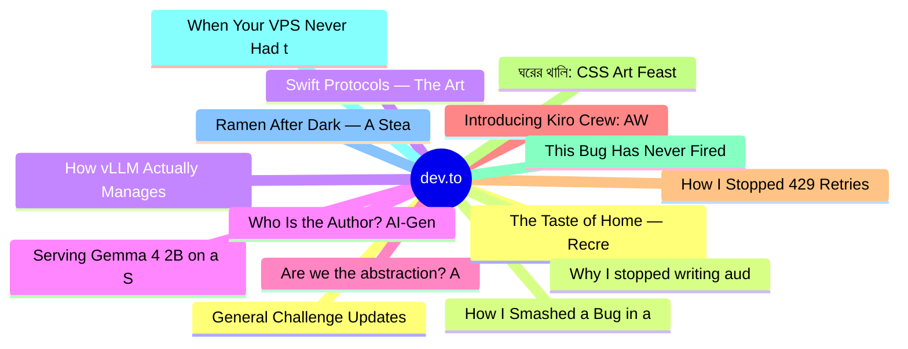

# dev.to Top 15 (2026-08-06)

## 思维导图

## 列表（15 条）

### 1. General Challenge Updates Moving Forward
- **链接**: [https://dev.to/thepracticaldev/general-challenge-updates-moving-forward-5h39](https://dev.to/thepracticaldev/general-challenge-updates-moving-forward-5h39)
- **作者**: dev.to staff | **阅读**: 2min
- **反应**: 14 | **评论**: 1
- **标签**: `devchallenge`
- **简介**: Hey all, as part of our expanding challenge program we want to update and clarify some challenge...

### 2. How I Smashed a Bug in a Shared Authentication Library
- **链接**: [https://dev.to/gramli/how-i-smashed-a-bug-in-a-shared-authentication-library-33fm](https://dev.to/gramli/how-i-smashed-a-bug-in-a-shared-authentication-library-33fm)
- **作者**: Daniel Balcarek | **阅读**: 4min
- **反应**: 51 | **评论**: 36
- **标签**: `devchallenge`, `bugsmash`, `angular`, `typescript`
- **简介**: This is a submission for DEV's Summer Bug Smash: Smash Stories powered by Sentry.  This happened a...

### 3. Swift Protocols — The Art of Making Promises 🤝
- **链接**: [https://dev.to/gamya_m/swift-protocols-the-art-of-making-promises-59mb](https://dev.to/gamya_m/swift-protocols-the-art-of-making-promises-59mb)
- **作者**: Gamya  | **阅读**: 5min
- **反应**: 16 | **评论**: 1
- **标签**: `swift`, `ios`, `programming`, `developer`
- **简介**: Protocols let you define what a type can do without caring about what it actually is. Once...

### 4. Serving Gemma 4 2B on a Single TPU v5e Chip with MCP and Antigravity CLI
- **链接**: [https://dev.to/gde/serving-gemma-4-2b-on-a-single-tpu-v5e-chip-with-mcp-and-antigravity-cli-33l8](https://dev.to/gde/serving-gemma-4-2b-on-a-single-tpu-v5e-chip-with-mcp-and-antigravity-cli-33l8)
- **作者**: xbill | **阅读**: 17min
- **反应**: 7 | **评论**: 0
- **标签**: `antigravitycli`, `python`, `mcps`, `gemma`
- **简介**: This article is the v5e follow-on to the v6e-1 debugging guide. Same MCP tooling, same Antigravity...

### 5. Are we the abstraction? AI and the future of software engineering
- **链接**: [https://dev.to/jennapederson/the-abstraction-appears-to-include-us-2d47](https://dev.to/jennapederson/the-abstraction-appears-to-include-us-2d47)
- **作者**: Jenna Pederson | **阅读**: 4min
- **反应**: 4 | **评论**: 2
- **标签**: `ai`, `programming`, `productivity`, `webdev`
- **简介**: Dear past Jenna,  There will come a point when you wonder whether your career — the one you went to...

### 6. Introducing Kiro Crew: AWS's Open-Source AI Agent Orchestrator
- **链接**: [https://dev.to/sarvar_04/introducing-kiro-crew-awss-open-source-ai-agent-orchestrator-1e63](https://dev.to/sarvar_04/introducing-kiro-crew-awss-open-source-ai-agent-orchestrator-1e63)
- **作者**: Sarvar Nadaf | **阅读**: 12min
- **反应**: 14 | **评论**: 4
- **标签**: `agents`, `ai`, `aws`, `discuss`
- **简介**: AWS open-sourced a persistent workspace that coordinates AI coding agents across sessions, schedules, and repos. Here's what it actually does and why it matters.

### 7. How I Stopped 429 Retries from Duplicating Successful Batch Jobs
- **链接**: [https://dev.to/hirodeath/how-i-stopped-429-retries-from-duplicating-successful-batch-jobs-5ed](https://dev.to/hirodeath/how-i-stopped-429-retries-from-duplicating-successful-batch-jobs-5ed)
- **作者**: hiro@ | **阅读**: 3min
- **反应**: 2 | **评论**: 0
- **标签**: `devchallenge`, `bugsmash`, `typescript`, `nextjs`
- **简介**: This article is an English translation of the original Japanese article.  This is a submission for...

### 8. ঘরের থালি: CSS Art Feast of Peshawari Meat, Beef Curry & Chicken Biryani
- **链接**: [https://dev.to/kporus/ghrer-thaali-css-art-feast-of-peshawari-meat-beef-curry-chicken-biryani-he7](https://dev.to/kporus/ghrer-thaali-css-art-feast-of-peshawari-meat-beef-curry-chicken-biryani-he7)
- **作者**: Md. Fardin Khan | **阅读**: 2min
- **反应**: 4 | **评论**: 0
- **标签**: `frontendchallenge`, `devchallenge`, `css`
- **简介**: This is a submission for Frontend Challenge - Comfort Food Edition, CSS Art.          ...

### 9. This Bug Has Never Fired in Production. I Fixed It Anyway
- **链接**: [https://dev.to/p0rt/this-bug-has-never-fired-in-production-i-fixed-it-anyway-ga6](https://dev.to/p0rt/this-bug-has-never-fired-in-production-i-fixed-it-anyway-ga6)
- **作者**: Sergei Parfenov | **阅读**: 4min
- **反应**: 4 | **评论**: 1
- **标签**: `devchallenge`, `bugsmash`, `python`, `opensource`
- **简介**: A Python generator in Zulip's Microsoft Teams importer yielded a list and then cleared it. Every batch was the same object. Here's why latent bugs deserve fixes.

### 10. When Your VPS Never Had the Resources It Was Sold With
- **链接**: [https://dev.to/pascal_cescato_692b7a8a20/when-your-vps-never-had-the-resources-it-was-sold-with-302o](https://dev.to/pascal_cescato_692b7a8a20/when-your-vps-never-had-the-resources-it-was-sold-with-302o)
- **作者**: Pascal CESCATO | **阅读**: 5min
- **反应**: 6 | **评论**: 0
- **标签**: `networking`, `devops`, `vps`, `linux`
- **简介**: I needed a VPS to run CyberPanel. Simple enough: 1 vCPU, 1 GB RAM, 10 GB SSD, IPv6 only. CyberPanel...

### 11. Ramen After Dark — A Steaming Comfort-Food Scene Drawn Entirely in CSS
- **链接**: [https://dev.to/hirodeath/ramen-after-dark-a-steaming-comfort-food-scene-drawn-entirely-in-css-2hf1](https://dev.to/hirodeath/ramen-after-dark-a-steaming-comfort-food-scene-drawn-entirely-in-css-2hf1)
- **作者**: hiro@ | **阅读**: 3min
- **反应**: 5 | **评论**: 0
- **标签**: `frontendchallenge`, `devchallenge`, `css`, `html`
- **简介**: This is a submission for Frontend Challenge — Comfort Food Edition, CSS Art.          ...

### 12. The Taste of Home — Recreating Congolese Comfort Food with Pure HTML & CSS
- **链接**: [https://dev.to/alphonsekazadi/the-taste-of-home-recreating-congolese-comfort-food-with-pure-html-css-29h1](https://dev.to/alphonsekazadi/the-taste-of-home-recreating-congolese-comfort-food-with-pure-html-css-29h1)
- **作者**: Alphonse Kazadi  | **阅读**: 3min
- **反应**: 6 | **评论**: 0
- **标签**: `frontendchallenge`, `devchallenge`, `css`, `webdev`
- **简介**: This is a submission for Frontend Challenge - Comfort Food Edition, CSS Art.          ...

### 13. Why I stopped writing audio preprocessing scripts and built a tool instead
- **链接**: [https://dev.to/onepizzateam/why-i-stopped-writing-audio-preprocessing-scripts-and-built-a-tool-instead-eki](https://dev.to/onepizzateam/why-i-stopped-writing-audio-preprocessing-scripts-and-built-a-tool-instead-eki)
- **作者**: 1p | **阅读**: 5min
- **反应**: 4 | **评论**: 1
- **标签**: `python`, `opensource`, `whisper`, `ai`
- **简介**: Every time I start a TTS fine-tuning project, I lose the first day to roughly the same set of...

### 14. How vLLM Actually Manages KV Cache (vs the Toy Version I Built)
- **链接**: [https://dev.to/thokozani_buthelezi_2cd41/how-vllm-actually-manages-kv-cache-vs-the-toy-version-i-built-2kba](https://dev.to/thokozani_buthelezi_2cd41/how-vllm-actually-manages-kv-cache-vs-the-toy-version-i-built-2kba)
- **作者**: Thokozani Buthelezi | **阅读**: 4min
- **反应**: 3 | **评论**: 2
- **标签**: `architecture`, `llm`, `performance`, `python`
- **简介**: A few weeks back I built my own mini version of PagedAttention, a block manager, a free list, copy on...

### 15. Who Is the Author? AI-Generated Code and PCI DSS Code Review
- **链接**: [https://dev.to/yehyatt/when-an-ai-writes-the-code-who-is-the-author-3chi](https://dev.to/yehyatt/when-an-ai-writes-the-code-who-is-the-author-3chi)
- **作者**: Yahya Titi | **阅读**: 3min
- **反应**: 0 | **评论**: 1
- **标签**: `security`, `ai`, `mobile`, `ios`
- **简介**: PCI DSS requires that code review be performed by someone other than the code's author.  When an AI...
