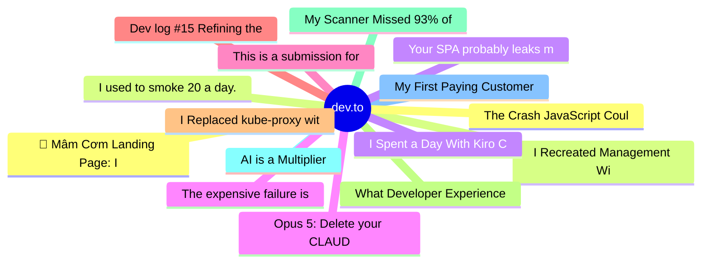

# dev.to Top 15 (2026-08-07)

## 思维导图

## 列表（15 条）

### 1. 🥁 Mâm Cơm Landing Page: I built a Vietnamese dinner tray on a 3,000-year-old bronze drum
- **链接**: [https://dev.to/minhlong2605/mam-com-landing-page-i-built-a-vietnamese-dinner-tray-on-a-3000-year-old-bronze-drum-3e6h](https://dev.to/minhlong2605/mam-com-landing-page-i-built-a-vietnamese-dinner-tray-on-a-3000-year-old-bronze-drum-3e6h)
- **作者**: Mike | **阅读**: 9min
- **反应**: 21 | **评论**: 2
- **标签**: `devchallenge`, `frontendchallenge`, `webdev`, `javascript`
- **简介**: This is a submission for Frontend Challenge - Comfort Food Edition, Perfect Landing           What I...

### 2. I Recreated Management With AI: 9 Things I Do Differently
- **链接**: [https://dev.to/anchildress1/i-recreated-management-with-ai-9-things-i-do-differently-3j8g](https://dev.to/anchildress1/i-recreated-management-with-ai-9-things-i-do-differently-3j8g)
- **作者**: Ashley Childress | **阅读**: 15min
- **反应**: 22 | **评论**: 3
- **标签**: `discuss`, `ai`, `writing`, `productivity`
- **简介**: I stopped treating permission prompts as the safety system, then spent four and a half months writing 134 standing rules to replace them. Nine things I do differently with AI, and the proof to back it

### 3. I Spent a Day With Kiro Crew. Here's What It Actually Does.
- **链接**: [https://dev.to/aws-builders/i-spent-a-day-with-kiro-crew-heres-what-it-actually-does-fk0](https://dev.to/aws-builders/i-spent-a-day-with-kiro-crew-heres-what-it-actually-does-fk0)
- **作者**: Sarvar Nadaf | **阅读**: 5min
- **反应**: 17 | **评论**: 1
- **标签**: `agents`, `ai`, `showdev`, `discuss`
- **简介**: 4-minute demo: AI agent investigates a P1 latency spike, sets up prevention automation, and documents tribal knowledge. Cost: $0.04 per incident.

### 4. Opus 5: Delete your CLAUDE.md?
- **链接**: [https://dev.to/reporails/opus-5-delete-your-claudemd-9ga](https://dev.to/reporails/opus-5-delete-your-claudemd-9ga)
- **作者**:  Gábor Mészáros | **阅读**: 13min
- **反应**: 7 | **评论**: 2
- **标签**: `ai`, `claude`, `promptengineering`, `tooling`
- **简介**: Last week Y Combinator posted an interview with Boris Cherny, the engineer who built Claude Code,...

### 5. This is a submission for [Frontend Challenge - Comfort Food Edition, Perfect Landing] 😊
- **链接**: [https://dev.to/edmundsparrow/this-is-a-submission-for-frontend-challenge-comfort-food-edition-perfect-landing-1p8c](https://dev.to/edmundsparrow/this-is-a-submission-for-frontend-challenge-comfort-food-edition-perfect-landing-1p8c)
- **作者**: Ekong Ikpe | **阅读**: 2min
- **反应**: 17 | **评论**: 4
- **标签**: `devchallenge`, `frontendchallenge`, `webdev`, `javascript`
- **简介**: What I Built   Gnoke Books works like an actual printed magazine on a table — you grab the...

### 6. Dev log #15 Refining the Craft: A week of Neovim UI hacking and portfolio architecture
- **链接**: [https://dev.to/yashksaini/dev-log-15-refining-the-craft-a-week-of-neovim-ui-hacking-and-portfolio-architecture-45a2](https://dev.to/yashksaini/dev-log-15-refining-the-craft-a-week-of-neovim-ui-hacking-and-portfolio-architecture-45a2)
- **作者**: Yash Kumar Saini | **阅读**: 4min
- **反应**: 7 | **评论**: 0
- **标签**: `webdev`, `weeklyui`, `ui`
- **简介**: Balanced the scales this week with a near-perfect 1:1 ratio of additions to deletions. Focused on...

### 7. I Replaced kube-proxy with eBPF in Production (And Why My Monitoring Went Blind for 6 Hours)
- **链接**: [https://dev.to/le_beltagy/i-replaced-kube-proxy-with-ebpf-in-production-and-why-my-monitoring-went-blind-for-6-hours-1n18](https://dev.to/le_beltagy/i-replaced-kube-proxy-with-ebpf-in-production-and-why-my-monitoring-went-blind-for-6-hours-1n18)
- **作者**: Le Beltagy | **阅读**: 10min
- **反应**: 8 | **评论**: 0
- **标签**: `kubernetes`, `ebpf`, `security`, `homelab`
- **简介**: I Replaced kube-proxy with eBPF in Production (And Why My Monitoring Went Blind for 6...

### 8. What Developer Experience Actually Means
- **链接**: [https://dev.to/robat_das_3c6e956212f6408/what-developer-experience-actually-means-339j](https://dev.to/robat_das_3c6e956212f6408/what-developer-experience-actually-means-339j)
- **作者**: Orvi Das | **阅读**: 8min
- **反应**: 0 | **评论**: 0
- **标签**: `devrel`, `dx`, `engineeringculture`, `softwaredevelopment`
- **简介**: Broken onboarding docs, unmeasured toil, and the quiet demoralization that compounds before anyone notices. Here

### 9. My Scanner Missed 93% of the Bugs — and That Was the Right First Result
- **链接**: [https://dev.to/alimafana/my-scanner-missed-93-of-the-bugs-and-that-was-the-right-first-result-1pjg](https://dev.to/alimafana/my-scanner-missed-93-of-the-bugs-and-that-was-the-right-first-result-1pjg)
- **作者**: Ali Afana  | **阅读**: 11min
- **反应**: 5 | **评论**: 0
- **标签**: `ai`, `security`, `programming`, `llm`
- **简介**: The first time I ran my vulnerability scanner against the industry-standard benchmark, the bottom...

### 10. AI is a Multiplier
- **链接**: [https://dev.to/realflowcontrol/ai-is-a-multiplier-59eg](https://dev.to/realflowcontrol/ai-is-a-multiplier-59eg)
- **作者**: Florian Engelhardt | **阅读**: 4min
- **反应**: 6 | **评论**: 1
- **标签**: `ai`, `programming`, `career`, `llm`
- **简介**: TL;DR: AI can extend your capabilities and amplify your mistakes. Use it to accelerate your work, not...

### 11. My First Paying Customer Failed 4 Times: Quality Is Not a Final Check
- **链接**: [https://dev.to/woshiliyana/my-first-paying-customer-failed-4-times-quality-is-not-a-final-check-52l0](https://dev.to/woshiliyana/my-first-paying-customer-failed-4-times-quality-is-not-a-final-check-52l0)
- **作者**: Yana Li | **阅读**: 7min
- **反应**: 4 | **评论**: 1
- **标签**: `postmortem`, `startup`, `product`, `abotwrotethis`
- **简介**: A 0.3-second disagreement between two sources of truth made my first paying customer fail four...

### 12. The Crash JavaScript Couldn't Catch: Fixing Android Native Crashes in a React Native App
- **链接**: [https://dev.to/sourav_kashyap_3239f38dcc/the-crash-javascript-couldnt-catch-fixing-android-native-crashes-in-a-react-native-app-1mfc](https://dev.to/sourav_kashyap_3239f38dcc/the-crash-javascript-couldnt-catch-fixing-android-native-crashes-in-a-react-native-app-1mfc)
- **作者**: Sourav Kashyap | **阅读**: 7min
- **反应**: 2 | **评论**: 1
- **标签**: `reactnative`, `android`, `expo`, `debugging`
- **简介**: Our React Native app has one job that can't fail: know where the truck is.  Truxo Tracker is the...

### 13. I used to smoke 20 a day. I'm down to 5. Not me, but AI built the app that helped.
- **链接**: [https://dev.to/ravipurohit1991/i-used-to-smoke-20-a-day-im-down-to-5-not-me-but-ai-built-the-app-that-helped-434j](https://dev.to/ravipurohit1991/i-used-to-smoke-20-a-day-im-down-to-5-not-me-but-ai-built-the-app-that-helped-434j)
- **作者**: Ravi | **阅读**: 4min
- **反应**: 8 | **评论**: 4
- **标签**: `community`, `discuss`, `ai`, `resources`
- **简介**: Let me start with the honest part, because it's the whole point of this post.  I am not an Android...

### 14. Your SPA probably leaks memory. Your Playwright suite can catch it
- **链接**: [https://dev.to/asmyshlyaev177/your-spa-probably-leaks-memory-your-playwright-suite-can-catch-it-93l](https://dev.to/asmyshlyaev177/your-spa-probably-leaks-memory-your-playwright-suite-can-catch-it-93l)
- **作者**: Alex | **阅读**: 5min
- **反应**: 6 | **评论**: 0
- **标签**: `playwright`, `memoryleaks`, `soak`, `webdev`
- **简介**: [soak] drawer — 80 iterations     base     heap   2.83MB  nodes    675  listeners   163  docs 1    ...

### 15. The expensive failure is an agent re-implementing something your team already killed
- **链接**: [https://dev.to/masondelan/the-expensive-failure-is-an-agent-re-implementing-something-your-team-already-killed-51an](https://dev.to/masondelan/the-expensive-failure-is-an-agent-re-implementing-something-your-team-already-killed-51an)
- **作者**: Mason Delan | **阅读**: 7min
- **反应**: 1 | **评论**: 2
- **标签**: `ai`, `claudecode`, `mcp`, `agents`
- **简介**: "I'm 99% sure that grep won't find your commit because you rejected 'oauth-library' and grepping for...
