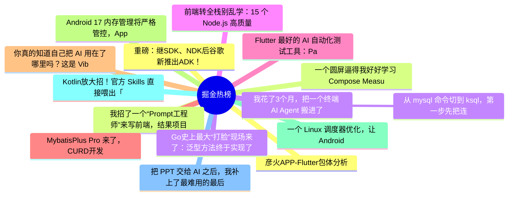

# 掘金热榜 Top 15 (2026-06-06)

## 思维导图

## 列表（15 条）

### 1. 彦火APP-Flutter包体分析
- **链接**: [https://juejin.cn/post/7646674707382927375](https://juejin.cn/post/7646674707382927375)
- **作者**: 我是小胡胡
- **热度**: 1287 | **浏览**: 2414 | **点赞**: 16 | **评论**: 7

### 2. 我招了一个“Prompt工程师”来写前端，结果项目差点崩了
- **链接**: [https://juejin.cn/post/7647355871891587087](https://juejin.cn/post/7647355871891587087)
- **作者**: kyriewen
- **热度**: 810 | **浏览**: 1256 | **点赞**: 9 | **评论**: 19

### 3. Go史上最大“打脸”现场来了：泛型方法终于实现了
- **链接**: [https://juejin.cn/post/7646996673109573684](https://juejin.cn/post/7646996673109573684)
- **作者**: 吴佳浩Alben
- **热度**: 684 | **浏览**: 1113 | **点赞**: 19 | **评论**: 2

### 4. 前端转全栈别乱学：15 个 Node.js 高质量资源，按能力地图整理
- **链接**: [https://juejin.cn/post/7647086721050525705](https://juejin.cn/post/7647086721050525705)
- **作者**: ikoala
- **热度**: 603 | **浏览**: 773 | **点赞**: 29 | **评论**: 0

### 5. Flutter 最好的 AI 自动化测试工具：Patrol
- **链接**: [https://juejin.cn/post/7646696467931807807](https://juejin.cn/post/7646696467931807807)
- **作者**: 恋猫de小郭
- **热度**: 603 | **浏览**: 1001 | **点赞**: 16 | **评论**: 1

### 6. MybatisPlus Pro 来了，CURD开发效率直接拉满！
- **链接**: [https://juejin.cn/post/7646606448858595364](https://juejin.cn/post/7646606448858595364)
- **作者**: 苏三说技术
- **热度**: 468 | **浏览**: 921 | **点赞**: 4 | **评论**: 2

### 7. 你真的知道自己把 AI 用在了哪里吗？这是 Vibe Usage 想回答的问题
- **链接**: [https://juejin.cn/post/7647175057976115200](https://juejin.cn/post/7647175057976115200)
- **作者**: XCaptain
- **热度**: 351 | **浏览**: 605 | **点赞**: 8 | **评论**: 1

### 8. Android 17 内存管理将严格管控，App 要注意适配
- **链接**: [https://juejin.cn/post/7647356541462806580](https://juejin.cn/post/7647356541462806580)
- **作者**: 恋猫de小郭
- **热度**: 342 | **浏览**: 527 | **点赞**: 11 | **评论**: 1

### 9. 一个 Linux 调度器优化，让 Android 多耗 20% 的电，传音工程师如何发现问题？
- **链接**: [https://juejin.cn/post/7646955656403238966](https://juejin.cn/post/7646955656403238966)
- **作者**: 恋猫de小郭
- **热度**: 315 | **浏览**: 577 | **点赞**: 6 | **评论**: 1

### 10. Kotlin放大招！官方 Skills 直接喂出「专家级」代码
- **链接**: [https://juejin.cn/post/7647096140721340462](https://juejin.cn/post/7647096140721340462)
- **作者**: Carson带你学Android
- **热度**: 279 | **浏览**: 489 | **点赞**: 7 | **评论**: 0

### 11. 把 PPT 交给 AI 之后，我补上了最难用的最后一公里
- **链接**: [https://juejin.cn/post/7647175057976213504](https://juejin.cn/post/7647175057976213504)
- **作者**: HiSt
- **热度**: 243 | **浏览**: 332 | **点赞**: 7 | **评论**: 4

### 12. 重磅：继SDK、NDK后谷歌新推出ADK！
- **链接**: [https://juejin.cn/post/7647438301877501978](https://juejin.cn/post/7647438301877501978)
- **作者**: 黄林晴
- **热度**: 225 | **浏览**: 404 | **点赞**: 4 | **评论**: 1

### 13. 一个圆屏逼得我好好学习 Compose MeasurePolicy
- **链接**: [https://juejin.cn/post/7646960545632272434](https://juejin.cn/post/7646960545632272434)
- **作者**: RockByte
- **热度**: 207 | **浏览**: 348 | **点赞**: 5 | **评论**: 1

### 14. 我花了3个月，把一个终端 AI Agent 搬进了浏览器——踩坑全记录
- **链接**: [https://juejin.cn/post/7646674857891217454](https://juejin.cn/post/7646674857891217454)
- **作者**: 夜焱辰
- **热度**: 189 | **浏览**: 307 | **点赞**: 3 | **评论**: 3

### 15.  从 mysql 命令切到 ksql，第一步先把连接搞明白
- **链接**: [https://juejin.cn/post/7647434190326841371](https://juejin.cn/post/7647434190326841371)
- **作者**: 一只牛博
- **热度**: 189 | **浏览**: 439 | **点赞**: 0 | **评论**: 0
