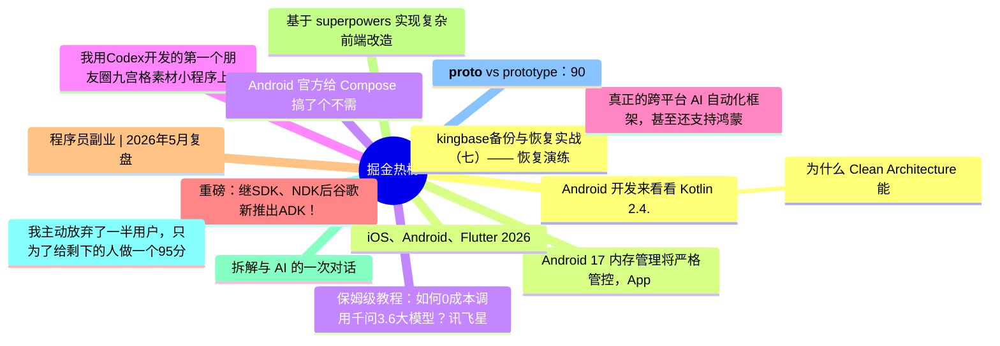

# 掘金热榜 Top 15 (2026-06-09)

## 思维导图

## 列表（15 条）

### 1. kingbase备份与恢复实战（七）—— 恢复演练与验收：从“能恢复”到“可交付预案”
- **链接**: [https://juejin.cn/post/7648121330443812864](https://juejin.cn/post/7648121330443812864)
- **作者**: 倔强的石头_
- **热度**: 1854 | **浏览**: 4059 | **点赞**: 3 | **评论**: 1

### 2. Android 17 内存管理将严格管控，App 要注意适配
- **链接**: [https://juejin.cn/post/7647356541462806580](https://juejin.cn/post/7647356541462806580)
- **作者**: 恋猫de小郭
- **热度**: 666 | **浏览**: 1120 | **点赞**: 17 | **评论**: 2

### 3. 保姆级教程：如何0成本调用千问3.6大模型？讯飞星辰MaaS平台上手指南
- **链接**: [https://juejin.cn/post/7648157267778486287](https://juejin.cn/post/7648157267778486287)
- **作者**: 倔强的石头_
- **热度**: 504 | **浏览**: 1031 | **点赞**: 5 | **评论**: 0

### 4. 我用Codex开发的第一个朋友圈九宫格素材小程序上线啦
- **链接**: [https://juejin.cn/post/7648545475571564563](https://juejin.cn/post/7648545475571564563)
- **作者**: 静Yu
- **热度**: 459 | **浏览**: 1010 | **点赞**: 1 | **评论**: 0

### 5. 真正的跨平台 AI 自动化框架，甚至还支持鸿蒙
- **链接**: [https://juejin.cn/post/7648520470531473471](https://juejin.cn/post/7648520470531473471)
- **作者**: 恋猫de小郭
- **热度**: 405 | **浏览**: 633 | **点赞**: 10 | **评论**: 4

### 6. 重磅：继SDK、NDK后谷歌新推出ADK！
- **链接**: [https://juejin.cn/post/7647438301877501978](https://juejin.cn/post/7647438301877501978)
- **作者**: 黄林晴
- **热度**: 369 | **浏览**: 708 | **点赞**: 5 | **评论**: 1

### 7. 程序员副业 | 2026年5月复盘
- **链接**: [https://juejin.cn/post/7648120903580647467](https://juejin.cn/post/7648120903580647467)
- **作者**: 嘟嘟MD
- **热度**: 351 | **浏览**: 628 | **点赞**: 6 | **评论**: 2

### 8. 基于 superpowers 实现复杂前端改造
- **链接**: [https://juejin.cn/post/7647868075887345674](https://juejin.cn/post/7647868075887345674)
- **作者**: 袋鼠云数栈UED团队
- **热度**: 333 | **浏览**: 645 | **点赞**: 4 | **评论**: 1

### 9. 拆解与 AI 的一次对话
- **链接**: [https://juejin.cn/post/7647825202339987465](https://juejin.cn/post/7647825202339987465)
- **作者**: 江澎涌
- **热度**: 324 | **浏览**: 460 | **点赞**: 9 | **评论**: 4

### 10. 我主动放弃了一半用户，只为了给剩下的人做一个95分的功能
- **链接**: [https://juejin.cn/post/7647882996956626998](https://juejin.cn/post/7647882996956626998)
- **作者**: 鸿蒙独立开发者
- **热度**: 297 | **浏览**: 513 | **点赞**: 3 | **评论**: 5

### 11. __proto__ vs prototype：90% 的人分不清的 JavaScript 核心
- **链接**: [https://juejin.cn/post/7648213611392172051](https://juejin.cn/post/7648213611392172051)
- **作者**: Ricado
- **热度**: 270 | **浏览**: 282 | **点赞**: 12 | **评论**: 4

### 12. Android 开发来看看 Kotlin 2.4.0 更新了个啥
- **链接**: [https://juejin.cn/post/7647679272668676105](https://juejin.cn/post/7647679272668676105)
- **作者**: RockByte
- **热度**: 252 | **浏览**: 507 | **点赞**: 3 | **评论**: 0

### 13.  为什么 Clean Architecture 能让 ViewModel 保持轻量？
- **链接**: [https://juejin.cn/post/7647072739918184458](https://juejin.cn/post/7647072739918184458)
- **作者**: 潜龙勿用之化骨龙
- **热度**: 252 | **浏览**: 395 | **点赞**: 7 | **评论**: 2

### 14. iOS、Android、Flutter 2026 流行框架对比
- **链接**: [https://juejin.cn/post/7648169201848401970](https://juejin.cn/post/7648169201848401970)
- **作者**: 王若风
- **热度**: 243 | **浏览**: 438 | **点赞**: 5 | **评论**: 1

### 15. Android 官方给 Compose 搞了个不需要 UI 环境的 Composable
- **链接**: [https://juejin.cn/post/7648174967504404522](https://juejin.cn/post/7648174967504404522)
- **作者**: 恋猫de小郭
- **热度**: 234 | **浏览**: 459 | **点赞**: 4 | **评论**: 0
