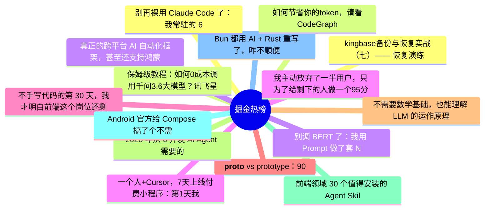

# 掘金热榜 Top 15 (2026-06-10)

## 思维导图

## 列表（15 条）

### 1. kingbase备份与恢复实战（七）—— 恢复演练与验收：从“能恢复”到“可交付预案”
- **链接**: [https://juejin.cn/post/7648121330443812864](https://juejin.cn/post/7648121330443812864)
- **作者**: 倔强的石头_
- **热度**: 2016 | **浏览**: 4416 | **点赞**: 3 | **评论**: 1

### 2. 保姆级教程：如何0成本调用千问3.6大模型？讯飞星辰MaaS平台上手指南
- **链接**: [https://juejin.cn/post/7648157267778486287](https://juejin.cn/post/7648157267778486287)
- **作者**: 倔强的石头_
- **热度**: 774 | **浏览**: 1553 | **点赞**: 9 | **评论**: 0

### 3. 真正的跨平台 AI 自动化框架，甚至还支持鸿蒙
- **链接**: [https://juejin.cn/post/7648520470531473471](https://juejin.cn/post/7648520470531473471)
- **作者**: 恋猫de小郭
- **热度**: 729 | **浏览**: 1246 | **点赞**: 15 | **评论**: 4

### 4. 我主动放弃了一半用户，只为了给剩下的人做一个95分的功能
- **链接**: [https://juejin.cn/post/7647882996956626998](https://juejin.cn/post/7647882996956626998)
- **作者**: 鸿蒙独立开发者
- **热度**: 630 | **浏览**: 1035 | **点赞**: 9 | **评论**: 10

### 5. 不手写代码的第 30 天，我才明白前端这个岗位还剩什么
- **链接**: [https://juejin.cn/post/7648915999020023817](https://juejin.cn/post/7648915999020023817)
- **作者**: 前端一小卒
- **热度**: 603 | **浏览**: 1093 | **点赞**: 12 | **评论**: 1

### 6. __proto__ vs prototype：90% 的人分不清的 JavaScript 核心
- **链接**: [https://juejin.cn/post/7648213611392172051](https://juejin.cn/post/7648213611392172051)
- **作者**: Ricado
- **热度**: 594 | **浏览**: 715 | **点赞**: 25 | **评论**: 6

### 7. 不需要数学基础，也能理解 LLM 的运作原理
- **链接**: [https://juejin.cn/post/7649105672894464006](https://juejin.cn/post/7649105672894464006)
- **作者**: 恋猫de小郭
- **热度**: 486 | **浏览**: 732 | **点赞**: 17 | **评论**: 1

### 8. 2026 年从 0 开发 AI Agent 需要的 10 个技能
- **链接**: [https://juejin.cn/post/7648894966207152180](https://juejin.cn/post/7648894966207152180)
- **作者**: 双越AI_club
- **热度**: 432 | **浏览**: 775 | **点赞**: 7 | **评论**: 3

### 9. 前端领域 30 个值得安装的 Agent Skills
- **链接**: [https://juejin.cn/post/7648545475571859475](https://juejin.cn/post/7648545475571859475)
- **作者**: 小小小小宇
- **热度**: 432 | **浏览**: 797 | **点赞**: 9 | **评论**: 0

### 10. Android 官方给 Compose 搞了个不需要 UI 环境的 Composable
- **链接**: [https://juejin.cn/post/7648174967504404522](https://juejin.cn/post/7648174967504404522)
- **作者**: 恋猫de小郭
- **热度**: 432 | **浏览**: 839 | **点赞**: 6 | **评论**: 1

### 11. Bun 都用 AI + Rust 重写了，咋不顺便把 Node.js 的 API 全兼容了？
- **链接**: [https://juejin.cn/post/7648424256876658703](https://juejin.cn/post/7648424256876658703)
- **作者**: 半刻纬度
- **热度**: 297 | **浏览**: 509 | **点赞**: 4 | **评论**: 4

### 12. 别再裸用 Claude Code 了：我常驻的 6 个 MCP + 4 条提效工作流（亲测）
- **链接**: [https://juejin.cn/post/7648152309277933608](https://juejin.cn/post/7648152309277933608)
- **作者**: 大鹏AI教育
- **热度**: 297 | **浏览**: 632 | **点赞**: 1 | **评论**: 1

### 13. 如何节省你的token，请看CodeGraph
- **链接**: [https://juejin.cn/post/7648643814988120107](https://juejin.cn/post/7648643814988120107)
- **作者**: 前端的阶梯
- **热度**: 279 | **浏览**: 528 | **点赞**: 3 | **评论**: 2

### 14. 别调 BERT 了：我用 Prompt 做了套 NLP 系统，20 分钟搞定
- **链接**: [https://juejin.cn/post/7647918647206559763](https://juejin.cn/post/7647918647206559763)
- **作者**: Ricado
- **热度**: 279 | **浏览**: 275 | **点赞**: 16 | **评论**: 2

### 15. 一个人+Cursor，7天上线付费小程序：第1天我就想放弃了
- **链接**: [https://juejin.cn/post/7648213611391598611](https://juejin.cn/post/7648213611391598611)
- **作者**: kyriewen
- **热度**: 279 | **浏览**: 525 | **点赞**: 3 | **评论**: 2
