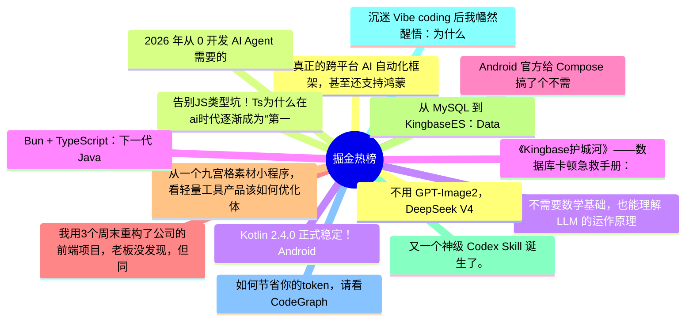

# 掘金热榜 Top 15 (2026-06-11)

## 思维导图

## 列表（15 条）

### 1. 真正的跨平台 AI 自动化框架，甚至还支持鸿蒙
- **链接**: [https://juejin.cn/post/7648520470531473471](https://juejin.cn/post/7648520470531473471)
- **作者**: 恋猫de小郭
- **热度**: 1107 | **浏览**: 1938 | **点赞**: 21 | **评论**: 6

### 2. 2026 年从 0 开发 AI Agent 需要的 10 个技能
- **链接**: [https://juejin.cn/post/7648894966207152180](https://juejin.cn/post/7648894966207152180)
- **作者**: 双越AI_club
- **热度**: 954 | **浏览**: 1654 | **点赞**: 16 | **评论**: 8

### 3. 不需要数学基础，也能理解 LLM 的运作原理
- **链接**: [https://juejin.cn/post/7649105672894464006](https://juejin.cn/post/7649105672894464006)
- **作者**: 恋猫de小郭
- **热度**: 810 | **浏览**: 1279 | **点赞**: 25 | **评论**: 2

### 4. 《Kingbase护城河》——数据库卡顿急救手册：会话状态深度解析与“僵尸进程”排查实战
- **链接**: [https://juejin.cn/post/7649298814721900578](https://juejin.cn/post/7649298814721900578)
- **作者**: 倔强的石头_
- **热度**: 612 | **浏览**: 1342 | **点赞**: 1 | **评论**: 0

### 5. Android 官方给 Compose 搞了个不需要 UI 环境的 Composable
- **链接**: [https://juejin.cn/post/7648174967504404522](https://juejin.cn/post/7648174967504404522)
- **作者**: 恋猫de小郭
- **热度**: 549 | **浏览**: 1050 | **点赞**: 8 | **评论**: 2

### 6. 我用3个周末重构了公司的前端项目，老板没发现，但同事都来找我要代码了
- **链接**: [https://juejin.cn/post/7649211548573925418](https://juejin.cn/post/7649211548573925418)
- **作者**: 柯克七七
- **热度**: 486 | **浏览**: 812 | **点赞**: 5 | **评论**: 9

### 7. 从一个九宫格素材小程序，看轻量工具产品该如何优化体验
- **链接**: [https://juejin.cn/post/7649333043737018410](https://juejin.cn/post/7649333043737018410)
- **作者**: 静Yu
- **热度**: 477 | **浏览**: 991 | **点赞**: 2 | **评论**: 2

### 8. 从 MySQL 到 KingbaseES：Database、Schema、User 一次讲透
- **链接**: [https://juejin.cn/post/7648852517350703147](https://juejin.cn/post/7648852517350703147)
- **作者**: 一只牛博
- **热度**: 450 | **浏览**: 962 | **点赞**: 1 | **评论**: 1

### 9. 又一个神级 Codex Skill 诞生了。
- **链接**: [https://juejin.cn/post/7649329229150650378](https://juejin.cn/post/7649329229150650378)
- **作者**: 沉默王二
- **热度**: 396 | **浏览**: 841 | **点赞**: 2 | **评论**: 1

### 10. 沉迷 Vibe coding 后我幡然醒悟：为什么可持续开发要回归半古法编程
- **链接**: [https://juejin.cn/post/7648829716128563251](https://juejin.cn/post/7648829716128563251)
- **作者**: 神奇小汤圆
- **热度**: 387 | **浏览**: 634 | **点赞**: 8 | **评论**: 4

### 11. 如何节省你的token，请看CodeGraph
- **链接**: [https://juejin.cn/post/7648643814988120107](https://juejin.cn/post/7648643814988120107)
- **作者**: 前端的阶梯
- **热度**: 360 | **浏览**: 666 | **点赞**: 4 | **评论**: 3

### 12. 不用 GPT-Image2，DeepSeek V4/GLM-5.1 + draw.io 就很顶!
- **链接**: [https://juejin.cn/post/7648855419078918150](https://juejin.cn/post/7648855419078918150)
- **作者**: 沉默王二
- **热度**: 342 | **浏览**: 671 | **点赞**: 2 | **评论**: 3

### 13. 告别JS类型坑！Ts为什么在ai时代逐渐成为"第一"语言
- **链接**: [https://juejin.cn/post/7648901848771149862](https://juejin.cn/post/7648901848771149862)
- **作者**: GuWenyue
- **热度**: 324 | **浏览**: 324 | **点赞**: 18 | **评论**: 2

### 14. Kotlin 2.4.0 正式稳定！Android 升级、Compose、KMP 全变化详解
- **链接**: [https://juejin.cn/post/7648301796494426139](https://juejin.cn/post/7648301796494426139)
- **作者**: 黄林晴
- **热度**: 324 | **浏览**: 546 | **点赞**: 4 | **评论**: 5

### 15. Bun + TypeScript：下一代 JavaScript 全栈开发的正确打开方式
- **链接**: [https://juejin.cn/post/7648903840467075082](https://juejin.cn/post/7648903840467075082)
- **作者**: JieE212
- **热度**: 315 | **浏览**: 170 | **点赞**: 26 | **评论**: 1
