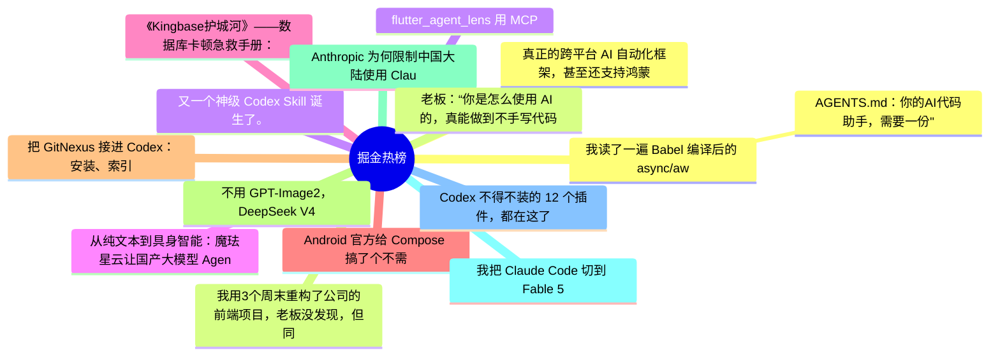

# 掘金热榜 Top 15 (2026-06-12)

## 思维导图

## 列表（15 条）

### 1. 真正的跨平台 AI 自动化框架，甚至还支持鸿蒙
- **链接**: [https://juejin.cn/post/7648520470531473471](https://juejin.cn/post/7648520470531473471)
- **作者**: 恋猫de小郭
- **热度**: 1467 | **浏览**: 2712 | **点赞**: 22 | **评论**: 7

### 2. 我用3个周末重构了公司的前端项目，老板没发现，但同事都来找我要代码了
- **链接**: [https://juejin.cn/post/7649211548573925418](https://juejin.cn/post/7649211548573925418)
- **作者**: 柯克七七
- **热度**: 1368 | **浏览**: 2243 | **点赞**: 14 | **评论**: 27

### 3. 又一个神级 Codex Skill 诞生了。
- **链接**: [https://juejin.cn/post/7649329229150650378](https://juejin.cn/post/7649329229150650378)
- **作者**: 沉默王二
- **热度**: 972 | **浏览**: 2013 | **点赞**: 6 | **评论**: 2

### 4. 从纯文本到具身智能：魔珐星云让国产大模型 Agent 拥有 3D 具身躯壳
- **链接**: [https://juejin.cn/post/7649738148373823529](https://juejin.cn/post/7649738148373823529)
- **作者**: 倔强的石头_
- **热度**: 738 | **浏览**: 1584 | **点赞**: 2 | **评论**: 1

### 5. 《Kingbase护城河》——数据库卡顿急救手册：会话状态深度解析与“僵尸进程”排查实战
- **链接**: [https://juejin.cn/post/7649298814721900578](https://juejin.cn/post/7649298814721900578)
- **作者**: 倔强的石头_
- **热度**: 702 | **浏览**: 1521 | **点赞**: 1 | **评论**: 1

### 6. Android 官方给 Compose 搞了个不需要 UI 环境的 Composable
- **链接**: [https://juejin.cn/post/7648174967504404522](https://juejin.cn/post/7648174967504404522)
- **作者**: 恋猫de小郭
- **热度**: 630 | **浏览**: 1212 | **点赞**: 8 | **评论**: 2

### 7. 把 GitNexus 接进 Codex：安装、索引、Web UI 和项目分析实操
- **链接**: [https://juejin.cn/post/7649633479534182436](https://juejin.cn/post/7649633479534182436)
- **作者**: 一只牛博
- **热度**: 486 | **浏览**: 1078 | **点赞**: 1 | **评论**: 0

### 8. 不用 GPT-Image2，DeepSeek V4/GLM-5.1 + draw.io 就很顶!
- **链接**: [https://juejin.cn/post/7648855419078918150](https://juejin.cn/post/7648855419078918150)
- **作者**: 沉默王二
- **热度**: 432 | **浏览**: 881 | **点赞**: 2 | **评论**: 3

### 9. Anthropic 为何限制中国大陆使用 Claude？
- **链接**: [https://juejin.cn/post/7649977961550987314](https://juejin.cn/post/7649977961550987314)
- **作者**: IT乐手
- **热度**: 432 | **浏览**: 739 | **点赞**: 7 | **评论**: 5

### 10. 我把 Claude Code 切到 Fable 5，先别急着兴奋
- **链接**: [https://juejin.cn/post/7649577388315017259](https://juejin.cn/post/7649577388315017259)
- **作者**: 孟健AI编程
- **热度**: 396 | **浏览**: 774 | **点赞**: 5 | **评论**: 1

### 11. Codex 不得不装的 12 个插件，都在这了
- **链接**: [https://juejin.cn/post/7649738148373725225](https://juejin.cn/post/7649738148373725225)
- **作者**: ikoala
- **热度**: 396 | **浏览**: 570 | **点赞**: 15 | **评论**: 2

### 12. 我读了一遍 Babel 编译后的 async/await，终于搞懂了它的原理（附 20 行手写实现）
- **链接**: [https://juejin.cn/post/7648866670523875363](https://juejin.cn/post/7648866670523875363)
- **作者**: kyriewen
- **热度**: 378 | **浏览**: 566 | **点赞**: 6 | **评论**: 8

### 13.  AGENTS.md：你的AI代码助手，需要一份"项目说明书"
- **链接**: [https://juejin.cn/post/7649018346516758591](https://juejin.cn/post/7649018346516758591)
- **作者**: 秋天的一阵风
- **热度**: 378 | **浏览**: 580 | **点赞**: 12 | **评论**: 1

### 14. 老板：“你是怎么使用 AI 的，真能做到不手写代码？为什么 Codex 在我手里感觉是个智障。。”我：“这样，然后再这样。。”老板直接跪了。
- **链接**: [https://juejin.cn/post/7649591353740460067](https://juejin.cn/post/7649591353740460067)
- **作者**: 沉默王二
- **热度**: 360 | **浏览**: 528 | **点赞**: 12 | **评论**: 2

### 15. flutter_agent_lens 用 MCP 服务，将 Flutter DevTools 暴露给 AI
- **链接**: [https://juejin.cn/post/7649337767211515910](https://juejin.cn/post/7649337767211515910)
- **作者**: 恋猫de小郭
- **热度**: 324 | **浏览**: 541 | **点赞**: 9 | **评论**: 1
