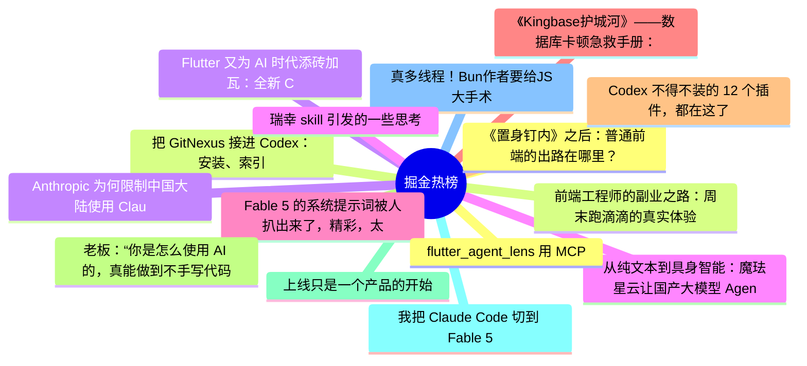

# 掘金热榜 Top 15 (2026-06-13)

## 思维导图

## 列表（15 条）

### 1. 《置身钉内》之后：普通前端的出路在哪里？
- **链接**: [https://juejin.cn/post/7650089863865565219](https://juejin.cn/post/7650089863865565219)
- **作者**: 勇宝趣学前端
- **热度**: 1377 | **浏览**: 2382 | **点赞**: 28 | **评论**: 6

### 2. 把 GitNexus 接进 Codex：安装、索引、Web UI 和项目分析实操
- **链接**: [https://juejin.cn/post/7649633479534182436](https://juejin.cn/post/7649633479534182436)
- **作者**: 一只牛博
- **热度**: 1152 | **浏览**: 2464 | **点赞**: 5 | **评论**: 1

### 3. Anthropic 为何限制中国大陆使用 Claude？
- **链接**: [https://juejin.cn/post/7649977961550987314](https://juejin.cn/post/7649977961550987314)
- **作者**: IT乐手
- **热度**: 1116 | **浏览**: 1991 | **点赞**: 13 | **评论**: 12

### 4. 从纯文本到具身智能：魔珐星云让国产大模型 Agent 拥有 3D 具身躯壳
- **链接**: [https://juejin.cn/post/7649738148373823529](https://juejin.cn/post/7649738148373823529)
- **作者**: 倔强的石头_
- **热度**: 855 | **浏览**: 1779 | **点赞**: 5 | **评论**: 2

### 5. Fable 5 的系统提示词被人扒出来了，精彩，太精彩了。
- **链接**: [https://juejin.cn/post/7650052991786401832](https://juejin.cn/post/7650052991786401832)
- **作者**: cxuanAI
- **热度**: 783 | **浏览**: 1250 | **点赞**: 21 | **评论**: 4

### 6. 《Kingbase护城河》——数据库卡顿急救手册：会话状态深度解析与“僵尸进程”排查实战
- **链接**: [https://juejin.cn/post/7649298814721900578](https://juejin.cn/post/7649298814721900578)
- **作者**: 倔强的石头_
- **热度**: 747 | **浏览**: 1638 | **点赞**: 1 | **评论**: 1

### 7. Codex 不得不装的 12 个插件，都在这了
- **链接**: [https://juejin.cn/post/7649738148373725225](https://juejin.cn/post/7649738148373725225)
- **作者**: ikoala
- **热度**: 729 | **浏览**: 1123 | **点赞**: 21 | **评论**: 4

### 8. 老板：“你是怎么使用 AI 的，真能做到不手写代码？为什么 Codex 在我手里感觉是个智障。。”我：“这样，然后再这样。。”老板直接跪了。
- **链接**: [https://juejin.cn/post/7649591353740460067](https://juejin.cn/post/7649591353740460067)
- **作者**: 沉默王二
- **热度**: 549 | **浏览**: 840 | **点赞**: 16 | **评论**: 4

### 9. 上线只是一个产品的开始
- **链接**: [https://juejin.cn/post/7650065510063587370](https://juejin.cn/post/7650065510063587370)
- **作者**: 静Yu
- **热度**: 531 | **浏览**: 1089 | **点赞**: 3 | **评论**: 2

### 10. 我把 Claude Code 切到 Fable 5，先别急着兴奋
- **链接**: [https://juejin.cn/post/7649577388315017259](https://juejin.cn/post/7649577388315017259)
- **作者**: 孟健AI编程
- **热度**: 522 | **浏览**: 1002 | **点赞**: 6 | **评论**: 2

### 11. 真多线程！Bun作者要给JS大手术
- **链接**: [https://juejin.cn/post/7649936611648700454](https://juejin.cn/post/7649936611648700454)
- **作者**: 云前端
- **热度**: 450 | **浏览**: 774 | **点赞**: 6 | **评论**: 6

### 12. flutter_agent_lens 用 MCP 服务，将 Flutter DevTools 暴露给 AI
- **链接**: [https://juejin.cn/post/7649337767211515910](https://juejin.cn/post/7649337767211515910)
- **作者**: 恋猫de小郭
- **热度**: 396 | **浏览**: 653 | **点赞**: 10 | **评论**: 2

### 13. 前端工程师的副业之路：周末跑滴滴的真实体验
- **链接**: [https://juejin.cn/post/7649974149243289646](https://juejin.cn/post/7649974149243289646)
- **作者**: 随风行酱
- **热度**: 396 | **浏览**: 641 | **点赞**: 7 | **评论**: 5

### 14. Flutter 又为 AI 时代添砖加瓦：全新 ComponentLibrary 提议
- **链接**: [https://juejin.cn/post/7649666537947807780](https://juejin.cn/post/7649666537947807780)
- **作者**: 恋猫de小郭
- **热度**: 396 | **浏览**: 642 | **点赞**: 8 | **评论**: 4

### 15. 瑞幸 skill 引发的一些思考
- **链接**: [https://juejin.cn/post/7650146543882518591](https://juejin.cn/post/7650146543882518591)
- **作者**: ZzT
- **热度**: 378 | **浏览**: 679 | **点赞**: 6 | **评论**: 3
