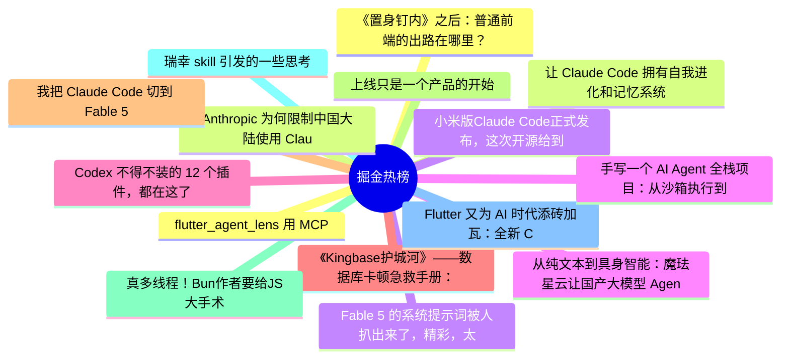

# 掘金热榜 Top 15 (2026-06-14)

## 思维导图

## 列表（15 条）

### 1. 《置身钉内》之后：普通前端的出路在哪里？
- **链接**: [https://juejin.cn/post/7650089863865565219](https://juejin.cn/post/7650089863865565219)
- **作者**: 勇宝趣学前端
- **热度**: 1701 | **浏览**: 2929 | **点赞**: 37 | **评论**: 7

### 2. Anthropic 为何限制中国大陆使用 Claude？
- **链接**: [https://juejin.cn/post/7649977961550987314](https://juejin.cn/post/7649977961550987314)
- **作者**: IT乐手
- **热度**: 1269 | **浏览**: 2297 | **点赞**: 15 | **评论**: 12

### 3. Fable 5 的系统提示词被人扒出来了，精彩，太精彩了。
- **链接**: [https://juejin.cn/post/7650052991786401832](https://juejin.cn/post/7650052991786401832)
- **作者**: cxuanAI
- **热度**: 1026 | **浏览**: 1651 | **点赞**: 27 | **评论**: 5

### 4. 从纯文本到具身智能：魔珐星云让国产大模型 Agent 拥有 3D 具身躯壳
- **链接**: [https://juejin.cn/post/7649738148373823529](https://juejin.cn/post/7649738148373823529)
- **作者**: 倔强的石头_
- **热度**: 891 | **浏览**: 1845 | **点赞**: 5 | **评论**: 2

### 5. Codex 不得不装的 12 个插件，都在这了
- **链接**: [https://juejin.cn/post/7649738148373725225](https://juejin.cn/post/7649738148373725225)
- **作者**: ikoala
- **热度**: 891 | **浏览**: 1368 | **点赞**: 27 | **评论**: 4

### 6. 《Kingbase护城河》——数据库卡顿急救手册：会话状态深度解析与“僵尸进程”排查实战
- **链接**: [https://juejin.cn/post/7649298814721900578](https://juejin.cn/post/7649298814721900578)
- **作者**: 倔强的石头_
- **热度**: 774 | **浏览**: 1680 | **点赞**: 1 | **评论**: 1

### 7. 我把 Claude Code 切到 Fable 5，先别急着兴奋
- **链接**: [https://juejin.cn/post/7649577388315017259](https://juejin.cn/post/7649577388315017259)
- **作者**: 孟健AI编程
- **热度**: 567 | **浏览**: 1086 | **点赞**: 7 | **评论**: 2

### 8. 上线只是一个产品的开始
- **链接**: [https://juejin.cn/post/7650065510063587370](https://juejin.cn/post/7650065510063587370)
- **作者**: 静Yu
- **热度**: 549 | **浏览**: 1132 | **点赞**: 3 | **评论**: 2

### 9. 真多线程！Bun作者要给JS大手术
- **链接**: [https://juejin.cn/post/7649936611648700454](https://juejin.cn/post/7649936611648700454)
- **作者**: 云前端
- **热度**: 540 | **浏览**: 928 | **点赞**: 7 | **评论**: 7

### 10. 瑞幸 skill 引发的一些思考
- **链接**: [https://juejin.cn/post/7650146543882518591](https://juejin.cn/post/7650146543882518591)
- **作者**: ZzT
- **热度**: 459 | **浏览**: 811 | **点赞**: 8 | **评论**: 3

### 11. Flutter 又为 AI 时代添砖加瓦：全新 ComponentLibrary 提议
- **链接**: [https://juejin.cn/post/7649666537947807780](https://juejin.cn/post/7649666537947807780)
- **作者**: 恋猫de小郭
- **热度**: 432 | **浏览**: 706 | **点赞**: 9 | **评论**: 4

### 12. flutter_agent_lens 用 MCP 服务，将 Flutter DevTools 暴露给 AI
- **链接**: [https://juejin.cn/post/7649337767211515910](https://juejin.cn/post/7649337767211515910)
- **作者**: 恋猫de小郭
- **热度**: 423 | **浏览**: 699 | **点赞**: 11 | **评论**: 2

### 13. 让 Claude Code 拥有自我进化和记忆系统｜得物技术
- **链接**: [https://juejin.cn/post/7649571695950856234](https://juejin.cn/post/7649571695950856234)
- **作者**: 得物技术
- **热度**: 351 | **浏览**: 617 | **点赞**: 6 | **评论**: 3

### 14. 小米版Claude Code正式发布，这次开源给到夯。
- **链接**: [https://juejin.cn/post/7650451521307770923](https://juejin.cn/post/7650451521307770923)
- **作者**: 沉默王二
- **热度**: 351 | **浏览**: 586 | **点赞**: 10 | **评论**: 0

### 15. 手写一个 AI Agent 全栈项目：从沙箱执行到子智能体的完整实现
- **链接**: [https://juejin.cn/post/7649578478749745194](https://juejin.cn/post/7649578478749745194)
- **作者**: JS菌
- **热度**: 324 | **浏览**: 485 | **点赞**: 10 | **评论**: 2
