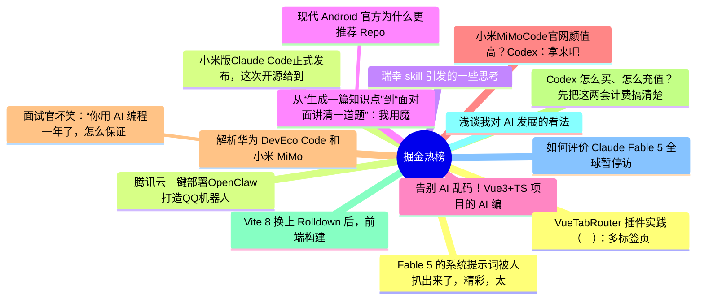

# 掘金热榜 Top 15 (2026-06-15)

## 思维导图

## 列表（15 条）

### 1. Fable 5 的系统提示词被人扒出来了，精彩，太精彩了。
- **链接**: [https://juejin.cn/post/7650052991786401832](https://juejin.cn/post/7650052991786401832)
- **作者**: cxuanAI
- **热度**: 2943 | **浏览**: 5333 | **点赞**: 48 | **评论**: 13

### 2. 小米版Claude Code正式发布，这次开源给到夯。
- **链接**: [https://juejin.cn/post/7650451521307770923](https://juejin.cn/post/7650451521307770923)
- **作者**: 沉默王二
- **热度**: 1665 | **浏览**: 3188 | **点赞**: 20 | **评论**: 6

### 3. 瑞幸 skill 引发的一些思考
- **链接**: [https://juejin.cn/post/7650146543882518591](https://juejin.cn/post/7650146543882518591)
- **作者**: ZzT
- **热度**: 963 | **浏览**: 1732 | **点赞**: 11 | **评论**: 10

### 4. 从“生成一篇知识点”到“面对面讲清一道题”：我用魔珐星云改造 AI 教育助手的实践
- **链接**: [https://juejin.cn/post/7651268339474202643](https://juejin.cn/post/7651268339474202643)
- **作者**: 静Yu
- **热度**: 603 | **浏览**: 1325 | **点赞**: 1 | **评论**: 0

### 5.  现代 Android 官方为什么更推荐 Repository 暴露 `suspend fun`，而不是在内部 `launch`
- **链接**: [https://juejin.cn/post/7650074080125599790](https://juejin.cn/post/7650074080125599790)
- **作者**: 潜龙勿用之化骨龙
- **热度**: 540 | **浏览**: 783 | **点赞**: 13 | **评论**: 8

### 6. 告别 AI 乱码！Vue3+TS 项目的 AI 编码助手规范实践
- **链接**: [https://juejin.cn/post/7650089863866286115](https://juejin.cn/post/7650089863866286115)
- **作者**: VOLUN
- **热度**: 477 | **浏览**: 629 | **点赞**: 14 | **评论**: 10

### 7. 小米MiMoCode官网颜值高？Codex：拿来吧，您嘞！1:1完美复刻～
- **链接**: [https://juejin.cn/post/7650352436700774400](https://juejin.cn/post/7650352436700774400)
- **作者**: 卡卡罗特AI
- **热度**: 423 | **浏览**: 693 | **点赞**: 5 | **评论**: 8

### 8. 解析华为 DevEco Code 和小米 MiMo Code，都基于 OpenCode ，有什么区别？
- **链接**: [https://juejin.cn/post/7650935690218209321](https://juejin.cn/post/7650935690218209321)
- **作者**: 恋猫de小郭
- **热度**: 378 | **浏览**: 670 | **点赞**: 7 | **评论**: 2

### 9.  面试官坏笑：“你用 AI 编程一年了，怎么保证 Claude Code 写出来的代码是对的？”我：“直接上 Claude Fable 5 啊！”
- **链接**: [https://juejin.cn/post/7650809417412509732](https://juejin.cn/post/7650809417412509732)
- **作者**: 沉默王二
- **热度**: 297 | **浏览**: 524 | **点赞**: 7 | **评论**: 0

### 10. Codex 怎么买、怎么充值？先把这两套计费搞清楚
- **链接**: [https://juejin.cn/post/7651176694349545506](https://juejin.cn/post/7651176694349545506)
- **作者**: ikoala
- **热度**: 288 | **浏览**: 363 | **点赞**: 13 | **评论**: 1

### 11. Vite 8 换上 Rolldown 后，前端构建真的会快很多吗？
- **链接**: [https://juejin.cn/post/7650313866518446143](https://juejin.cn/post/7650313866518446143)
- **作者**: 大前端历险记
- **热度**: 261 | **浏览**: 496 | **点赞**: 3 | **评论**: 2

### 12. 浅谈我对 AI 发展的看法
- **链接**: [https://juejin.cn/post/7650809417412935716](https://juejin.cn/post/7650809417412935716)
- **作者**: 我不是外星人
- **热度**: 234 | **浏览**: 356 | **点赞**: 8 | **评论**: 1

### 13. 如何评价 Claude Fable 5 全球暂停访问？
- **链接**: [https://juejin.cn/post/7650441125600165898](https://juejin.cn/post/7650441125600165898)
- **作者**: 勇宝趣学前端
- **热度**: 234 | **浏览**: 503 | **点赞**: 1 | **评论**: 0

### 14. VueTabRouter 插件实践（一）：多标签页不是一排 TabBar
- **链接**: [https://juejin.cn/post/7650417394410930191](https://juejin.cn/post/7650417394410930191)
- **作者**: xsbcme
- **热度**: 225 | **浏览**: 305 | **点赞**: 5 | **评论**: 5

### 15. 腾讯云一键部署OpenClaw打造QQ机器人
- **链接**: [https://juejin.cn/post/7651145221669355571](https://juejin.cn/post/7651145221669355571)
- **作者**: 倔强的石头_
- **热度**: 216 | **浏览**: 496 | **点赞**: 0 | **评论**: 0
