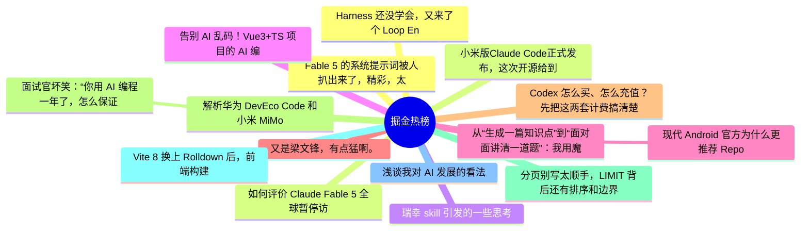

# 掘金热榜 Top 15 (2026-06-16)

## 思维导图

## 列表（15 条）

### 1. Fable 5 的系统提示词被人扒出来了，精彩，太精彩了。
- **链接**: [https://juejin.cn/post/7650052991786401832](https://juejin.cn/post/7650052991786401832)
- **作者**: cxuanAI
- **热度**: 3591 | **浏览**: 6553 | **点赞**: 57 | **评论**: 16

### 2. 小米版Claude Code正式发布，这次开源给到夯。
- **链接**: [https://juejin.cn/post/7650451521307770923](https://juejin.cn/post/7650451521307770923)
- **作者**: 沉默王二
- **热度**: 2196 | **浏览**: 4288 | **点赞**: 23 | **评论**: 8

### 3. 瑞幸 skill 引发的一些思考
- **链接**: [https://juejin.cn/post/7650146543882518591](https://juejin.cn/post/7650146543882518591)
- **作者**: ZzT
- **热度**: 1206 | **浏览**: 2170 | **点赞**: 12 | **评论**: 14

### 4. 告别 AI 乱码！Vue3+TS 项目的 AI 编码助手规范实践
- **链接**: [https://juejin.cn/post/7650089863866286115](https://juejin.cn/post/7650089863866286115)
- **作者**: VOLUN
- **热度**: 720 | **浏览**: 992 | **点赞**: 21 | **评论**: 11

### 5. 从“生成一篇知识点”到“面对面讲清一道题”：我用魔珐星云改造 AI 教育助手的实践
- **链接**: [https://juejin.cn/post/7651268339474202643](https://juejin.cn/post/7651268339474202643)
- **作者**: 静Yu
- **热度**: 675 | **浏览**: 1461 | **点赞**: 3 | **评论**: 0

### 6.  现代 Android 官方为什么更推荐 Repository 暴露 `suspend fun`，而不是在内部 `launch`
- **链接**: [https://juejin.cn/post/7650074080125599790](https://juejin.cn/post/7650074080125599790)
- **作者**: 潜龙勿用之化骨龙
- **热度**: 603 | **浏览**: 926 | **点赞**: 13 | **评论**: 8

### 7. 又是梁文锋，有点猛啊。
- **链接**: [https://juejin.cn/post/7651461757568811060](https://juejin.cn/post/7651461757568811060)
- **作者**: CodeSheep
- **热度**: 567 | **浏览**: 1075 | **点赞**: 10 | **评论**: 1

### 8. Codex 怎么买、怎么充值？先把这两套计费搞清楚
- **链接**: [https://juejin.cn/post/7651176694349545506](https://juejin.cn/post/7651176694349545506)
- **作者**: ikoala
- **热度**: 540 | **浏览**: 825 | **点赞**: 17 | **评论**: 2

### 9. 解析华为 DevEco Code 和小米 MiMo Code，都基于 OpenCode ，有什么区别？
- **链接**: [https://juejin.cn/post/7650935690218209321](https://juejin.cn/post/7650935690218209321)
- **作者**: 恋猫de小郭
- **热度**: 531 | **浏览**: 976 | **点赞**: 7 | **评论**: 4

### 10.  面试官坏笑：“你用 AI 编程一年了，怎么保证 Claude Code 写出来的代码是对的？”我：“直接上 Claude Fable 5 啊！”
- **链接**: [https://juejin.cn/post/7650809417412509732](https://juejin.cn/post/7650809417412509732)
- **作者**: 沉默王二
- **热度**: 450 | **浏览**: 860 | **点赞**: 8 | **评论**: 0

### 11. 分页别写太顺手，LIMIT 背后还有排序和边界
- **链接**: [https://juejin.cn/post/7651261115465924654](https://juejin.cn/post/7651261115465924654)
- **作者**: 一只牛博
- **热度**: 396 | **浏览**: 886 | **点赞**: 0 | **评论**: 0

### 12. Vite 8 换上 Rolldown 后，前端构建真的会快很多吗？
- **链接**: [https://juejin.cn/post/7650313866518446143](https://juejin.cn/post/7650313866518446143)
- **作者**: 大前端历险记
- **热度**: 378 | **浏览**: 685 | **点赞**: 5 | **评论**: 3

### 13. 浅谈我对 AI 发展的看法
- **链接**: [https://juejin.cn/post/7650809417412935716](https://juejin.cn/post/7650809417412935716)
- **作者**: 我不是外星人
- **热度**: 324 | **浏览**: 479 | **点赞**: 11 | **评论**: 2

### 14. Harness 还没学会，又来了个 Loop Engineering ？
- **链接**: [https://juejin.cn/post/7651153611318460425](https://juejin.cn/post/7651153611318460425)
- **作者**: 朱涛的自习室
- **热度**: 279 | **浏览**: 517 | **点赞**: 5 | **评论**: 1

### 15. 如何评价 Claude Fable 5 全球暂停访问？
- **链接**: [https://juejin.cn/post/7650441125600165898](https://juejin.cn/post/7650441125600165898)
- **作者**: 勇宝趣学前端
- **热度**: 270 | **浏览**: 594 | **点赞**: 1 | **评论**: 0
