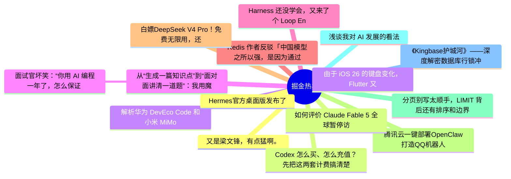

# 掘金热榜 Top 15 (2026-06-17)

## 思维导图

## 列表（15 条）

### 1. 又是梁文锋，有点猛啊。
- **链接**: [https://juejin.cn/post/7651461757568811060](https://juejin.cn/post/7651461757568811060)
- **作者**: CodeSheep
- **热度**: 2250 | **浏览**: 4033 | **点赞**: 41 | **评论**: 8

### 2. Codex 怎么买、怎么充值？先把这两套计费搞清楚
- **链接**: [https://juejin.cn/post/7651176694349545506](https://juejin.cn/post/7651176694349545506)
- **作者**: ikoala
- **热度**: 1017 | **浏览**: 1802 | **点赞**: 21 | **评论**: 3

### 3. 解析华为 DevEco Code 和小米 MiMo Code，都基于 OpenCode ，有什么区别？
- **链接**: [https://juejin.cn/post/7650935690218209321](https://juejin.cn/post/7650935690218209321)
- **作者**: 恋猫de小郭
- **热度**: 774 | **浏览**: 1458 | **点赞**: 9 | **评论**: 6

### 4. 从“生成一篇知识点”到“面对面讲清一道题”：我用魔珐星云改造 AI 教育助手的实践
- **链接**: [https://juejin.cn/post/7651268339474202643](https://juejin.cn/post/7651268339474202643)
- **作者**: 静Yu
- **热度**: 756 | **浏览**: 1637 | **点赞**: 3 | **评论**: 0

### 5.  面试官坏笑：“你用 AI 编程一年了，怎么保证 Claude Code 写出来的代码是对的？”我：“直接上 Claude Fable 5 啊！”
- **链接**: [https://juejin.cn/post/7650809417412509732](https://juejin.cn/post/7650809417412509732)
- **作者**: 沉默王二
- **热度**: 693 | **浏览**: 1379 | **点赞**: 9 | **评论**: 0

### 6. Harness 还没学会，又来了个 Loop Engineering ？
- **链接**: [https://juejin.cn/post/7651153611318460425](https://juejin.cn/post/7651153611318460425)
- **作者**: 朱涛的自习室
- **热度**: 558 | **浏览**: 1083 | **点赞**: 6 | **评论**: 3

### 7. Redis 作者反驳「中国模型之所以强，是因为通过 API 蒸馏了美国模型」
- **链接**: [https://juejin.cn/post/7651812581206491142](https://juejin.cn/post/7651812581206491142)
- **作者**: 恋猫de小郭
- **热度**: 549 | **浏览**: 949 | **点赞**: 8 | **评论**: 6

### 8. 白嫖DeepSeek V4 Pro！免费无限用，还能接入Claude-Code
- **链接**: [https://juejin.cn/post/7650882103059939337](https://juejin.cn/post/7650882103059939337)
- **作者**: 神奇小汤圆
- **热度**: 540 | **浏览**: 1115 | **点赞**: 4 | **评论**: 1

### 9. 腾讯云一键部署OpenClaw打造QQ机器人
- **链接**: [https://juejin.cn/post/7651145221669355571](https://juejin.cn/post/7651145221669355571)
- **作者**: 倔强的石头_
- **热度**: 531 | **浏览**: 1173 | **点赞**: 1 | **评论**: 0

### 10. 分页别写太顺手，LIMIT 背后还有排序和边界
- **链接**: [https://juejin.cn/post/7651261115465924654](https://juejin.cn/post/7651261115465924654)
- **作者**: 一只牛博
- **热度**: 477 | **浏览**: 1030 | **点赞**: 2 | **评论**: 0

### 11. 浅谈我对 AI 发展的看法
- **链接**: [https://juejin.cn/post/7650809417412935716](https://juejin.cn/post/7650809417412935716)
- **作者**: 我不是外星人
- **热度**: 414 | **浏览**: 658 | **点赞**: 12 | **评论**: 2

### 12. 《Kingbase护城河》——深度解密数据库行锁冲突与等待事件架构
- **链接**: [https://juejin.cn/post/7651494030828765235](https://juejin.cn/post/7651494030828765235)
- **作者**: 倔强的石头_
- **热度**: 405 | **浏览**: 899 | **点赞**: 1 | **评论**: 0

### 13. Hermes官方桌面版发布了
- **链接**: [https://juejin.cn/post/7651192027644428340](https://juejin.cn/post/7651192027644428340)
- **作者**: 程序员晓凡
- **热度**: 351 | **浏览**: 680 | **点赞**: 5 | **评论**: 0

### 14. 如何评价 Claude Fable 5 全球暂停访问？
- **链接**: [https://juejin.cn/post/7650441125600165898](https://juejin.cn/post/7650441125600165898)
- **作者**: 勇宝趣学前端
- **热度**: 342 | **浏览**: 719 | **点赞**: 3 | **评论**: 0

### 15. 由于 iOS 26 的键盘变化，Flutter 又要重构键盘区域逻辑
- **链接**: [https://juejin.cn/post/7651505036707512383](https://juejin.cn/post/7651505036707512383)
- **作者**: 恋猫de小郭
- **热度**: 324 | **浏览**: 520 | **点赞**: 7 | **评论**: 3
