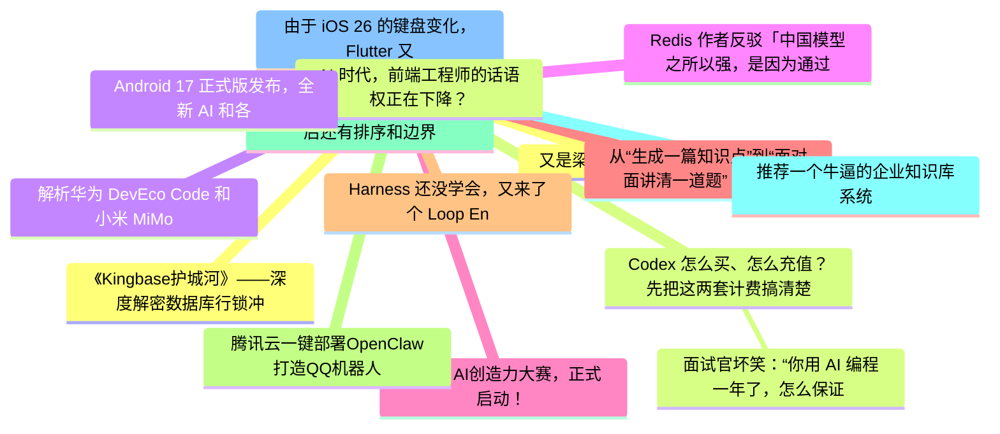

# 掘金热榜 Top 15 (2026-06-18)

## 思维导图

## 列表（15 条）

### 1. 又是梁文锋，有点猛啊。
- **链接**: [https://juejin.cn/post/7651461757568811060](https://juejin.cn/post/7651461757568811060)
- **作者**: CodeSheep
- **热度**: 3771 | **浏览**: 7121 | **点赞**: 49 | **评论**: 15

### 2. Codex 怎么买、怎么充值？先把这两套计费搞清楚
- **链接**: [https://juejin.cn/post/7651176694349545506](https://juejin.cn/post/7651176694349545506)
- **作者**: ikoala
- **热度**: 1728 | **浏览**: 3124 | **点赞**: 30 | **评论**: 7

### 3.  面试官坏笑：“你用 AI 编程一年了，怎么保证 Claude Code 写出来的代码是对的？”我：“直接上 Claude Fable 5 啊！”
- **链接**: [https://juejin.cn/post/7650809417412509732](https://juejin.cn/post/7650809417412509732)
- **作者**: 沉默王二
- **热度**: 1098 | **浏览**: 2240 | **点赞**: 12 | **评论**: 0

### 4. 解析华为 DevEco Code 和小米 MiMo Code，都基于 OpenCode ，有什么区别？
- **链接**: [https://juejin.cn/post/7650935690218209321](https://juejin.cn/post/7650935690218209321)
- **作者**: 恋猫de小郭
- **热度**: 1035 | **浏览**: 1918 | **点赞**: 13 | **评论**: 7

### 5. Redis 作者反驳「中国模型之所以强，是因为通过 API 蒸馏了美国模型」
- **链接**: [https://juejin.cn/post/7651812581206491142](https://juejin.cn/post/7651812581206491142)
- **作者**: 恋猫de小郭
- **热度**: 1008 | **浏览**: 1777 | **点赞**: 13 | **评论**: 11

### 6. TRAE AI创造力大赛，正式启动！ 
- **链接**: [https://juejin.cn/post/7651529231939878953](https://juejin.cn/post/7651529231939878953)
- **作者**: XCaptain
- **热度**: 900 | **浏览**: 1705 | **点赞**: 11 | **评论**: 5

### 7. 从“生成一篇知识点”到“面对面讲清一道题”：我用魔珐星云改造 AI 教育助手的实践
- **链接**: [https://juejin.cn/post/7651268339474202643](https://juejin.cn/post/7651268339474202643)
- **作者**: 静Yu
- **热度**: 837 | **浏览**: 1795 | **点赞**: 4 | **评论**: 0

### 8. Harness 还没学会，又来了个 Loop Engineering ？
- **链接**: [https://juejin.cn/post/7651153611318460425](https://juejin.cn/post/7651153611318460425)
- **作者**: 朱涛的自习室
- **热度**: 792 | **浏览**: 1569 | **点赞**: 7 | **评论**: 3

### 9. 腾讯云一键部署OpenClaw打造QQ机器人
- **链接**: [https://juejin.cn/post/7651145221669355571](https://juejin.cn/post/7651145221669355571)
- **作者**: 倔强的石头_
- **热度**: 594 | **浏览**: 1306 | **点赞**: 1 | **评论**: 0

### 10. 分页别写太顺手，LIMIT 背后还有排序和边界
- **链接**: [https://juejin.cn/post/7651261115465924654](https://juejin.cn/post/7651261115465924654)
- **作者**: 一只牛博
- **热度**: 540 | **浏览**: 1163 | **点赞**: 2 | **评论**: 0

### 11. 推荐一个牛逼的企业知识库系统
- **链接**: [https://juejin.cn/post/7651528402427723810](https://juejin.cn/post/7651528402427723810)
- **作者**: 苏三说技术
- **热度**: 477 | **浏览**: 870 | **点赞**: 9 | **评论**: 1

### 12. 由于 iOS 26 的键盘变化，Flutter 又要重构键盘区域逻辑
- **链接**: [https://juejin.cn/post/7651505036707512383](https://juejin.cn/post/7651505036707512383)
- **作者**: 恋猫de小郭
- **热度**: 468 | **浏览**: 781 | **点赞**: 10 | **评论**: 3

### 13. 《Kingbase护城河》——深度解密数据库行锁冲突与等待事件架构
- **链接**: [https://juejin.cn/post/7651494030828765235](https://juejin.cn/post/7651494030828765235)
- **作者**: 倔强的石头_
- **热度**: 450 | **浏览**: 993 | **点赞**: 1 | **评论**: 0

### 14. AI 时代，前端工程师的话语权正在下降？
- **链接**: [https://juejin.cn/post/7651188400656629787](https://juejin.cn/post/7651188400656629787)
- **作者**: 勇宝趣学前端
- **热度**: 450 | **浏览**: 897 | **点赞**: 6 | **评论**: 0

### 15. Android 17 正式版发布，全新 AI 和各种破坏性更新
- **链接**: [https://juejin.cn/post/7651930056574517289](https://juejin.cn/post/7651930056574517289)
- **作者**: 恋猫de小郭
- **热度**: 432 | **浏览**: 731 | **点赞**: 11 | **评论**: 1
