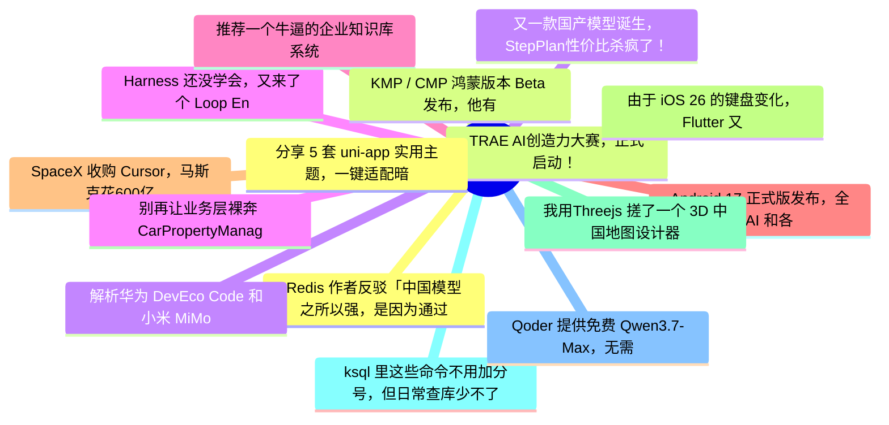

# 掘金热榜 Top 15 (2026-06-19)

## 思维导图

## 列表（15 条）

### 1. Redis 作者反驳「中国模型之所以强，是因为通过 API 蒸馏了美国模型」
- **链接**: [https://juejin.cn/post/7651812581206491142](https://juejin.cn/post/7651812581206491142)
- **作者**: 恋猫de小郭
- **热度**: 1440 | **浏览**: 2645 | **点赞**: 16 | **评论**: 12

### 2. TRAE AI创造力大赛，正式启动！ 
- **链接**: [https://juejin.cn/post/7651529231939878953](https://juejin.cn/post/7651529231939878953)
- **作者**: XCaptain
- **热度**: 1233 | **浏览**: 2333 | **点赞**: 16 | **评论**: 6

### 3. 解析华为 DevEco Code 和小米 MiMo Code，都基于 OpenCode ，有什么区别？
- **链接**: [https://juejin.cn/post/7650935690218209321](https://juejin.cn/post/7650935690218209321)
- **作者**: 恋猫de小郭
- **热度**: 1179 | **浏览**: 2226 | **点赞**: 13 | **评论**: 7

### 4. Harness 还没学会，又来了个 Loop Engineering ？
- **链接**: [https://juejin.cn/post/7651153611318460425](https://juejin.cn/post/7651153611318460425)
- **作者**: 朱涛的自习室
- **热度**: 1062 | **浏览**: 2007 | **点赞**: 14 | **评论**: 4

### 5. 推荐一个牛逼的企业知识库系统
- **链接**: [https://juejin.cn/post/7651528402427723810](https://juejin.cn/post/7651528402427723810)
- **作者**: 苏三说技术
- **热度**: 747 | **浏览**: 1325 | **点赞**: 14 | **评论**: 3

### 6. Android 17 正式版发布，全新 AI 和各种破坏性更新
- **链接**: [https://juejin.cn/post/7651930056574517289](https://juejin.cn/post/7651930056574517289)
- **作者**: 恋猫de小郭
- **热度**: 621 | **浏览**: 1142 | **点赞**: 11 | **评论**: 1

### 7. SpaceX 收购 Cursor，马斯克花600亿美元买了个代码编辑器
- **链接**: [https://juejin.cn/post/7651610218149707782](https://juejin.cn/post/7651610218149707782)
- **作者**: 知识药丸
- **热度**: 540 | **浏览**: 937 | **点赞**: 9 | **评论**: 5

### 8. 由于 iOS 26 的键盘变化，Flutter 又要重构键盘区域逻辑
- **链接**: [https://juejin.cn/post/7651505036707512383](https://juejin.cn/post/7651505036707512383)
- **作者**: 恋猫de小郭
- **热度**: 531 | **浏览**: 932 | **点赞**: 10 | **评论**: 3

### 9. 我用Threejs 搓了一个 3D 中国地图设计器，开箱即用
- **链接**: [https://juejin.cn/post/7651793637707202586](https://juejin.cn/post/7651793637707202586)
- **作者**: 柳杉
- **热度**: 486 | **浏览**: 771 | **点赞**: 10 | **评论**: 6

### 10. ksql 里这些命令不用加分号，但日常查库少不了
- **链接**: [https://juejin.cn/post/7652377935778070578](https://juejin.cn/post/7652377935778070578)
- **作者**: 一只牛博
- **热度**: 477 | **浏览**: 1075 | **点赞**: 0 | **评论**: 0

### 11. Qoder 提供免费 Qwen3.7-Max，无需订阅
- **链接**: [https://juejin.cn/post/7651476660258078766](https://juejin.cn/post/7651476660258078766)
- **作者**: SimonKing
- **热度**: 477 | **浏览**: 905 | **点赞**: 2 | **评论**: 6

### 12. 分享 5 套 uni-app 实用主题，一键适配暗黑模式
- **链接**: [https://juejin.cn/post/7651271964158083106](https://juejin.cn/post/7651271964158083106)
- **作者**: 前端梦工厂
- **热度**: 405 | **浏览**: 685 | **点赞**: 11 | **评论**: 0

### 13. KMP / CMP 鸿蒙版本 Beta 发布，他有什么特别之处？
- **链接**: [https://juejin.cn/post/7651954728705212422](https://juejin.cn/post/7651954728705212422)
- **作者**: 恋猫de小郭
- **热度**: 351 | **浏览**: 505 | **点赞**: 7 | **评论**: 7

### 14. 又一款国产模型诞生，StepPlan性价比杀疯了！
- **链接**: [https://juejin.cn/post/7651450218761650227](https://juejin.cn/post/7651450218761650227)
- **作者**: 沉默王二
- **热度**: 342 | **浏览**: 679 | **点赞**: 5 | **评论**: 0

### 15. 别再让业务层裸奔 CarPropertyManager 了！谈谈汽车车载核心服务的架构封装
- **链接**: [https://juejin.cn/post/7651056986952613939](https://juejin.cn/post/7651056986952613939)
- **作者**: 潜龙勿用之化骨龙
- **热度**: 333 | **浏览**: 484 | **点赞**: 9 | **评论**: 4
