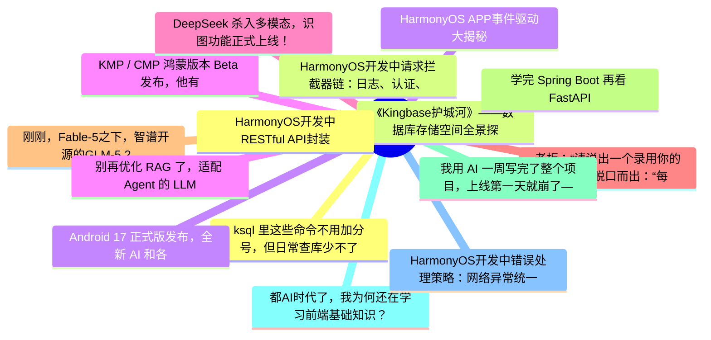

# 掘金热榜 Top 15 (2026-06-21)

## 思维导图

## 列表（15 条）

### 1. ksql 里这些命令不用加分号，但日常查库少不了
- **链接**: [https://juejin.cn/post/7652377935778070578](https://juejin.cn/post/7652377935778070578)
- **作者**: 一只牛博
- **热度**: 1647 | **浏览**: 3637 | **点赞**: 1 | **评论**: 1

### 2. 《Kingbase护城河》——数据库存储空间全景探测与精细化瘦身实战
- **链接**: [https://juejin.cn/post/7652513657561792563](https://juejin.cn/post/7652513657561792563)
- **作者**: 倔强的石头_
- **热度**: 1179 | **浏览**: 2557 | **点赞**: 4 | **评论**: 0

### 3. Android 17 正式版发布，全新 AI 和各种破坏性更新
- **链接**: [https://juejin.cn/post/7651930056574517289](https://juejin.cn/post/7651930056574517289)
- **作者**: 恋猫de小郭
- **热度**: 882 | **浏览**: 1671 | **点赞**: 14 | **评论**: 1

### 4. KMP / CMP 鸿蒙版本 Beta 发布，他有什么特别之处？
- **链接**: [https://juejin.cn/post/7651954728705212422](https://juejin.cn/post/7651954728705212422)
- **作者**: 恋猫de小郭
- **热度**: 522 | **浏览**: 877 | **点赞**: 8 | **评论**: 7

### 5. DeepSeek 杀入多模态，识图功能正式上线！
- **链接**: [https://juejin.cn/post/7652384976291495974](https://juejin.cn/post/7652384976291495974)
- **作者**: cxuanAI
- **热度**: 378 | **浏览**: 681 | **点赞**: 8 | **评论**: 0

### 6. 老板：“请说出一个录用你的理由。”我脱口而出：“每个月 AI 支出都超过我的生活费了！”老板愣了一下，随即哈哈大笑：“好吧，你被录用了。”
- **链接**: [https://juejin.cn/post/7652201148235382803](https://juejin.cn/post/7652201148235382803)
- **作者**: 沉默王二
- **热度**: 360 | **浏览**: 697 | **点赞**: 7 | **评论**: 0

### 7. 刚刚，Fable-5之下，智谱开源的GLM-5.2拿下AI编程第一！
- **链接**: [https://juejin.cn/post/7651812531246678026](https://juejin.cn/post/7651812531246678026)
- **作者**: 量子位
- **热度**: 342 | **浏览**: 635 | **点赞**: 4 | **评论**: 3

### 8. 学完 Spring Boot 再看 FastAPI，我破防了
- **链接**: [https://juejin.cn/post/7652012624294215707](https://juejin.cn/post/7652012624294215707)
- **作者**: 神奇小汤圆
- **热度**: 324 | **浏览**: 632 | **点赞**: 3 | **评论**: 2

### 9. 我用 AI 一周写完了整个项目，上线第一天就崩了——这是我踩过最贵的 5 个坑
- **链接**: [https://juejin.cn/post/7652581847890133018](https://juejin.cn/post/7652581847890133018)
- **作者**: kyriewen
- **热度**: 315 | **浏览**: 522 | **点赞**: 7 | **评论**: 4

### 10. 都AI时代了，我为何还在学习前端基础知识？
- **链接**: [https://juejin.cn/post/7652548338932924470](https://juejin.cn/post/7652548338932924470)
- **作者**: 张鑫旭
- **热度**: 315 | **浏览**: 464 | **点赞**: 9 | **评论**: 3

### 11. HarmonyOS开发中错误处理策略：网络异常统一处理
- **链接**: [https://juejin.cn/post/7652636952518754340](https://juejin.cn/post/7652636952518754340)
- **作者**: Jack20
- **热度**: 270 | **浏览**: 591 | **点赞**: 1 | **评论**: 0

### 12. HarmonyOS开发中RESTful API封装：网络层架构设计
- **链接**: [https://juejin.cn/post/7652636952518721572](https://juejin.cn/post/7652636952518721572)
- **作者**: Jack20
- **热度**: 270 | **浏览**: 589 | **点赞**: 1 | **评论**: 0

### 13. HarmonyOS开发中请求拦截器链：日志、认证、重试
- **链接**: [https://juejin.cn/post/7652976567262675007](https://juejin.cn/post/7652976567262675007)
- **作者**: Jack20
- **热度**: 252 | **浏览**: 560 | **点赞**: 1 | **评论**: 0

### 14. HarmonyOS APP事件驱动大揭秘
- **链接**: [https://juejin.cn/post/7652676128406306859](https://juejin.cn/post/7652676128406306859)
- **作者**: Jack20
- **热度**: 234 | **浏览**: 502 | **点赞**: 1 | **评论**: 0

### 15. 别再优化 RAG 了，适配 Agent 的 LLM Wiki 知识库理念
- **链接**: [https://juejin.cn/post/7652284932754145286](https://juejin.cn/post/7652284932754145286)
- **作者**: 阿祖zu
- **热度**: 216 | **浏览**: 325 | **点赞**: 6 | **评论**: 2
