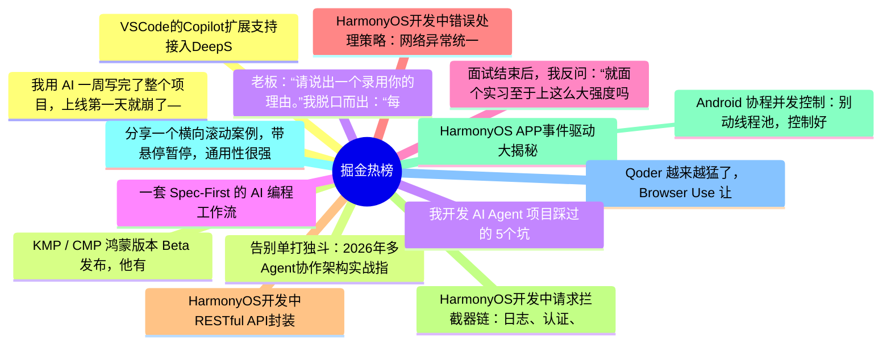

# 掘金热榜 Top 15 (2026-06-22)

## 思维导图

## 列表（15 条）

### 1. 我用 AI 一周写完了整个项目，上线第一天就崩了——这是我踩过最贵的 5 个坑
- **链接**: [https://juejin.cn/post/7652581847890133018](https://juejin.cn/post/7652581847890133018)
- **作者**: kyriewen
- **热度**: 837 | **浏览**: 1397 | **点赞**: 16 | **评论**: 8

### 2. KMP / CMP 鸿蒙版本 Beta 发布，他有什么特别之处？
- **链接**: [https://juejin.cn/post/7651954728705212422](https://juejin.cn/post/7651954728705212422)
- **作者**: 恋猫de小郭
- **热度**: 684 | **浏览**: 1170 | **点赞**: 11 | **评论**: 7

### 3. 老板：“请说出一个录用你的理由。”我脱口而出：“每个月 AI 支出都超过我的生活费了！”老板愣了一下，随即哈哈大笑：“好吧，你被录用了。”
- **链接**: [https://juejin.cn/post/7652201148235382803](https://juejin.cn/post/7652201148235382803)
- **作者**: 沉默王二
- **热度**: 603 | **浏览**: 1151 | **点赞**: 9 | **评论**: 1

### 4. 一套 Spec-First 的 AI 编程工作流
- **链接**: [https://juejin.cn/post/7652581847889330202](https://juejin.cn/post/7652581847889330202)
- **作者**: 袋鼠云数栈UED团队
- **热度**: 396 | **浏览**: 707 | **点赞**: 9 | **评论**: 0

### 5. 面试结束后，我反问：“就面个实习至于上这么大强度吗？”面试官：“你对 RAG、Agent、MCP、Skill 理解得很到位，所以要求高一点。”
- **链接**: [https://juejin.cn/post/7653108100300242987](https://juejin.cn/post/7653108100300242987)
- **作者**: 沉默王二
- **热度**: 342 | **浏览**: 631 | **点赞**: 7 | **评论**: 0

### 6. HarmonyOS开发中错误处理策略：网络异常统一处理
- **链接**: [https://juejin.cn/post/7652636952518754340](https://juejin.cn/post/7652636952518754340)
- **作者**: Jack20
- **热度**: 324 | **浏览**: 700 | **点赞**: 1 | **评论**: 0

### 7. HarmonyOS开发中RESTful API封装：网络层架构设计
- **链接**: [https://juejin.cn/post/7652636952518721572](https://juejin.cn/post/7652636952518721572)
- **作者**: Jack20
- **热度**: 306 | **浏览**: 663 | **点赞**: 1 | **评论**: 0

### 8. HarmonyOS开发中请求拦截器链：日志、认证、重试
- **链接**: [https://juejin.cn/post/7652976567262675007](https://juejin.cn/post/7652976567262675007)
- **作者**: Jack20
- **热度**: 288 | **浏览**: 636 | **点赞**: 1 | **评论**: 0

### 9. HarmonyOS APP事件驱动大揭秘
- **链接**: [https://juejin.cn/post/7652676128406306859](https://juejin.cn/post/7652676128406306859)
- **作者**: Jack20
- **热度**: 270 | **浏览**: 575 | **点赞**: 2 | **评论**: 0

### 10.  Android 协程并发控制：别动线程池，控制好并发语义就够了
- **链接**: [https://juejin.cn/post/7652257652502298662](https://juejin.cn/post/7652257652502298662)
- **作者**: 潜龙勿用之化骨龙
- **热度**: 261 | **浏览**: 461 | **点赞**: 6 | **评论**: 0

### 11. 分享一个横向滚动案例，带悬停暂停，通用性很强
- **链接**: [https://juejin.cn/post/7652606969636503595](https://juejin.cn/post/7652606969636503595)
- **作者**: JacksonChen
- **热度**: 252 | **浏览**: 468 | **点赞**: 5 | **评论**: 0

### 12. Qoder 越来越猛了，Browser Use 让 Agent 的联网能力拉满。
- **链接**: [https://juejin.cn/post/7653331314107809846](https://juejin.cn/post/7653331314107809846)
- **作者**: 沉默王二
- **热度**: 252 | **浏览**: 406 | **点赞**: 7 | **评论**: 1

### 13. VSCode的Copilot扩展支持接入DeepSeek，Kimi了！
- **链接**: [https://juejin.cn/post/7652621263220424744](https://juejin.cn/post/7652621263220424744)
- **作者**: 前端之虎陈随易
- **热度**: 198 | **浏览**: 353 | **点赞**: 5 | **评论**: 0

### 14. 告别单打独斗：2026年多Agent协作架构实战指南
- **链接**: [https://juejin.cn/post/7652581847890165786](https://juejin.cn/post/7652581847890165786)
- **作者**: 米小虾
- **热度**: 189 | **浏览**: 354 | **点赞**: 5 | **评论**: 0

### 15. 我开发 AI Agent 项目踩过的 5个坑
- **链接**: [https://juejin.cn/post/7653660327263666176](https://juejin.cn/post/7653660327263666176)
- **作者**: 双越AI_club
- **热度**: 180 | **浏览**: 357 | **点赞**: 3 | **评论**: 0
