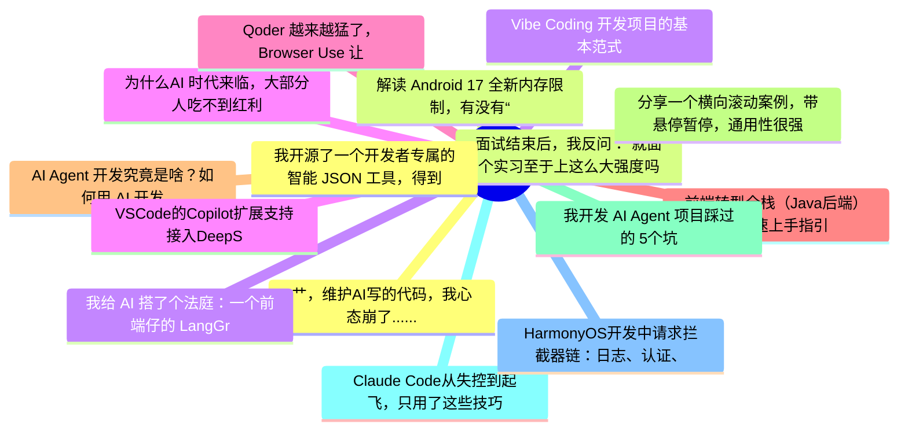

# 掘金热榜 Top 15 (2026-06-23)

## 思维导图

## 列表（15 条）

### 1. 艹，维护AI写的代码，我心态崩了......
- **链接**: [https://juejin.cn/post/7653666093677314057](https://juejin.cn/post/7653666093677314057)
- **作者**: SimonKing
- **热度**: 1926 | **浏览**: 3611 | **点赞**: 14 | **评论**: 21

### 2. 面试结束后，我反问：“就面个实习至于上这么大强度吗？”面试官：“你对 RAG、Agent、MCP、Skill 理解得很到位，所以要求高一点。”
- **链接**: [https://juejin.cn/post/7653108100300242987](https://juejin.cn/post/7653108100300242987)
- **作者**: 沉默王二
- **热度**: 954 | **浏览**: 1772 | **点赞**: 16 | **评论**: 3

### 3. 我给 AI 搭了个法庭：一个前端仔的 LangGraph 实战全记录
- **链接**: [https://juejin.cn/post/7653442979387506726](https://juejin.cn/post/7653442979387506726)
- **作者**: 波棱盖卡住了
- **热度**: 675 | **浏览**: 1037 | **点赞**: 12 | **评论**: 13

### 4. 为什么AI 时代来临，大部分人吃不到红利
- **链接**: [https://juejin.cn/post/7653186491406073856](https://juejin.cn/post/7653186491406073856)
- **作者**: 乘风gg
- **热度**: 657 | **浏览**: 1313 | **点赞**: 8 | **评论**: 0

### 5. Qoder 越来越猛了，Browser Use 让 Agent 的联网能力拉满。
- **链接**: [https://juejin.cn/post/7653331314107809846](https://juejin.cn/post/7653331314107809846)
- **作者**: 沉默王二
- **热度**: 522 | **浏览**: 927 | **点赞**: 9 | **评论**: 3

### 6. 前端转型全栈（Java后端）的快速上手指引
- **链接**: [https://juejin.cn/post/7652621263219376168](https://juejin.cn/post/7652621263219376168)
- **作者**: 银岭峰爽捞牛牛的大平原火鸡
- **热度**: 414 | **浏览**: 581 | **点赞**: 17 | **评论**: 0

### 7. AI Agent 开发究竟是啥？如何用 AI 开发 Agent ？深入浅出给你一套概念
- **链接**: [https://juejin.cn/post/7653293019979661355](https://juejin.cn/post/7653293019979661355)
- **作者**: 恋猫de小郭
- **热度**: 405 | **浏览**: 640 | **点赞**: 13 | **评论**: 1

### 8. 分享一个横向滚动案例，带悬停暂停，通用性很强
- **链接**: [https://juejin.cn/post/7652606969636503595](https://juejin.cn/post/7652606969636503595)
- **作者**: JacksonChen
- **热度**: 405 | **浏览**: 728 | **点赞**: 6 | **评论**: 3

### 9. 我开发 AI Agent 项目踩过的 5个坑
- **链接**: [https://juejin.cn/post/7653660327263666176](https://juejin.cn/post/7653660327263666176)
- **作者**: 双越AI_club
- **热度**: 369 | **浏览**: 726 | **点赞**: 5 | **评论**: 0

### 10. Claude Code从失控到起飞，只用了这些技巧
- **链接**: [https://juejin.cn/post/7652656011178000394](https://juejin.cn/post/7652656011178000394)
- **作者**: 苏三说技术
- **热度**: 333 | **浏览**: 607 | **点赞**: 7 | **评论**: 0

### 11. HarmonyOS开发中请求拦截器链：日志、认证、重试
- **链接**: [https://juejin.cn/post/7652976567262675007](https://juejin.cn/post/7652976567262675007)
- **作者**: Jack20
- **热度**: 324 | **浏览**: 710 | **点赞**: 1 | **评论**: 0

### 12. 我开源了一个开发者专属的智能 JSON 工具，得到了媳妇高度认可
- **链接**: [https://juejin.cn/post/7653686112275333154](https://juejin.cn/post/7653686112275333154)
- **作者**: 程序员小富
- **热度**: 288 | **浏览**: 385 | **点赞**: 10 | **评论**: 3

### 13. 解读 Android 17 全新内存限制，有没有“豁免”后门？
- **链接**: [https://juejin.cn/post/7653533398468542473](https://juejin.cn/post/7653533398468542473)
- **作者**: 恋猫de小郭
- **热度**: 288 | **浏览**: 534 | **点赞**: 6 | **评论**: 0

### 14. Vibe Coding 开发项目的基本范式
- **链接**: [https://juejin.cn/post/7653050742082437166](https://juejin.cn/post/7653050742082437166)
- **作者**: 旅梦用户
- **热度**: 270 | **浏览**: 310 | **点赞**: 15 | **评论**: 0

### 15. VSCode的Copilot扩展支持接入DeepSeek，Kimi了！
- **链接**: [https://juejin.cn/post/7652621263220424744](https://juejin.cn/post/7652621263220424744)
- **作者**: 前端之虎陈随易
- **热度**: 270 | **浏览**: 504 | **点赞**: 5 | **评论**: 0
