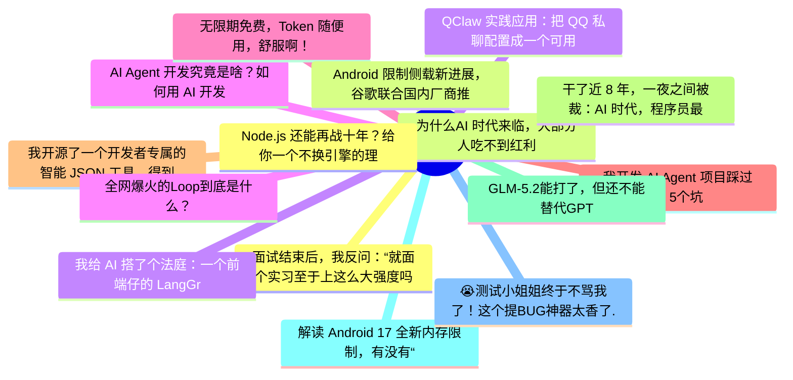

# 掘金热榜 Top 15 (2026-06-24)

## 思维导图

## 列表（15 条）

### 1. 面试结束后，我反问：“就面个实习至于上这么大强度吗？”面试官：“你对 RAG、Agent、MCP、Skill 理解得很到位，所以要求高一点。”
- **链接**: [https://juejin.cn/post/7653108100300242987](https://juejin.cn/post/7653108100300242987)
- **作者**: 沉默王二
- **热度**: 1755 | **浏览**: 3246 | **点赞**: 33 | **评论**: 3

### 2. 为什么AI 时代来临，大部分人吃不到红利
- **链接**: [https://juejin.cn/post/7653186491406073856](https://juejin.cn/post/7653186491406073856)
- **作者**: 乘风gg
- **热度**: 1332 | **浏览**: 2634 | **点赞**: 13 | **评论**: 4

### 3. 我给 AI 搭了个法庭：一个前端仔的 LangGraph 实战全记录
- **链接**: [https://juejin.cn/post/7653442979387506726](https://juejin.cn/post/7653442979387506726)
- **作者**: 波棱盖卡住了
- **热度**: 963 | **浏览**: 1534 | **点赞**: 18 | **评论**: 13

### 4. AI Agent 开发究竟是啥？如何用 AI 开发 Agent ？深入浅出给你一套概念
- **链接**: [https://juejin.cn/post/7653293019979661355](https://juejin.cn/post/7653293019979661355)
- **作者**: 恋猫de小郭
- **热度**: 729 | **浏览**: 1164 | **点赞**: 21 | **评论**: 3

### 5. 无限期免费，Token 随便用，舒服啊！
- **链接**: [https://juejin.cn/post/7654102171461402662](https://juejin.cn/post/7654102171461402662)
- **作者**: 沉默王二
- **热度**: 621 | **浏览**: 1307 | **点赞**: 5 | **评论**: 0

### 6. 我开发 AI Agent 项目踩过的 5个坑
- **链接**: [https://juejin.cn/post/7653660327263666176](https://juejin.cn/post/7653660327263666176)
- **作者**: 双越AI_club
- **热度**: 540 | **浏览**: 1107 | **点赞**: 5 | **评论**: 0

### 7. 我开源了一个开发者专属的智能 JSON 工具，得到了媳妇高度认可
- **链接**: [https://juejin.cn/post/7653686112275333154](https://juejin.cn/post/7653686112275333154)
- **作者**: 程序员小富
- **热度**: 441 | **浏览**: 624 | **点赞**: 13 | **评论**: 5

### 8. 干了近 8 年，一夜之间被裁：AI 时代，程序员最该害怕的不是 AI
- **链接**: [https://juejin.cn/post/7653402752283082803](https://juejin.cn/post/7653402752283082803)
- **作者**: 勇宝趣学前端
- **热度**: 414 | **浏览**: 808 | **点赞**: 6 | **评论**: 0

### 9. GLM-5.2能打了，但还不能替代GPT
- **链接**: [https://juejin.cn/post/7653847759125987368](https://juejin.cn/post/7653847759125987368)
- **作者**: 孟健AI编程
- **热度**: 387 | **浏览**: 709 | **点赞**: 7 | **评论**: 1

### 10. 解读 Android 17 全新内存限制，有没有“豁免”后门？
- **链接**: [https://juejin.cn/post/7653533398468542473](https://juejin.cn/post/7653533398468542473)
- **作者**: 恋猫de小郭
- **热度**: 387 | **浏览**: 726 | **点赞**: 7 | **评论**: 0

### 11. 😭测试小姐姐终于不骂我了！这个提BUG神器太香了...
- **链接**: [https://juejin.cn/post/7653760158447091762](https://juejin.cn/post/7653760158447091762)
- **作者**: 阳火锅
- **热度**: 360 | **浏览**: 683 | **点赞**: 4 | **评论**: 3

### 12. Node.js 还能再战十年？给你一个不换引擎的理由
- **链接**: [https://juejin.cn/post/7654166345454026803](https://juejin.cn/post/7654166345454026803)
- **作者**: ErpanOmer
- **热度**: 351 | **浏览**: 672 | **点赞**: 6 | **评论**: 0

### 13. Android 限制侧载新进展，谷歌联合国内厂商推验证计划
- **链接**: [https://juejin.cn/post/7653720174962868234](https://juejin.cn/post/7653720174962868234)
- **作者**: 恋猫de小郭
- **热度**: 324 | **浏览**: 560 | **点赞**: 7 | **评论**: 2

### 14. QClaw 实践应用：把 QQ 私聊配置成一个可用的 AI Agent 入口
- **链接**: [https://juejin.cn/post/7653409737293627392](https://juejin.cn/post/7653409737293627392)
- **作者**: 倔强的石头_
- **热度**: 288 | **浏览**: 598 | **点赞**: 3 | **评论**: 0

### 15. 全网爆火的Loop到底是什么？
- **链接**: [https://juejin.cn/post/7654044236049367066](https://juejin.cn/post/7654044236049367066)
- **作者**: 苏三说技术
- **热度**: 288 | **浏览**: 510 | **点赞**: 6 | **评论**: 1
