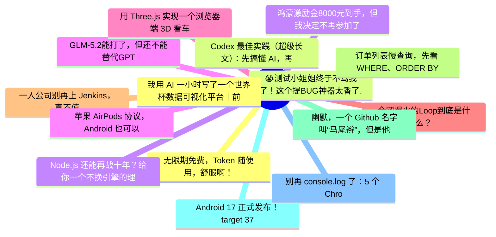

# 掘金热榜 Top 15 (2026-06-25)

## 思维导图

## 列表（15 条）

### 1. 无限期免费，Token 随便用，舒服啊！
- **链接**: [https://juejin.cn/post/7654102171461402662](https://juejin.cn/post/7654102171461402662)
- **作者**: 沉默王二
- **热度**: 2259 | **浏览**: 4643 | **点赞**: 15 | **评论**: 5

### 2. 😭测试小姐姐终于不骂我了！这个提BUG神器太香了...
- **链接**: [https://juejin.cn/post/7653760158447091762](https://juejin.cn/post/7653760158447091762)
- **作者**: 阳火锅
- **热度**: 810 | **浏览**: 1425 | **点赞**: 11 | **评论**: 8

### 3. Node.js 还能再战十年？给你一个不换引擎的理由
- **链接**: [https://juejin.cn/post/7654166345454026803](https://juejin.cn/post/7654166345454026803)
- **作者**: ErpanOmer
- **热度**: 612 | **浏览**: 1146 | **点赞**: 11 | **评论**: 0

### 4. GLM-5.2能打了，但还不能替代GPT
- **链接**: [https://juejin.cn/post/7653847759125987368](https://juejin.cn/post/7653847759125987368)
- **作者**: 孟健AI编程
- **热度**: 585 | **浏览**: 1148 | **点赞**: 7 | **评论**: 1

### 5. 用 Three.js 实现一个浏览器端 3D 看车的项目
- **链接**: [https://juejin.cn/post/7653437401840189474](https://juejin.cn/post/7653437401840189474)
- **作者**: 牧艺
- **热度**: 513 | **浏览**: 881 | **点赞**: 13 | **评论**: 0

### 6. 全网爆火的Loop到底是什么？
- **链接**: [https://juejin.cn/post/7654044236049367066](https://juejin.cn/post/7654044236049367066)
- **作者**: 苏三说技术
- **热度**: 486 | **浏览**: 908 | **点赞**: 8 | **评论**: 1

### 7. 一人公司别再上 Jenkins，真不值
- **链接**: [https://juejin.cn/post/7654166345454829619](https://juejin.cn/post/7654166345454829619)
- **作者**: 程序员凌览
- **热度**: 414 | **浏览**: 791 | **点赞**: 5 | **评论**: 2

### 8. 订单列表慢查询，先看 WHERE、ORDER BY 和 LIMIT
- **链接**: [https://juejin.cn/post/7654102171461812262](https://juejin.cn/post/7654102171461812262)
- **作者**: 一只牛博
- **热度**: 369 | **浏览**: 835 | **点赞**: 0 | **评论**: 0

### 9. 幽默，一个 Github 名字叫“马尾辫”，但是他给你省了 80% 的 token
- **链接**: [https://juejin.cn/post/7654045327082799123](https://juejin.cn/post/7654045327082799123)
- **作者**: cxuanAI
- **热度**: 351 | **浏览**: 704 | **点赞**: 4 | **评论**: 0

### 10. Android 17 正式发布！target 37 一大批旧代码直接不能用了
- **链接**: [https://juejin.cn/post/7653533398469820425](https://juejin.cn/post/7653533398469820425)
- **作者**: 黄林晴
- **热度**: 342 | **浏览**: 698 | **点赞**: 4 | **评论**: 0

### 11. 别再 console.log 了：5 个 Chrome DevTools 调试技巧，用过就回不去了
- **链接**: [https://juejin.cn/post/7654473428947795994](https://juejin.cn/post/7654473428947795994)
- **作者**: kyriewen
- **热度**: 324 | **浏览**: 423 | **点赞**: 9 | **评论**: 6

### 12. 我用 AI 一小时写了一个世界杯数据可视化平台｜前端 VibeCoding 初体验
- **链接**: [https://juejin.cn/post/7653757121414643764](https://juejin.cn/post/7653757121414643764)
- **作者**: kartjim
- **热度**: 306 | **浏览**: 626 | **点赞**: 3 | **评论**: 0

### 13. Codex 最佳实践（超级长文）：先搞懂 AI，再用好 AI
- **链接**: [https://juejin.cn/post/7654140424869855282](https://juejin.cn/post/7654140424869855282)
- **作者**: oil欧哟
- **热度**: 297 | **浏览**: 525 | **点赞**: 7 | **评论**: 0

### 14. 鸿蒙激励金8000元到手，但我决定不再参加了
- **链接**: [https://juejin.cn/post/7654531180474597395](https://juejin.cn/post/7654531180474597395)
- **作者**: 前端梦工厂
- **热度**: 288 | **浏览**: 508 | **点赞**: 2 | **评论**: 5

### 15. 苹果 AirPods 协议，Android 也可以使用完整版 AirPods 能力
- **链接**: [https://juejin.cn/post/7654471531117379590](https://juejin.cn/post/7654471531117379590)
- **作者**: 恋猫de小郭
- **热度**: 279 | **浏览**: 450 | **点赞**: 9 | **评论**: 0
