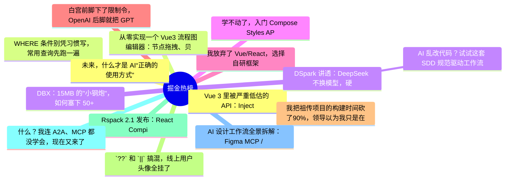

# 掘金热榜 Top 15 (2026-06-29)

## 思维导图

## 列表（15 条）

### 1.  Vue 3 里被严重低估的 API：InjectionKey
- **链接**: [https://juejin.cn/post/7654840513968537641](https://juejin.cn/post/7654840513968537641)
- **作者**: 秋天的一阵风
- **热度**: 828 | **浏览**: 1323 | **点赞**: 18 | **评论**: 8

### 2. WHERE 条件别凭习惯写，常用查询先跑一遍
- **链接**: [https://juejin.cn/post/7655235192540102665](https://juejin.cn/post/7655235192540102665)
- **作者**: 一只牛博
- **热度**: 630 | **浏览**: 1387 | **点赞**: 1 | **评论**: 0

### 3. DBX：15MB 的"小钢炮"，如何塞下 50+ 种数据库
- **链接**: [https://juejin.cn/post/7654787758995144731](https://juejin.cn/post/7654787758995144731)
- **作者**: SimonKing
- **热度**: 324 | **浏览**: 611 | **点赞**: 5 | **评论**: 1

### 4. 学不动了，入门 Compose Styles API
- **链接**: [https://juejin.cn/post/7655245911813128238](https://juejin.cn/post/7655245911813128238)
- **作者**: RockByte
- **热度**: 297 | **浏览**: 543 | **点赞**: 6 | **评论**: 0

### 5. 我放弃了 Vue/React，选择自研框架
- **链接**: [https://juejin.cn/post/7655009852205187078](https://juejin.cn/post/7655009852205187078)
- **作者**: 下家
- **热度**: 288 | **浏览**: 505 | **点赞**: 5 | **评论**: 2

### 6. 白宫前脚下了限制令，OpenAI 后脚就把 GPT-5.6 发了
- **链接**: [https://juejin.cn/post/7655594666130554921](https://juejin.cn/post/7655594666130554921)
- **作者**: kyriewen
- **热度**: 288 | **浏览**: 580 | **点赞**: 3 | **评论**: 0

### 7. 我把祖传项目的构建时间砍了90%，领导以为我只是在"优化了一下"，结果隔壁组的CI都崩了来问我配置
- **链接**: [https://juejin.cn/post/7655348005602361363](https://juejin.cn/post/7655348005602361363)
- **作者**: 柯克七七
- **热度**: 279 | **浏览**: 409 | **点赞**: 9 | **评论**: 2

### 8. `??` 和 `||` 搞混，线上用户头像全挂了
- **链接**: [https://juejin.cn/post/7655657102968438811](https://juejin.cn/post/7655657102968438811)
- **作者**: Csvn
- **热度**: 270 | **浏览**: 386 | **点赞**: 4 | **评论**: 7

### 9. Rspack 2.1 发布：React Compiler 提速 10 倍！
- **链接**: [https://juejin.cn/post/7655529019282571291](https://juejin.cn/post/7655529019282571291)
- **作者**: WebInfra
- **热度**: 243 | **浏览**: 393 | **点赞**: 7 | **评论**: 1

### 10. 什么？我连 A2A、MCP 都没学会，现在又来了 AG-UI、A2UI.
- **链接**: [https://juejin.cn/post/7655279037151510537](https://juejin.cn/post/7655279037151510537)
- **作者**: threerocks
- **热度**: 198 | **浏览**: 412 | **点赞**: 2 | **评论**: 0

### 11. AI 设计工作流全景拆解：Figma MCP / Claude Design / Codex / Google Stitch
- **链接**: [https://juejin.cn/post/7655515848211841076](https://juejin.cn/post/7655515848211841076)
- **作者**: Shockang
- **热度**: 180 | **浏览**: 256 | **点赞**: 8 | **评论**: 0

### 12. 未来，什么才是 AI“正确的使用方式”
- **链接**: [https://juejin.cn/post/7655097833112518666](https://juejin.cn/post/7655097833112518666)
- **作者**: vivo互联网技术
- **热度**: 180 | **浏览**: 353 | **点赞**: 2 | **评论**: 1

### 13. 从零实现一个 Vue3 流程图编辑器：节点拖拽、贝塞尔连线与框选
- **链接**: [https://juejin.cn/post/7655564736501039130](https://juejin.cn/post/7655564736501039130)
- **作者**: CoderWeen
- **热度**: 180 | **浏览**: 220 | **点赞**: 8 | **评论**: 1

### 14. DSpark 讲透：DeepSeek 不换模型，硬把 V4 提速 85%，是怎么做到的？
- **链接**: [https://juejin.cn/post/7655691054172700718](https://juejin.cn/post/7655691054172700718)
- **作者**: 蝎子莱莱爱打怪
- **热度**: 162 | **浏览**: 213 | **点赞**: 7 | **评论**: 1

### 15.  AI 乱改代码？试试这套 SDD 规范驱动工作流
- **链接**: [https://juejin.cn/post/7656050265522913280](https://juejin.cn/post/7656050265522913280)
- **作者**: 古茗前端团队
- **热度**: 162 | **浏览**: 177 | **点赞**: 8 | **评论**: 2
