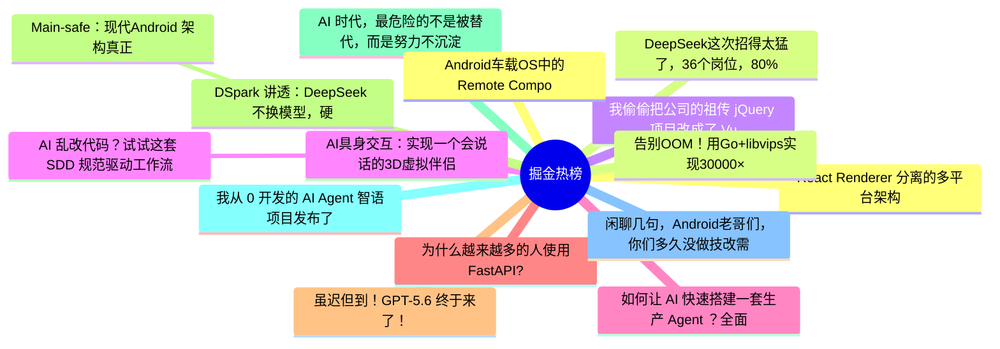

# 掘金热榜 Top 15 (2026-06-30)

## 思维导图

## 列表（15 条）

### 1. React Renderer 分离的多平台架构
- **链接**: [https://juejin.cn/post/7656342465024540718](https://juejin.cn/post/7656342465024540718)
- **作者**: 老王以为
- **热度**: 1323 | **浏览**: 2701 | **点赞**: 12 | **评论**: 0

### 2. DeepSeek这次招得太猛了，36个岗位，80%都要会Agent！
- **链接**: [https://juejin.cn/post/7656300675647373321](https://juejin.cn/post/7656300675647373321)
- **作者**: 沉默王二
- **热度**: 729 | **浏览**: 1236 | **点赞**: 16 | **评论**: 4

### 3. 我偷偷把公司的祖传 jQuery 项目改成了 Vue3，CTO 没发现，但全组都来抄我的代码了
- **链接**: [https://juejin.cn/post/7655631091143704595](https://juejin.cn/post/7655631091143704595)
- **作者**: 奶油mm
- **热度**: 621 | **浏览**: 979 | **点赞**: 9 | **评论**: 12

### 4. AI具身交互：实现一个会说话的3D虚拟伴侣
- **链接**: [https://juejin.cn/post/7656050265523372032](https://juejin.cn/post/7656050265523372032)
- **作者**: 石小石Orz
- **热度**: 459 | **浏览**: 787 | **点赞**: 7 | **评论**: 5

### 5.  AI 乱改代码？试试这套 SDD 规范驱动工作流
- **链接**: [https://juejin.cn/post/7656050265522913280](https://juejin.cn/post/7656050265522913280)
- **作者**: 古茗前端团队
- **热度**: 441 | **浏览**: 608 | **点赞**: 15 | **评论**: 4

### 6. 如何让 AI 快速搭建一套生产 Agent ？全面理解 Agent 架构。
- **链接**: [https://juejin.cn/post/7656055019972722731](https://juejin.cn/post/7656055019972722731)
- **作者**: 恋猫de小郭
- **热度**: 378 | **浏览**: 594 | **点赞**: 13 | **评论**: 0

### 7. 为什么越来越多的人使用FastAPI?
- **链接**: [https://juejin.cn/post/7656613897318907958](https://juejin.cn/post/7656613897318907958)
- **作者**: 苏三说技术
- **热度**: 351 | **浏览**: 611 | **点赞**: 7 | **评论**: 2

### 8. 虽迟但到！GPT-5.6 终于来了！
- **链接**: [https://juejin.cn/post/7655631091143917587](https://juejin.cn/post/7655631091143917587)
- **作者**: cxuanAI
- **热度**: 333 | **浏览**: 698 | **点赞**: 3 | **评论**: 0

### 9. DSpark 讲透：DeepSeek 不换模型，硬把 V4 提速 85%，是怎么做到的？
- **链接**: [https://juejin.cn/post/7655691054172700718](https://juejin.cn/post/7655691054172700718)
- **作者**: 蝎子莱莱爱打怪
- **热度**: 324 | **浏览**: 547 | **点赞**: 7 | **评论**: 2

### 10.  Main-safe：现代Android 架构真正的分水岭
- **链接**: [https://juejin.cn/post/7656080006646497307](https://juejin.cn/post/7656080006646497307)
- **作者**: 潜龙勿用之化骨龙
- **热度**: 270 | **浏览**: 405 | **点赞**: 10 | **评论**: 0

### 11. AI 时代，最危险的不是被替代，而是努力不沉淀
- **链接**: [https://juejin.cn/post/7656467869551722537](https://juejin.cn/post/7656467869551722537)
- **作者**: 东东拿铁
- **热度**: 243 | **浏览**: 396 | **点赞**: 7 | **评论**: 1

### 12. 我从 0 开发的 AI Agent 智语项目发布了
- **链接**: [https://juejin.cn/post/7656384927139102772](https://juejin.cn/post/7656384927139102772)
- **作者**: 双越AI_club
- **热度**: 234 | **浏览**: 464 | **点赞**: 1 | **评论**: 2

### 13. 闲聊几句，Android老哥们，你们多久没做技改需求了
- **链接**: [https://juejin.cn/post/7656473537566375976](https://juejin.cn/post/7656473537566375976)
- **作者**: Coffeeee
- **热度**: 234 | **浏览**: 443 | **点赞**: 4 | **评论**: 0

### 14. Android车载OS中的Remote Compose
- **链接**: [https://juejin.cn/post/7655611059512262708](https://juejin.cn/post/7655611059512262708)
- **作者**: 稀有猿诉
- **热度**: 207 | **浏览**: 327 | **点赞**: 7 | **评论**: 0

### 15. 告别OOM！用Go+libvips实现30000×50000超大图片的流式瓦片服务
- **链接**: [https://juejin.cn/post/7656055019971788843](https://juejin.cn/post/7656055019971788843)
- **作者**: GetcharZp
- **热度**: 180 | **浏览**: 279 | **点赞**: 4 | **评论**: 3
