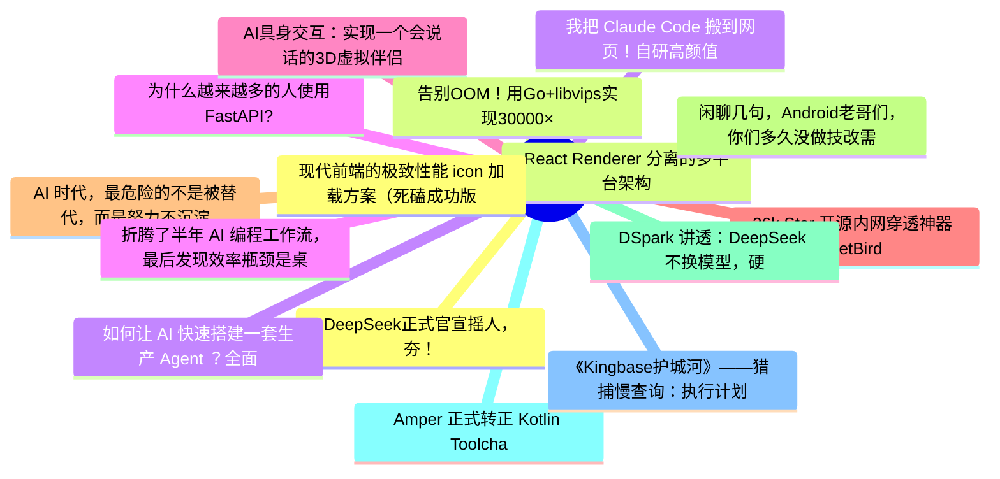

# 掘金热榜 Top 15 (2026-07-02)

## 思维导图

## 列表（15 条）

### 1. DeepSeek正式官宣摇人，夯！
- **链接**: [https://juejin.cn/post/7656721849944064010](https://juejin.cn/post/7656721849944064010)
- **作者**: CodeSheep
- **热度**: 2205 | **浏览**: 4226 | **点赞**: 25 | **评论**: 9

### 2. React Renderer 分离的多平台架构
- **链接**: [https://juejin.cn/post/7656342465024540718](https://juejin.cn/post/7656342465024540718)
- **作者**: 老王以为
- **热度**: 2079 | **浏览**: 3993 | **点赞**: 23 | **评论**: 9

### 3. 如何让 AI 快速搭建一套生产 Agent ？全面理解 Agent 架构。
- **链接**: [https://juejin.cn/post/7656055019972722731](https://juejin.cn/post/7656055019972722731)
- **作者**: 恋猫de小郭
- **热度**: 1116 | **浏览**: 1928 | **点赞**: 26 | **评论**: 2

### 4. 为什么越来越多的人使用FastAPI?
- **链接**: [https://juejin.cn/post/7656613897318907958](https://juejin.cn/post/7656613897318907958)
- **作者**: 苏三说技术
- **热度**: 1107 | **浏览**: 1972 | **点赞**: 21 | **评论**: 4

### 5. AI具身交互：实现一个会说话的3D虚拟伴侣
- **链接**: [https://juejin.cn/post/7656050265523372032](https://juejin.cn/post/7656050265523372032)
- **作者**: 石小石Orz
- **热度**: 891 | **浏览**: 1553 | **点赞**: 13 | **评论**: 9

### 6. 26k Star 开源内网穿透神器 NetBird，一分钟实现全球设备互联！
- **链接**: [https://juejin.cn/post/7657201270935519266](https://juejin.cn/post/7657201270935519266)
- **作者**: GetcharZp
- **热度**: 612 | **浏览**: 978 | **点赞**: 18 | **评论**: 2

### 7. AI 时代，最危险的不是被替代，而是努力不沉淀
- **链接**: [https://juejin.cn/post/7656467869551722537](https://juejin.cn/post/7656467869551722537)
- **作者**: 东东拿铁
- **热度**: 558 | **浏览**: 920 | **点赞**: 14 | **评论**: 3

### 8. 闲聊几句，Android老哥们，你们多久没做技改需求了
- **链接**: [https://juejin.cn/post/7656473537566375976](https://juejin.cn/post/7656473537566375976)
- **作者**: Coffeeee
- **热度**: 540 | **浏览**: 991 | **点赞**: 9 | **评论**: 2

### 9. DSpark 讲透：DeepSeek 不换模型，硬把 V4 提速 85%，是怎么做到的？
- **链接**: [https://juejin.cn/post/7655691054172700718](https://juejin.cn/post/7655691054172700718)
- **作者**: 蝎子莱莱爱打怪
- **热度**: 531 | **浏览**: 940 | **点赞**: 10 | **评论**: 2

### 10. Amper 正式转正 Kotlin Toolchain ，Gradle 未来何去何从
- **链接**: [https://juejin.cn/post/7656202263124082730](https://juejin.cn/post/7656202263124082730)
- **作者**: 恋猫de小郭
- **热度**: 504 | **浏览**: 904 | **点赞**: 10 | **评论**: 1

### 11. 《Kingbase护城河》——猎捕慢查询：执行计划的微观解析与索引调优实战
- **链接**: [https://juejin.cn/post/7657366002275614754](https://juejin.cn/post/7657366002275614754)
- **作者**: 倔强的石头_
- **热度**: 351 | **浏览**: 792 | **点赞**: 0 | **评论**: 0

### 12. 现代前端的极致性能 icon 加载方案（死磕成功版）
- **链接**: [https://juejin.cn/post/7656286434068119590](https://juejin.cn/post/7656286434068119590)
- **作者**: 妙码生花
- **热度**: 351 | **浏览**: 623 | **点赞**: 5 | **评论**: 3

### 13. 告别OOM！用Go+libvips实现30000×50000超大图片的流式瓦片服务
- **链接**: [https://juejin.cn/post/7656055019971788843](https://juejin.cn/post/7656055019971788843)
- **作者**: GetcharZp
- **热度**: 315 | **浏览**: 504 | **点赞**: 6 | **评论**: 4

### 14. 我把 Claude Code 搬到网页！自研高颜值 Web 交互工作台
- **链接**: [https://juejin.cn/post/7656681358269825067](https://juejin.cn/post/7656681358269825067)
- **作者**: 我不是外星人
- **热度**: 306 | **浏览**: 578 | **点赞**: 5 | **评论**: 1

### 15. 折腾了半年 AI 编程工作流，最后发现效率瓶颈是桌上那块屏幕
- **链接**: [https://juejin.cn/post/7656369631994920960](https://juejin.cn/post/7656369631994920960)
- **作者**: kyriewen
- **热度**: 270 | **浏览**: 484 | **点赞**: 2 | **评论**: 4
