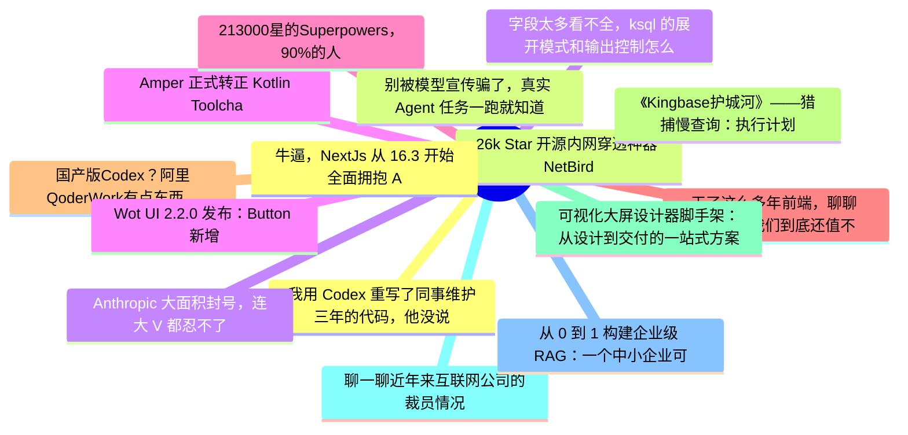

# 掘金热榜 Top 15 (2026-07-03)

## 思维导图

## 列表（15 条）

### 1. 我用 Codex 重写了同事维护三年的代码，他没说谢谢——而是找了领导
- **链接**: [https://juejin.cn/post/7657392618506764326](https://juejin.cn/post/7657392618506764326)
- **作者**: kyriewen
- **热度**: 1728 | **浏览**: 2629 | **点赞**: 18 | **评论**: 43

### 2. 26k Star 开源内网穿透神器 NetBird，一分钟实现全球设备互联！
- **链接**: [https://juejin.cn/post/7657201270935519266](https://juejin.cn/post/7657201270935519266)
- **作者**: GetcharZp
- **热度**: 1071 | **浏览**: 1787 | **点赞**: 27 | **评论**: 3

### 3. Anthropic 大面积封号，连大 V 都忍不了开喷了。
- **链接**: [https://juejin.cn/post/7657477469919494185](https://juejin.cn/post/7657477469919494185)
- **作者**: cxuanAI
- **热度**: 909 | **浏览**: 1605 | **点赞**: 8 | **评论**: 13

### 4. Amper 正式转正 Kotlin Toolchain ，Gradle 未来何去何从
- **链接**: [https://juejin.cn/post/7656202263124082730](https://juejin.cn/post/7656202263124082730)
- **作者**: 恋猫de小郭
- **热度**: 702 | **浏览**: 1279 | **点赞**: 13 | **评论**: 2

### 5. 213000星的Superpowers，90%的人只用了它10%的功能
- **链接**: [https://juejin.cn/post/7657074612481523747](https://juejin.cn/post/7657074612481523747)
- **作者**: 码哥字节
- **热度**: 486 | **浏览**: 844 | **点赞**: 12 | **评论**: 0

### 6. 干了这么多年前端，聊聊 2026 年我们到底还值不值钱
- **链接**: [https://juejin.cn/post/7657147946866753545](https://juejin.cn/post/7657147946866753545)
- **作者**: 纯爱掌门人
- **热度**: 468 | **浏览**: 835 | **点赞**: 10 | **评论**: 1

### 7. 国产版Codex？阿里QoderWork有点东西，设计出来的Codex+Claude Code学习网站好看啊（附教程，超简单）
- **链接**: [https://juejin.cn/post/7657075968750829622](https://juejin.cn/post/7657075968750829622)
- **作者**: 沉默王二
- **热度**: 414 | **浏览**: 840 | **点赞**: 3 | **评论**: 1

### 8. 《Kingbase护城河》——猎捕慢查询：执行计划的微观解析与索引调优实战
- **链接**: [https://juejin.cn/post/7657366002275614754](https://juejin.cn/post/7657366002275614754)
- **作者**: 倔强的石头_
- **热度**: 405 | **浏览**: 896 | **点赞**: 1 | **评论**: 0

### 9. 可视化大屏设计器脚手架：从设计到交付的一站式方案
- **链接**: [https://juejin.cn/post/7657067589738463282](https://juejin.cn/post/7657067589738463282)
- **作者**: 柳杉
- **热度**: 396 | **浏览**: 601 | **点赞**: 10 | **评论**: 4

### 10. 聊一聊近年来互联网公司的裁员情况
- **链接**: [https://juejin.cn/post/7657863114353229862](https://juejin.cn/post/7657863114353229862)
- **作者**: 狂师
- **热度**: 369 | **浏览**: 657 | **点赞**: 9 | **评论**: 0

### 11. 从 0 到 1 构建企业级 RAG：一个中小企业可落地版本的完整架构
- **链接**: [https://juejin.cn/post/7657791057036525614](https://juejin.cn/post/7657791057036525614)
- **作者**: 一只牛博
- **热度**: 360 | **浏览**: 751 | **点赞**: 3 | **评论**: 0

### 12. 牛逼，NextJs 从 16.3 开始全面拥抱 Agent Native 🥰🥰🥰
- **链接**: [https://juejin.cn/post/7656739536886710314](https://juejin.cn/post/7656739536886710314)
- **作者**: Moment
- **热度**: 360 | **浏览**: 690 | **点赞**: 6 | **评论**: 0

### 13. 别被模型宣传骗了，真实 Agent 任务一跑就知道
- **链接**: [https://juejin.cn/post/7658119907389554738](https://juejin.cn/post/7658119907389554738)
- **作者**: 轻口味
- **热度**: 351 | **浏览**: 768 | **点赞**: 0 | **评论**: 1

### 14. 字段太多看不全，ksql 的展开模式和输出控制怎么用
- **链接**: [https://juejin.cn/post/7657831024920133659](https://juejin.cn/post/7657831024920133659)
- **作者**: 一只牛博
- **热度**: 333 | **浏览**: 742 | **点赞**: 0 | **评论**: 0

### 15. Wot UI 2.2.0 发布：Button 新增 subtle，VideoPreview 预览体验继续增强
- **链接**: [https://juejin.cn/post/7657449804227543091](https://juejin.cn/post/7657449804227543091)
- **作者**: 不如摸鱼去
- **热度**: 306 | **浏览**: 483 | **点赞**: 7 | **评论**: 3
