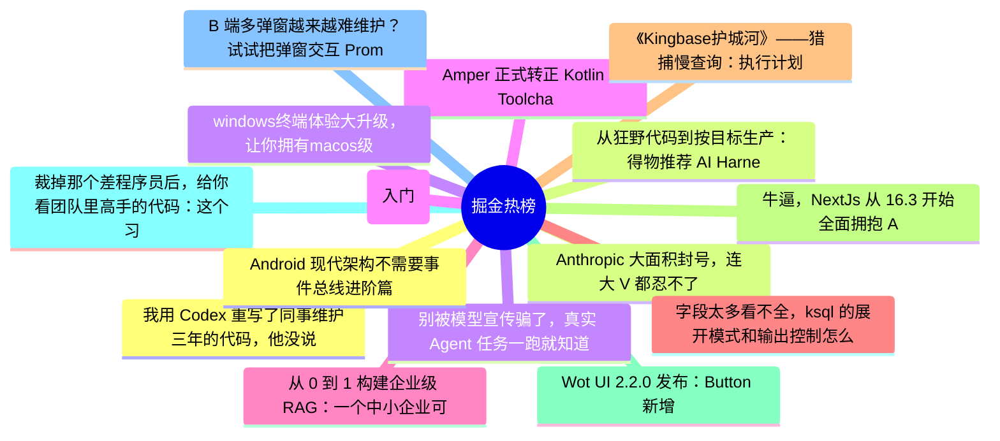

# 掘金热榜 Top 15 (2026-07-04)

## 思维导图

## 列表（15 条）

### 1. 我用 Codex 重写了同事维护三年的代码，他没说谢谢——而是找了领导
- **链接**: [https://juejin.cn/post/7657392618506764326](https://juejin.cn/post/7657392618506764326)
- **作者**: kyriewen
- **热度**: 2070 | **浏览**: 3268 | **点赞**: 24 | **评论**: 43

### 2. Anthropic 大面积封号，连大 V 都忍不了开喷了。
- **链接**: [https://juejin.cn/post/7657477469919494185](https://juejin.cn/post/7657477469919494185)
- **作者**: cxuanAI
- **热度**: 1116 | **浏览**: 1942 | **点赞**: 11 | **评论**: 16

### 3. 别被模型宣传骗了，真实 Agent 任务一跑就知道
- **链接**: [https://juejin.cn/post/7658119907389554738](https://juejin.cn/post/7658119907389554738)
- **作者**: 轻口味
- **热度**: 783 | **浏览**: 1712 | **点赞**: 1 | **评论**: 1

### 4. Amper 正式转正 Kotlin Toolchain ，Gradle 未来何去何从
- **链接**: [https://juejin.cn/post/7656202263124082730](https://juejin.cn/post/7656202263124082730)
- **作者**: 恋猫de小郭
- **热度**: 774 | **浏览**: 1408 | **点赞**: 14 | **评论**: 2

### 5. 从 0 到 1 构建企业级 RAG：一个中小企业可落地版本的完整架构
- **链接**: [https://juejin.cn/post/7657791057036525614](https://juejin.cn/post/7657791057036525614)
- **作者**: 一只牛博
- **热度**: 576 | **浏览**: 1211 | **点赞**: 4 | **评论**: 0

### 6. 字段太多看不全，ksql 的展开模式和输出控制怎么用
- **链接**: [https://juejin.cn/post/7657831024920133659](https://juejin.cn/post/7657831024920133659)
- **作者**: 一只牛博
- **热度**: 531 | **浏览**: 1189 | **点赞**: 0 | **评论**: 0

### 7. 《Kingbase护城河》——猎捕慢查询：执行计划的微观解析与索引调优实战
- **链接**: [https://juejin.cn/post/7657366002275614754](https://juejin.cn/post/7657366002275614754)
- **作者**: 倔强的石头_
- **热度**: 432 | **浏览**: 944 | **点赞**: 1 | **评论**: 0

### 8. 牛逼，NextJs 从 16.3 开始全面拥抱 Agent Native 🥰🥰🥰
- **链接**: [https://juejin.cn/post/7656739536886710314](https://juejin.cn/post/7656739536886710314)
- **作者**: Moment
- **热度**: 432 | **浏览**: 833 | **点赞**: 7 | **评论**: 0

### 9. Wot UI 2.2.0 发布：Button 新增 subtle，VideoPreview 预览体验继续增强
- **链接**: [https://juejin.cn/post/7657449804227543091](https://juejin.cn/post/7657449804227543091)
- **作者**: 不如摸鱼去
- **热度**: 351 | **浏览**: 570 | **点赞**: 8 | **评论**: 3

### 10. 裁掉那个差程序员后，给你看团队里高手的代码：这个习惯，希望你有
- **链接**: [https://juejin.cn/post/7657453685375811635](https://juejin.cn/post/7657453685375811635)
- **作者**: SamDeepThinking
- **热度**: 333 | **浏览**: 539 | **点赞**: 5 | **评论**: 6

### 11. B 端多弹窗越来越难维护？试试把弹窗交互 Promise 化
- **链接**: [https://juejin.cn/post/7657051584129351715](https://juejin.cn/post/7657051584129351715)
- **作者**: 灏仟亿前端技术团队
- **热度**: 315 | **浏览**: 568 | **点赞**: 7 | **评论**: 0

### 12. Android 现代架构不需要事件总线进阶篇
- **链接**: [https://juejin.cn/post/7657104125783703562](https://juejin.cn/post/7657104125783703562)
- **作者**: 潜龙勿用之化骨龙
- **热度**: 297 | **浏览**: 494 | **点赞**: 6 | **评论**: 3

### 13. 从狂野代码到按目标生产：得物推荐 AI Harness 的工程化实践｜AICon 演讲整理
- **链接**: [https://juejin.cn/post/7656741994434576427](https://juejin.cn/post/7656741994434576427)
- **作者**: 得物技术
- **热度**: 279 | **浏览**: 500 | **点赞**: 6 | **评论**: 0

### 14. windows终端体验大升级，让你拥有macos级别的美化
- **链接**: [https://juejin.cn/post/7657755366327664680](https://juejin.cn/post/7657755366327664680)
- **作者**: 非洲农业不发达
- **热度**: 252 | **浏览**: 552 | **点赞**: 1 | **评论**: 0

### 15. Go语言第一章(入门)
- **链接**: [https://juejin.cn/post/7657567333606506505](https://juejin.cn/post/7657567333606506505)
- **作者**: 小满zs
- **热度**: 252 | **浏览**: 306 | **点赞**: 9 | **评论**: 4
