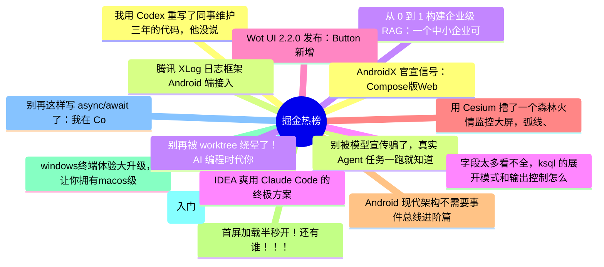

# 掘金热榜 Top 15 (2026-07-05)

## 思维导图

## 列表（15 条）

### 1. 我用 Codex 重写了同事维护三年的代码，他没说谢谢——而是找了领导
- **链接**: [https://juejin.cn/post/7657392618506764326](https://juejin.cn/post/7657392618506764326)
- **作者**: kyriewen
- **热度**: 2574 | **浏览**: 4096 | **点赞**: 32 | **评论**: 50

### 2. 别被模型宣传骗了，真实 Agent 任务一跑就知道
- **链接**: [https://juejin.cn/post/7658119907389554738](https://juejin.cn/post/7658119907389554738)
- **作者**: 轻口味
- **热度**: 1755 | **浏览**: 3811 | **点赞**: 3 | **评论**: 2

### 3. 从 0 到 1 构建企业级 RAG：一个中小企业可落地版本的完整架构
- **链接**: [https://juejin.cn/post/7657791057036525614](https://juejin.cn/post/7657791057036525614)
- **作者**: 一只牛博
- **热度**: 927 | **浏览**: 2000 | **点赞**: 4 | **评论**: 0

### 4. 字段太多看不全，ksql 的展开模式和输出控制怎么用
- **链接**: [https://juejin.cn/post/7657831024920133659](https://juejin.cn/post/7657831024920133659)
- **作者**: 一只牛博
- **热度**: 873 | **浏览**: 1951 | **点赞**: 0 | **评论**: 0

### 5. Wot UI 2.2.0 发布：Button 新增 subtle，VideoPreview 预览体验继续增强
- **链接**: [https://juejin.cn/post/7657449804227543091](https://juejin.cn/post/7657449804227543091)
- **作者**: 不如摸鱼去
- **热度**: 504 | **浏览**: 818 | **点赞**: 12 | **评论**: 4

### 6. 用 Cesium 撸了一个森林火情监控大屏，弧线、粒子、发光效果都齐了
- **链接**: [https://juejin.cn/post/7657791057037131822](https://juejin.cn/post/7657791057037131822)
- **作者**: 尘世中一位迷途小书童
- **热度**: 450 | **浏览**: 714 | **点赞**: 15 | **评论**: 0

### 7. Android 现代架构不需要事件总线进阶篇
- **链接**: [https://juejin.cn/post/7657104125783703562](https://juejin.cn/post/7657104125783703562)
- **作者**: 潜龙勿用之化骨龙
- **热度**: 396 | **浏览**: 651 | **点赞**: 8 | **评论**: 4

### 8. 首屏加载半秒开！还有谁！！！
- **链接**: [https://juejin.cn/post/7657709791472861225](https://juejin.cn/post/7657709791472861225)
- **作者**: 锋行天下
- **热度**: 369 | **浏览**: 689 | **点赞**: 4 | **评论**: 3

### 9. windows终端体验大升级，让你拥有macos级别的美化
- **链接**: [https://juejin.cn/post/7657755366327664680](https://juejin.cn/post/7657755366327664680)
- **作者**: 非洲农业不发达
- **热度**: 333 | **浏览**: 688 | **点赞**: 2 | **评论**: 1

### 10. Go语言第一章(入门)
- **链接**: [https://juejin.cn/post/7657567333606506505](https://juejin.cn/post/7657567333606506505)
- **作者**: 小满zs
- **热度**: 297 | **浏览**: 406 | **点赞**: 9 | **评论**: 4

### 11. 别再这样写 async/await 了：我在 Code Review 中见过最多的 8 个错误
- **链接**: [https://juejin.cn/post/7657129096329986099](https://juejin.cn/post/7657129096329986099)
- **作者**: kyriewen
- **热度**: 297 | **浏览**: 554 | **点赞**: 6 | **评论**: 0

### 12. AndroidX 官宣信号：Compose版WebView要来了！
- **链接**: [https://juejin.cn/post/7656730922040639498](https://juejin.cn/post/7656730922040639498)
- **作者**: 黄林晴
- **热度**: 297 | **浏览**: 582 | **点赞**: 4 | **评论**: 0

### 13. 腾讯 XLog 日志框架 Android 端接入
- **链接**: [https://juejin.cn/post/7657495300086120488](https://juejin.cn/post/7657495300086120488)
- **作者**: 李斯维
- **热度**: 261 | **浏览**: 401 | **点赞**: 5 | **评论**: 4

### 14. 别再被 worktree 绕晕了！AI 编程时代你必须掌握的 Git 隔离神器
- **链接**: [https://juejin.cn/post/7657811451365982208](https://juejin.cn/post/7657811451365982208)
- **作者**: 阳光是sunny
- **热度**: 234 | **浏览**: 406 | **点赞**: 6 | **评论**: 0

### 15. IDEA 爽用 Claude Code 的终极方案，太丝滑。
- **链接**: [https://juejin.cn/post/7657794899358973986](https://juejin.cn/post/7657794899358973986)
- **作者**: 沉默王二
- **热度**: 234 | **浏览**: 456 | **点赞**: 4 | **评论**: 0
