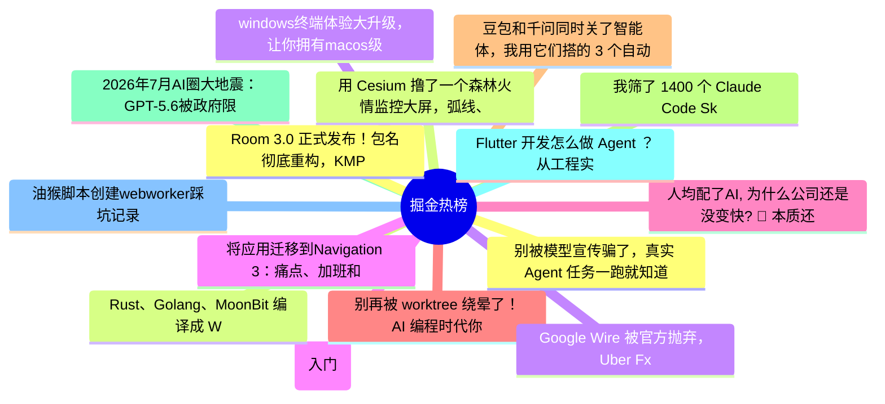

# 掘金热榜 Top 15 (2026-07-06)

## 思维导图

## 列表（15 条）

### 1. 别被模型宣传骗了，真实 Agent 任务一跑就知道
- **链接**: [https://juejin.cn/post/7658119907389554738](https://juejin.cn/post/7658119907389554738)
- **作者**: 轻口味
- **热度**: 3330 | **浏览**: 7266 | **点赞**: 6 | **评论**: 2

### 2. 用 Cesium 撸了一个森林火情监控大屏，弧线、粒子、发光效果都齐了
- **链接**: [https://juejin.cn/post/7657791057037131822](https://juejin.cn/post/7657791057037131822)
- **作者**: 尘世中一位迷途小书童
- **热度**: 828 | **浏览**: 1392 | **点赞**: 21 | **评论**: 2

### 3. windows终端体验大升级，让你拥有macos级别的美化
- **链接**: [https://juejin.cn/post/7657755366327664680](https://juejin.cn/post/7657755366327664680)
- **作者**: 非洲农业不发达
- **热度**: 513 | **浏览**: 1054 | **点赞**: 2 | **评论**: 3

### 4. Go语言第一章(入门)
- **链接**: [https://juejin.cn/post/7657567333606506505](https://juejin.cn/post/7657567333606506505)
- **作者**: 小满zs
- **热度**: 441 | **浏览**: 675 | **点赞**: 12 | **评论**: 4

### 5. 人均配了AI, 为什么公司还是没变快? 🤔 本质还是分布式系统问题
- **链接**: [https://juejin.cn/post/7657956930892136475](https://juejin.cn/post/7657956930892136475)
- **作者**: HiSt
- **热度**: 351 | **浏览**: 665 | **点赞**: 6 | **评论**: 0

### 6. 别再被 worktree 绕晕了！AI 编程时代你必须掌握的 Git 隔离神器
- **链接**: [https://juejin.cn/post/7657811451365982208](https://juejin.cn/post/7657811451365982208)
- **作者**: 阳光是sunny
- **热度**: 315 | **浏览**: 592 | **点赞**: 6 | **评论**: 0

### 7. 豆包和千问同时关了智能体，我用它们搭的 3 个自动化全废了——迁移方案整理
- **链接**: [https://juejin.cn/post/7658599462051086371](https://juejin.cn/post/7658599462051086371)
- **作者**: kyriewen
- **热度**: 315 | **浏览**: 498 | **点赞**: 7 | **评论**: 4

### 8. 我筛了 1400 个 Claude Code Skills，留下 5 个天天在用的
- **链接**: [https://juejin.cn/post/7657936630132883492](https://juejin.cn/post/7657936630132883492)
- **作者**: kyriewen
- **热度**: 288 | **浏览**: 454 | **点赞**: 10 | **评论**: 0

### 9. 2026年7月AI圈大地震：GPT-5.6被政府限制、Claude入驻Slack、Anthropic自研芯片
- **链接**: [https://juejin.cn/post/7658290915859087370](https://juejin.cn/post/7658290915859087370)
- **作者**: 米小虾
- **热度**: 279 | **浏览**: 610 | **点赞**: 1 | **评论**: 0

### 10. Flutter 开发怎么做 Agent ？从工程实战详细给你解读下
- **链接**: [https://juejin.cn/post/7658865284564926518](https://juejin.cn/post/7658865284564926518)
- **作者**: 恋猫de小郭
- **热度**: 270 | **浏览**: 288 | **点赞**: 13 | **评论**: 3

### 11. 油猴脚本创建webworker踩坑记录
- **链接**: [https://juejin.cn/post/7658132679137460239](https://juejin.cn/post/7658132679137460239)
- **作者**: 天平
- **热度**: 252 | **浏览**: 342 | **点赞**: 6 | **评论**: 6

### 12. Room 3.0 正式发布！包名彻底重构，KMP 成为核心主线
- **链接**: [https://juejin.cn/post/7657822489852149806](https://juejin.cn/post/7657822489852149806)
- **作者**: 黄林晴
- **热度**: 243 | **浏览**: 472 | **点赞**: 2 | **评论**: 2

### 13. Rust、Golang、MoonBit 编译成 WASM，体积和速度差距有多大？
- **链接**: [https://juejin.cn/post/7658310488636538926](https://juejin.cn/post/7658310488636538926)
- **作者**: 前端之虎陈随易
- **热度**: 243 | **浏览**: 396 | **点赞**: 5 | **评论**: 3

### 14. Google Wire 被官方抛弃，Uber Fx 启动就 panic，Go DI 还有救吗？
- **链接**: [https://juejin.cn/post/7658096117938651199](https://juejin.cn/post/7658096117938651199)
- **作者**: 程序员老鹰
- **热度**: 234 | **浏览**: 441 | **点赞**: 4 | **评论**: 0

### 15. 将应用迁移到Navigation 3：痛点、加班和紧急修复
- **链接**: [https://juejin.cn/post/7658107153195810831](https://juejin.cn/post/7658107153195810831)
- **作者**: 稀有猿诉
- **热度**: 216 | **浏览**: 314 | **点赞**: 9 | **评论**: 0
