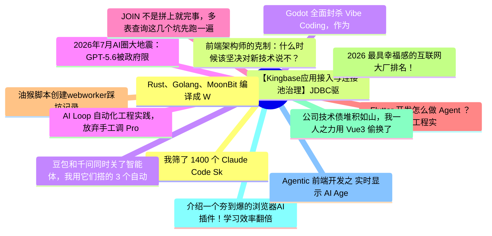

# 掘金热榜 Top 15 (2026-07-07)

## 思维导图

## 列表（15 条）

### 1. 我筛了 1400 个 Claude Code Skills，留下 5 个天天在用的
- **链接**: [https://juejin.cn/post/7657936630132883492](https://juejin.cn/post/7657936630132883492)
- **作者**: kyriewen
- **热度**: 819 | **浏览**: 1402 | **点赞**: 22 | **评论**: 0

### 2. 【Kingbase应用接入与连接池治理】JDBC驱动与连接串实战
- **链接**: [https://juejin.cn/post/7658588277832253481](https://juejin.cn/post/7658588277832253481)
- **作者**: 倔强的石头_
- **热度**: 810 | **浏览**: 1768 | **点赞**: 2 | **评论**: 0

### 3. 豆包和千问同时关了智能体，我用它们搭的 3 个自动化全废了——迁移方案整理
- **链接**: [https://juejin.cn/post/7658599462051086371](https://juejin.cn/post/7658599462051086371)
- **作者**: kyriewen
- **热度**: 639 | **浏览**: 1118 | **点赞**: 11 | **评论**: 5

### 4. 2026年7月AI圈大地震：GPT-5.6被政府限制、Claude入驻Slack、Anthropic自研芯片
- **链接**: [https://juejin.cn/post/7658290915859087370](https://juejin.cn/post/7658290915859087370)
- **作者**: 米小虾
- **热度**: 585 | **浏览**: 1298 | **点赞**: 1 | **评论**: 0

### 5. JOIN 不是拼上就完事，多表查询这几个坑先跑一遍
- **链接**: [https://juejin.cn/post/7658601500857597978](https://juejin.cn/post/7658601500857597978)
- **作者**: 一只牛博
- **热度**: 576 | **浏览**: 1270 | **点赞**: 1 | **评论**: 0

### 6. Flutter 开发怎么做 Agent ？从工程实战详细给你解读下
- **链接**: [https://juejin.cn/post/7658865284564926518](https://juejin.cn/post/7658865284564926518)
- **作者**: 恋猫de小郭
- **热度**: 477 | **浏览**: 650 | **点赞**: 18 | **评论**: 3

### 7. 油猴脚本创建webworker踩坑记录
- **链接**: [https://juejin.cn/post/7658132679137460239](https://juejin.cn/post/7658132679137460239)
- **作者**: 天平
- **热度**: 396 | **浏览**: 575 | **点赞**: 10 | **评论**: 6

### 8. 2026 最具幸福感的互联网大厂排名！
- **链接**: [https://juejin.cn/post/7658663867577581595](https://juejin.cn/post/7658663867577581595)
- **作者**: 狂师
- **热度**: 396 | **浏览**: 813 | **点赞**: 2 | **评论**: 3

### 9. 公司技术债堆积如山，我一人之力用 Vue3 偷换了整个前端架构
- **链接**: [https://juejin.cn/post/7658484986351648822](https://juejin.cn/post/7658484986351648822)
- **作者**: 奶油mm
- **热度**: 378 | **浏览**: 568 | **点赞**: 6 | **评论**: 8

### 10. 介绍一个夯到爆的浏览器AI插件！学习效率翻倍
- **链接**: [https://juejin.cn/post/7658710517372059688](https://juejin.cn/post/7658710517372059688)
- **作者**: 五阳
- **热度**: 351 | **浏览**: 558 | **点赞**: 7 | **评论**: 5

### 11. Agentic 前端开发之 实时显示 AI Agent 终端输出
- **链接**: [https://juejin.cn/post/7658274482063687689](https://juejin.cn/post/7658274482063687689)
- **作者**: anOnion
- **热度**: 306 | **浏览**: 511 | **点赞**: 9 | **评论**: 0

### 12. Rust、Golang、MoonBit 编译成 WASM，体积和速度差距有多大？
- **链接**: [https://juejin.cn/post/7658310488636538926](https://juejin.cn/post/7658310488636538926)
- **作者**: 前端之虎陈随易
- **热度**: 297 | **浏览**: 497 | **点赞**: 6 | **评论**: 3

### 13. 前端架构师的克制：什么时候该坚决对新技术说不？
- **链接**: [https://juejin.cn/post/7659215962541441024](https://juejin.cn/post/7659215962541441024)
- **作者**: ErpanOmer
- **热度**: 243 | **浏览**: 454 | **点赞**: 4 | **评论**: 1

### 14. Godot 全面封杀 Vibe Coding，作为每天用 AI 写代码的人，我反而觉得这是件好事
- **链接**: [https://juejin.cn/post/7659225944678432806](https://juejin.cn/post/7659225944678432806)
- **作者**: kyriewen
- **热度**: 234 | **浏览**: 516 | **点赞**: 1 | **评论**: 0

### 15. AI Loop 自动化工程实践，放弃手工调 Prompt，循环才是标准答案！
- **链接**: [https://juejin.cn/post/7658596342126788618](https://juejin.cn/post/7658596342126788618)
- **作者**: mONESY
- **热度**: 225 | **浏览**: 299 | **点赞**: 11 | **评论**: 0
