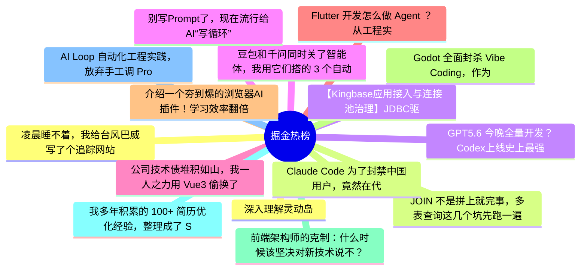

# 掘金热榜 Top 15 (2026-07-08)

## 思维导图

## 列表（15 条）

### 1. 凌晨睡不着，我给台风巴威写了个追踪网站
- **链接**: [https://juejin.cn/post/7659393583027896330](https://juejin.cn/post/7659393583027896330)
- **作者**: HiSt
- **热度**: 1359 | **浏览**: 1993 | **点赞**: 34 | **评论**: 19

### 2. JOIN 不是拼上就完事，多表查询这几个坑先跑一遍
- **链接**: [https://juejin.cn/post/7658601500857597978](https://juejin.cn/post/7658601500857597978)
- **作者**: 一只牛博
- **热度**: 1017 | **浏览**: 2221 | **点赞**: 3 | **评论**: 0

### 3. 【Kingbase应用接入与连接池治理】JDBC驱动与连接串实战
- **链接**: [https://juejin.cn/post/7658588277832253481](https://juejin.cn/post/7658588277832253481)
- **作者**: 倔强的石头_
- **热度**: 900 | **浏览**: 1964 | **点赞**: 2 | **评论**: 0

### 4. 豆包和千问同时关了智能体，我用它们搭的 3 个自动化全废了——迁移方案整理
- **链接**: [https://juejin.cn/post/7658599462051086371](https://juejin.cn/post/7658599462051086371)
- **作者**: kyriewen
- **热度**: 891 | **浏览**: 1651 | **点赞**: 11 | **评论**: 6

### 5. 公司技术债堆积如山，我一人之力用 Vue3 偷换了整个前端架构
- **链接**: [https://juejin.cn/post/7658484986351648822](https://juejin.cn/post/7658484986351648822)
- **作者**: 奶油mm
- **热度**: 702 | **浏览**: 1120 | **点赞**: 9 | **评论**: 14

### 6. Flutter 开发怎么做 Agent ？从工程实战详细给你解读下
- **链接**: [https://juejin.cn/post/7658865284564926518](https://juejin.cn/post/7658865284564926518)
- **作者**: 恋猫de小郭
- **热度**: 630 | **浏览**: 921 | **点赞**: 20 | **评论**: 4

### 7. 介绍一个夯到爆的浏览器AI插件！学习效率翻倍
- **链接**: [https://juejin.cn/post/7658710517372059688](https://juejin.cn/post/7658710517372059688)
- **作者**: 五阳
- **热度**: 576 | **浏览**: 946 | **点赞**: 9 | **评论**: 8

### 8. Godot 全面封杀 Vibe Coding，作为每天用 AI 写代码的人，我反而觉得这是件好事
- **链接**: [https://juejin.cn/post/7659225944678432806](https://juejin.cn/post/7659225944678432806)
- **作者**: kyriewen
- **热度**: 567 | **浏览**: 1029 | **点赞**: 8 | **评论**: 4

### 9. 前端架构师的克制：什么时候该坚决对新技术说不？
- **链接**: [https://juejin.cn/post/7659215962541441024](https://juejin.cn/post/7659215962541441024)
- **作者**: ErpanOmer
- **热度**: 531 | **浏览**: 855 | **点赞**: 9 | **评论**: 8

### 10. 我多年积累的 100+ 简历优化经验，整理成了 Skill
- **链接**: [https://juejin.cn/post/7659275867992850486](https://juejin.cn/post/7659275867992850486)
- **作者**: 双越AI_club
- **热度**: 378 | **浏览**: 666 | **点赞**: 9 | **评论**: 0

### 11. AI Loop 自动化工程实践，放弃手工调 Prompt，循环才是标准答案！
- **链接**: [https://juejin.cn/post/7658596342126788618](https://juejin.cn/post/7658596342126788618)
- **作者**: mONESY
- **热度**: 306 | **浏览**: 422 | **点赞**: 13 | **评论**: 0

### 12. 深入理解灵动岛
- **链接**: [https://juejin.cn/post/7659098906315948084](https://juejin.cn/post/7659098906315948084)
- **作者**: _瑞
- **热度**: 297 | **浏览**: 435 | **点赞**: 6 | **评论**: 6

### 13. Claude Code 为了封禁中国用户，竟然在代码里下毒
- **链接**: [https://juejin.cn/post/7659217248749912114](https://juejin.cn/post/7659217248749912114)
- **作者**: cxuanAI
- **热度**: 279 | **浏览**: 579 | **点赞**: 2 | **评论**: 1

### 14. GPT5.6 今晚全量开发？Codex上线史上最强Coding模型！
- **链接**: [https://juejin.cn/post/7659585088225624079](https://juejin.cn/post/7659585088225624079)
- **作者**: 卡卡罗特AI
- **热度**: 261 | **浏览**: 540 | **点赞**: 3 | **评论**: 0

### 15. 别写Prompt了，现在流行给AI“写循环”
- **链接**: [https://juejin.cn/post/7658709899374755875](https://juejin.cn/post/7658709899374755875)
- **作者**: 码事漫谈
- **热度**: 261 | **浏览**: 440 | **点赞**: 6 | **评论**: 1
