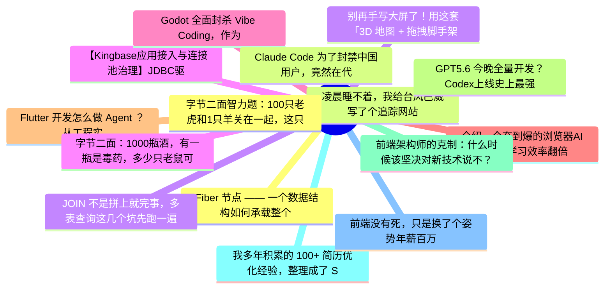

# 掘金热榜 Top 15 (2026-07-09)

## 思维导图

## 列表（15 条）

### 1. Fiber 节点 —— 一个数据结构如何承载整个 React 运行时
- **链接**: [https://juejin.cn/post/7659763781161730102](https://juejin.cn/post/7659763781161730102)
- **作者**: 老王以为
- **热度**: 5103 | **浏览**: 11225 | **点赞**: 5 | **评论**: 2

### 2. 凌晨睡不着，我给台风巴威写了个追踪网站
- **链接**: [https://juejin.cn/post/7659393583027896330](https://juejin.cn/post/7659393583027896330)
- **作者**: HiSt
- **热度**: 2610 | **浏览**: 4246 | **点赞**: 56 | **评论**: 23

### 3. JOIN 不是拼上就完事，多表查询这几个坑先跑一遍
- **链接**: [https://juejin.cn/post/7658601500857597978](https://juejin.cn/post/7658601500857597978)
- **作者**: 一只牛博
- **热度**: 1449 | **浏览**: 3148 | **点赞**: 4 | **评论**: 0

### 4. 【Kingbase应用接入与连接池治理】JDBC驱动与连接串实战
- **链接**: [https://juejin.cn/post/7658588277832253481](https://juejin.cn/post/7658588277832253481)
- **作者**: 倔强的石头_
- **热度**: 963 | **浏览**: 2105 | **点赞**: 2 | **评论**: 0

### 5. Godot 全面封杀 Vibe Coding，作为每天用 AI 写代码的人，我反而觉得这是件好事
- **链接**: [https://juejin.cn/post/7659225944678432806](https://juejin.cn/post/7659225944678432806)
- **作者**: kyriewen
- **热度**: 900 | **浏览**: 1706 | **点赞**: 9 | **评论**: 6

### 6. 介绍一个夯到爆的浏览器AI插件！学习效率翻倍
- **链接**: [https://juejin.cn/post/7658710517372059688](https://juejin.cn/post/7658710517372059688)
- **作者**: 五阳
- **热度**: 792 | **浏览**: 1399 | **点赞**: 11 | **评论**: 8

### 7. Flutter 开发怎么做 Agent ？从工程实战详细给你解读下
- **链接**: [https://juejin.cn/post/7658865284564926518](https://juejin.cn/post/7658865284564926518)
- **作者**: 恋猫de小郭
- **热度**: 765 | **浏览**: 1154 | **点赞**: 23 | **评论**: 5

### 8. GPT5.6 今晚全量开发？Codex上线史上最强Coding模型！
- **链接**: [https://juejin.cn/post/7659585088225624079](https://juejin.cn/post/7659585088225624079)
- **作者**: 卡卡罗特AI
- **热度**: 702 | **浏览**: 1517 | **点赞**: 2 | **评论**: 1

### 9. 前端架构师的克制：什么时候该坚决对新技术说不？
- **链接**: [https://juejin.cn/post/7659215962541441024](https://juejin.cn/post/7659215962541441024)
- **作者**: ErpanOmer
- **热度**: 684 | **浏览**: 1160 | **点赞**: 11 | **评论**: 8

### 10. 我多年积累的 100+ 简历优化经验，整理成了 Skill
- **链接**: [https://juejin.cn/post/7659275867992850486](https://juejin.cn/post/7659275867992850486)
- **作者**: 双越AI_club
- **热度**: 567 | **浏览**: 990 | **点赞**: 14 | **评论**: 0

### 11. 前端没有死，只是换了个姿势年薪百万
- **链接**: [https://juejin.cn/post/7657809077683257387](https://juejin.cn/post/7657809077683257387)
- **作者**: 涛涛ing
- **热度**: 540 | **浏览**: 794 | **点赞**: 10 | **评论**: 11

### 12. 字节二面智力题：100只老虎和1只羊关在一起，这只羊会不会被吃？
- **链接**: [https://juejin.cn/post/7659936053578465315](https://juejin.cn/post/7659936053578465315)
- **作者**: Fox爱分享
- **热度**: 513 | **浏览**: 909 | **点赞**: 11 | **评论**: 1

### 13. Claude Code 为了封禁中国用户，竟然在代码里下毒
- **链接**: [https://juejin.cn/post/7659217248749912114](https://juejin.cn/post/7659217248749912114)
- **作者**: cxuanAI
- **热度**: 387 | **浏览**: 794 | **点赞**: 3 | **评论**: 1

### 14. 别再手写大屏了！用这套「3D 地图 + 拖拽脚手架」示例源码，交付效率提升 80%
- **链接**: [https://juejin.cn/post/7658831018950918153](https://juejin.cn/post/7658831018950918153)
- **作者**: 柳杉
- **热度**: 369 | **浏览**: 740 | **点赞**: 4 | **评论**: 0

### 15. 字节二面：1000瓶酒，有一瓶是毒药，多少只老鼠可以查出来？
- **链接**: [https://juejin.cn/post/7659854493060923407](https://juejin.cn/post/7659854493060923407)
- **作者**: Fox爱分享
- **热度**: 369 | **浏览**: 594 | **点赞**: 6 | **评论**: 6
