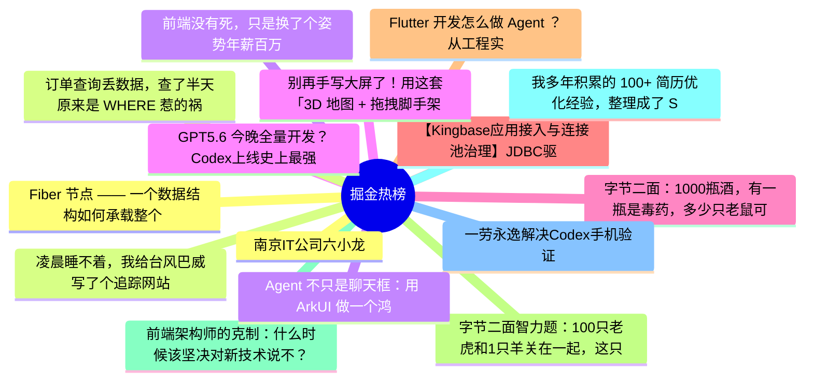

# 掘金热榜 Top 15 (2026-07-10)

## 思维导图

## 列表（15 条）

### 1. Fiber 节点 —— 一个数据结构如何承载整个 React 运行时
- **链接**: [https://juejin.cn/post/7659763781161730102](https://juejin.cn/post/7659763781161730102)
- **作者**: 老王以为
- **热度**: 5607 | **浏览**: 11957 | **点赞**: 16 | **评论**: 10

### 2. 凌晨睡不着，我给台风巴威写了个追踪网站
- **链接**: [https://juejin.cn/post/7659393583027896330](https://juejin.cn/post/7659393583027896330)
- **作者**: HiSt
- **热度**: 3744 | **浏览**: 6131 | **点赞**: 75 | **评论**: 35

### 3. 前端没有死，只是换了个姿势年薪百万
- **链接**: [https://juejin.cn/post/7657809077683257387](https://juejin.cn/post/7657809077683257387)
- **作者**: 涛涛ing
- **热度**: 1899 | **浏览**: 3173 | **点赞**: 35 | **评论**: 18

### 4. GPT5.6 今晚全量开发？Codex上线史上最强Coding模型！
- **链接**: [https://juejin.cn/post/7659585088225624079](https://juejin.cn/post/7659585088225624079)
- **作者**: 卡卡罗特AI
- **热度**: 1224 | **浏览**: 2522 | **点赞**: 6 | **评论**: 4

### 5. 字节二面：1000瓶酒，有一瓶是毒药，多少只老鼠可以查出来？
- **链接**: [https://juejin.cn/post/7659854493060923407](https://juejin.cn/post/7659854493060923407)
- **作者**: Fox爱分享
- **热度**: 1143 | **浏览**: 1897 | **点赞**: 19 | **评论**: 14

### 6. 【Kingbase应用接入与连接池治理】JDBC驱动与连接串实战
- **链接**: [https://juejin.cn/post/7658588277832253481](https://juejin.cn/post/7658588277832253481)
- **作者**: 倔强的石头_
- **热度**: 1035 | **浏览**: 2249 | **点赞**: 3 | **评论**: 0

### 7. Flutter 开发怎么做 Agent ？从工程实战详细给你解读下
- **链接**: [https://juejin.cn/post/7658865284564926518](https://juejin.cn/post/7658865284564926518)
- **作者**: 恋猫de小郭
- **热度**: 864 | **浏览**: 1361 | **点赞**: 23 | **评论**: 5

### 8. 字节二面智力题：100只老虎和1只羊关在一起，这只羊会不会被吃？
- **链接**: [https://juejin.cn/post/7659936053578465315](https://juejin.cn/post/7659936053578465315)
- **作者**: Fox爱分享
- **热度**: 837 | **浏览**: 1423 | **点赞**: 17 | **评论**: 5

### 9. 前端架构师的克制：什么时候该坚决对新技术说不？
- **链接**: [https://juejin.cn/post/7659215962541441024](https://juejin.cn/post/7659215962541441024)
- **作者**: ErpanOmer
- **热度**: 792 | **浏览**: 1383 | **点赞**: 11 | **评论**: 8

### 10. 我多年积累的 100+ 简历优化经验，整理成了 Skill
- **链接**: [https://juejin.cn/post/7659275867992850486](https://juejin.cn/post/7659275867992850486)
- **作者**: 双越AI_club
- **热度**: 693 | **浏览**: 1237 | **点赞**: 16 | **评论**: 0

### 11. 一劳永逸解决Codex手机验证
- **链接**: [https://juejin.cn/post/7659854493060136975](https://juejin.cn/post/7659854493060136975)
- **作者**: 金色的暴发户
- **热度**: 666 | **浏览**: 850 | **点赞**: 25 | **评论**: 7

### 12. 南京IT公司六小龙
- **链接**: [https://juejin.cn/post/7659978807450796075](https://juejin.cn/post/7659978807450796075)
- **作者**: CodeSheep
- **热度**: 657 | **浏览**: 1199 | **点赞**: 10 | **评论**: 4

### 13. 订单查询丢数据，查了半天原来是 WHERE 惹的祸
- **链接**: [https://juejin.cn/post/7659981643583782938](https://juejin.cn/post/7659981643583782938)
- **作者**: 一只牛博
- **热度**: 603 | **浏览**: 1318 | **点赞**: 2 | **评论**: 0

### 14. Agent 不只是聊天框：用 ArkUI 做一个鸿蒙任务工作台
- **链接**: [https://juejin.cn/post/7660062528128516146](https://juejin.cn/post/7660062528128516146)
- **作者**: 一只牛博
- **热度**: 585 | **浏览**: 1321 | **点赞**: 0 | **评论**: 0

### 15. 别再手写大屏了！用这套「3D 地图 + 拖拽脚手架」示例源码，交付效率提升 80%
- **链接**: [https://juejin.cn/post/7658831018950918153](https://juejin.cn/post/7658831018950918153)
- **作者**: 柳杉
- **热度**: 477 | **浏览**: 962 | **点赞**: 5 | **评论**: 0
