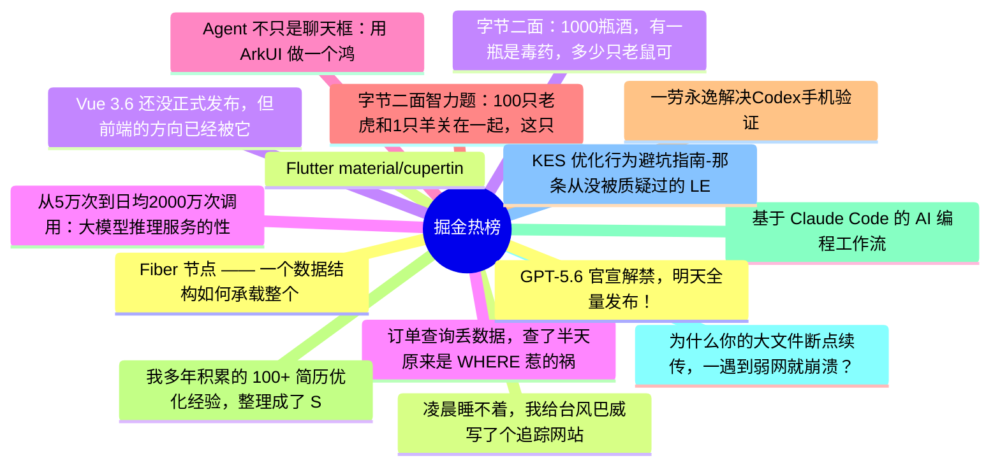

# 掘金热榜 Top 15 (2026-07-11)

## 思维导图

## 列表（15 条）

### 1. Fiber 节点 —— 一个数据结构如何承载整个 React 运行时
- **链接**: [https://juejin.cn/post/7659763781161730102](https://juejin.cn/post/7659763781161730102)
- **作者**: 老王以为
- **热度**: 5877 | **浏览**: 12516 | **点赞**: 18 | **评论**: 10

### 2. 凌晨睡不着，我给台风巴威写了个追踪网站
- **链接**: [https://juejin.cn/post/7659393583027896330](https://juejin.cn/post/7659393583027896330)
- **作者**: HiSt
- **热度**: 4653 | **浏览**: 7822 | **点赞**: 88 | **评论**: 38

### 3. 字节二面：1000瓶酒，有一瓶是毒药，多少只老鼠可以查出来？
- **链接**: [https://juejin.cn/post/7659854493060923407](https://juejin.cn/post/7659854493060923407)
- **作者**: Fox爱分享
- **热度**: 1719 | **浏览**: 3006 | **点赞**: 26 | **评论**: 16

### 4. 订单查询丢数据，查了半天原来是 WHERE 惹的祸
- **链接**: [https://juejin.cn/post/7659981643583782938](https://juejin.cn/post/7659981643583782938)
- **作者**: 一只牛博
- **热度**: 1278 | **浏览**: 2806 | **点赞**: 2 | **评论**: 0

### 5. Agent 不只是聊天框：用 ArkUI 做一个鸿蒙任务工作台
- **链接**: [https://juejin.cn/post/7660062528128516146](https://juejin.cn/post/7660062528128516146)
- **作者**: 一只牛博
- **热度**: 1242 | **浏览**: 2779 | **点赞**: 0 | **评论**: 0

### 6. 字节二面智力题：100只老虎和1只羊关在一起，这只羊会不会被吃？
- **链接**: [https://juejin.cn/post/7659936053578465315](https://juejin.cn/post/7659936053578465315)
- **作者**: Fox爱分享
- **热度**: 1071 | **浏览**: 1807 | **点赞**: 20 | **评论**: 9

### 7. 一劳永逸解决Codex手机验证
- **链接**: [https://juejin.cn/post/7659854493060136975](https://juejin.cn/post/7659854493060136975)
- **作者**: 金色的暴发户
- **热度**: 855 | **浏览**: 1185 | **点赞**: 28 | **评论**: 8

### 8. 我多年积累的 100+ 简历优化经验，整理成了 Skill
- **链接**: [https://juejin.cn/post/7659275867992850486](https://juejin.cn/post/7659275867992850486)
- **作者**: 双越AI_club
- **热度**: 810 | **浏览**: 1455 | **点赞**: 18 | **评论**: 0

### 9. 基于 Claude Code 的 AI 编程工作流探索
- **链接**: [https://juejin.cn/post/7659569188227285019](https://juejin.cn/post/7659569188227285019)
- **作者**: Lsx_
- **热度**: 513 | **浏览**: 934 | **点赞**: 8 | **评论**: 3

### 10. 为什么你的大文件断点续传，一遇到弱网就崩溃？
- **链接**: [https://juejin.cn/post/7659345269612855330](https://juejin.cn/post/7659345269612855330)
- **作者**: ErpanOmer
- **热度**: 504 | **浏览**: 657 | **点赞**: 16 | **评论**: 8

### 11. KES 优化行为避坑指南-那条从没被质疑过的 LEFT JOIN，在迁 KES 时终于露馅了
- **链接**: [https://juejin.cn/post/7660229701227675663](https://juejin.cn/post/7660229701227675663)
- **作者**: 倔强的石头_
- **热度**: 432 | **浏览**: 949 | **点赞**: 1 | **评论**: 0

### 12. GPT-5.6 官宣解禁，明天全量发布！
- **链接**: [https://juejin.cn/post/7659981643583684634](https://juejin.cn/post/7659981643583684634)
- **作者**: cxuanAI
- **热度**: 396 | **浏览**: 723 | **点赞**: 8 | **评论**: 0

### 13. Flutter material/cupertino 解耦最新进展，已经在做新样式了
- **链接**: [https://juejin.cn/post/7660030380293357609](https://juejin.cn/post/7660030380293357609)
- **作者**: 恋猫de小郭
- **热度**: 396 | **浏览**: 648 | **点赞**: 11 | **评论**: 1

### 14. Vue 3.6 还没正式发布，但前端的方向已经被它定下来了
- **链接**: [https://juejin.cn/post/7660079523232399402](https://juejin.cn/post/7660079523232399402)
- **作者**: 涛涛ing
- **热度**: 378 | **浏览**: 671 | **点赞**: 8 | **评论**: 1

### 15. 从5万次到日均2000万次调用：大模型推理服务的性能工程实践
- **链接**: [https://juejin.cn/post/7660697495832035362](https://juejin.cn/post/7660697495832035362)
- **作者**: 倔强的石头_
- **热度**: 360 | **浏览**: 744 | **点赞**: 2 | **评论**: 1
