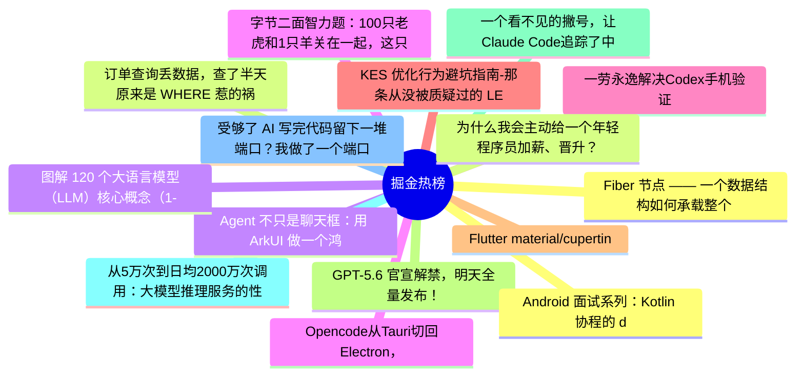

# 掘金热榜 Top 15 (2026-07-12)

## 思维导图

## 列表（15 条）

### 1. Fiber 节点 —— 一个数据结构如何承载整个 React 运行时
- **链接**: [https://juejin.cn/post/7659763781161730102](https://juejin.cn/post/7659763781161730102)
- **作者**: 老王以为
- **热度**: 6039 | **浏览**: 12821 | **点赞**: 20 | **评论**: 10

### 2. 订单查询丢数据，查了半天原来是 WHERE 惹的祸
- **链接**: [https://juejin.cn/post/7659981643583782938](https://juejin.cn/post/7659981643583782938)
- **作者**: 一只牛博
- **热度**: 1908 | **浏览**: 4190 | **点赞**: 3 | **评论**: 0

### 3. Agent 不只是聊天框：用 ArkUI 做一个鸿蒙任务工作台
- **链接**: [https://juejin.cn/post/7660062528128516146](https://juejin.cn/post/7660062528128516146)
- **作者**: 一只牛博
- **热度**: 1863 | **浏览**: 4166 | **点赞**: 0 | **评论**: 0

### 4. 字节二面智力题：100只老虎和1只羊关在一起，这只羊会不会被吃？
- **链接**: [https://juejin.cn/post/7659936053578465315](https://juejin.cn/post/7659936053578465315)
- **作者**: Fox爱分享
- **热度**: 1152 | **浏览**: 1975 | **点赞**: 20 | **评论**: 10

### 5. 一劳永逸解决Codex手机验证
- **链接**: [https://juejin.cn/post/7659854493060136975](https://juejin.cn/post/7659854493060136975)
- **作者**: 金色的暴发户
- **热度**: 963 | **浏览**: 1414 | **点赞**: 29 | **评论**: 8

### 6. KES 优化行为避坑指南-那条从没被质疑过的 LEFT JOIN，在迁 KES 时终于露馅了
- **链接**: [https://juejin.cn/post/7660229701227675663](https://juejin.cn/post/7660229701227675663)
- **作者**: 倔强的石头_
- **热度**: 459 | **浏览**: 1006 | **点赞**: 1 | **评论**: 0

### 7. Flutter material/cupertino 解耦最新进展，已经在做新样式了
- **链接**: [https://juejin.cn/post/7660030380293357609](https://juejin.cn/post/7660030380293357609)
- **作者**: 恋猫de小郭
- **热度**: 450 | **浏览**: 756 | **点赞**: 12 | **评论**: 1

### 8. GPT-5.6 官宣解禁，明天全量发布！
- **链接**: [https://juejin.cn/post/7659981643583684634](https://juejin.cn/post/7659981643583684634)
- **作者**: cxuanAI
- **热度**: 432 | **浏览**: 816 | **点赞**: 8 | **评论**: 0

### 9. 一个看不见的撇号，让Claude Code追踪了中国开发者三个月
- **链接**: [https://juejin.cn/post/7659618806900588582](https://juejin.cn/post/7659618806900588582)
- **作者**: kyriewen
- **热度**: 432 | **浏览**: 864 | **点赞**: 5 | **评论**: 0

### 10. 从5万次到日均2000万次调用：大模型推理服务的性能工程实践
- **链接**: [https://juejin.cn/post/7660697495832035362](https://juejin.cn/post/7660697495832035362)
- **作者**: 倔强的石头_
- **热度**: 405 | **浏览**: 843 | **点赞**: 2 | **评论**: 1

### 11. 受够了 AI 写完代码留下一堆端口？我做了一个端口管理App！
- **链接**: [https://juejin.cn/post/7660229701248303139](https://juejin.cn/post/7660229701248303139)
- **作者**: 青椒肉丝_
- **热度**: 378 | **浏览**: 403 | **点赞**: 10 | **评论**: 12

### 12. Android 面试系列：Kotlin 协程的 delay 到底发生在哪个线程？
- **链接**: [https://juejin.cn/post/7659252393879896073](https://juejin.cn/post/7659252393879896073)
- **作者**: 潜龙勿用之化骨龙
- **热度**: 360 | **浏览**: 607 | **点赞**: 10 | **评论**: 0

### 13. 为什么我会主动给一个年轻程序员加薪、晋升？
- **链接**: [https://juejin.cn/post/7660529058778513460](https://juejin.cn/post/7660529058778513460)
- **作者**: SamDeepThinking
- **热度**: 342 | **浏览**: 543 | **点赞**: 8 | **评论**: 3

### 14. 图解 120 个大语言模型（LLM）核心概念（1-30）
- **链接**: [https://juejin.cn/post/7660708287620808739](https://juejin.cn/post/7660708287620808739)
- **作者**: 周末程序猿
- **热度**: 333 | **浏览**: 630 | **点赞**: 6 | **评论**: 0

### 15. Opencode从Tauri切回Electron，桌面端技术选型别被体积陷阱带偏了
- **链接**: [https://juejin.cn/post/7660513725813014578](https://juejin.cn/post/7660513725813014578)
- **作者**: 程序员老刘
- **热度**: 315 | **浏览**: 565 | **点赞**: 7 | **评论**: 0
