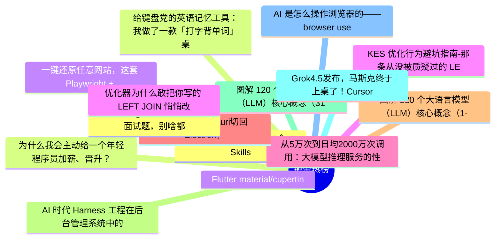

# 掘金热榜 Top 15 (2026-07-13)

## 思维导图

## 列表（15 条）

### 1. 2026编程圈很火的10个Skills
- **链接**: [https://juejin.cn/post/7660712622825144374](https://juejin.cn/post/7660712622825144374)
- **作者**: 苏三说技术
- **热度**: 765 | **浏览**: 1353 | **点赞**: 18 | **评论**: 1

### 2. 为什么我会主动给一个年轻程序员加薪、晋升？
- **链接**: [https://juejin.cn/post/7660529058778513460](https://juejin.cn/post/7660529058778513460)
- **作者**: SamDeepThinking
- **热度**: 621 | **浏览**: 1069 | **点赞**: 12 | **评论**: 4

### 3. Flutter material/cupertino 解耦最新进展，已经在做新样式了
- **链接**: [https://juejin.cn/post/7660030380293357609](https://juejin.cn/post/7660030380293357609)
- **作者**: 恋猫de小郭
- **热度**: 576 | **浏览**: 1012 | **点赞**: 13 | **评论**: 1

### 4. KES 优化行为避坑指南-那条从没被质疑过的 LEFT JOIN，在迁 KES 时终于露馅了
- **链接**: [https://juejin.cn/post/7660229701227675663](https://juejin.cn/post/7660229701227675663)
- **作者**: 倔强的石头_
- **热度**: 531 | **浏览**: 1142 | **点赞**: 2 | **评论**: 0

### 5. 从5万次到日均2000万次调用：大模型推理服务的性能工程实践
- **链接**: [https://juejin.cn/post/7660697495832035362](https://juejin.cn/post/7660697495832035362)
- **作者**: 倔强的石头_
- **热度**: 531 | **浏览**: 1086 | **点赞**: 4 | **评论**: 1

### 6. Opencode从Tauri切回Electron，桌面端技术选型别被体积陷阱带偏了
- **链接**: [https://juejin.cn/post/7660513725813014578](https://juejin.cn/post/7660513725813014578)
- **作者**: 程序员老刘
- **热度**: 531 | **浏览**: 964 | **点赞**: 10 | **评论**: 1

### 7. 图解 120 个大语言模型（LLM）核心概念（1-30）
- **链接**: [https://juejin.cn/post/7660708287620808739](https://juejin.cn/post/7660708287620808739)
- **作者**: 周末程序猿
- **热度**: 495 | **浏览**: 919 | **点赞**: 10 | **评论**: 0

### 8. AI 时代 Harness 工程在后台管理系统中的实践 🌈
- **链接**: [https://juejin.cn/post/7660780385584316454](https://juejin.cn/post/7660780385584316454)
- **作者**: pany
- **热度**: 315 | **浏览**: 536 | **点赞**: 9 | **评论**: 0

### 9. 图解 120 个大语言模型（LLM）核心概念（31-60）
- **链接**: [https://juejin.cn/post/7660697431320690723](https://juejin.cn/post/7660697431320690723)
- **作者**: 周末程序猿
- **热度**: 315 | **浏览**: 594 | **点赞**: 6 | **评论**: 0

### 10. Grok4.5发布，马斯克终于上桌了！Cursor功不可没～
- **链接**: [https://juejin.cn/post/7660359043139731496](https://juejin.cn/post/7660359043139731496)
- **作者**: 卡卡罗特AI
- **热度**: 288 | **浏览**: 561 | **点赞**: 3 | **评论**: 2

### 11. AI 是怎么操作浏览器的——browser use 实现原理
- **链接**: [https://juejin.cn/post/7660466008562892835](https://juejin.cn/post/7660466008562892835)
- **作者**: 谭sir
- **热度**: 225 | **浏览**: 412 | **点赞**: 5 | **评论**: 0

### 12. 22道AI Agent 工程师必会的面试题，别啥都不会就出去找工作
- **链接**: [https://juejin.cn/post/7660415930171490356](https://juejin.cn/post/7660415930171490356)
- **作者**: Coffeeee
- **热度**: 198 | **浏览**: 319 | **点赞**: 3 | **评论**: 4

### 13. 给键盘党的英语记忆工具：我做了一款「打字背单词」桌面应用
- **链接**: [https://juejin.cn/post/7660395581106159642](https://juejin.cn/post/7660395581106159642)
- **作者**: 碎_浪
- **热度**: 198 | **浏览**: 321 | **点赞**: 6 | **评论**: 2

### 14. 一键还原任意网站，这套 Playwright + 多 Agent 工程流太猛了 
- **链接**: [https://juejin.cn/post/7661439504077176847](https://juejin.cn/post/7661439504077176847)
- **作者**: 我不是外星人
- **热度**: 198 | **浏览**: 272 | **点赞**: 7 | **评论**: 2

### 15. 优化器为什么敢把你写的 LEFT JOIN 悄悄改掉？-国产化金仓 KES 优化器设计思路拆解
- **链接**: [https://juejin.cn/post/7661123972889329670](https://juejin.cn/post/7661123972889329670)
- **作者**: 倔强的石头_
- **热度**: 180 | **浏览**: 376 | **点赞**: 2 | **评论**: 0
