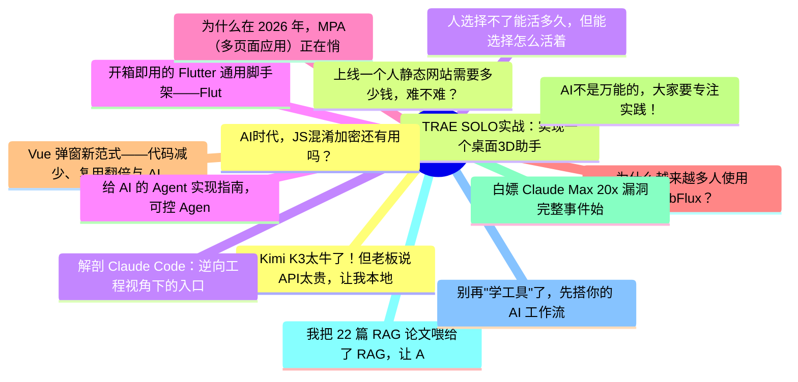

# 掘金热榜 Top 15 (2026-07-29)

## 思维导图

## 列表（15 条）

### 1. Kimi K3太牛了！但老板说API太贵，让我本地化部署，我算完成本，他涨红脸沉默不语了！其实成本不高，三千万足矣。
- **链接**: [https://juejin.cn/post/7666482995197722630](https://juejin.cn/post/7666482995197722630)
- **作者**: 李剑一
- **热度**: 2097 | **浏览**: 3911 | **点赞**: 19 | **评论**: 19

### 2. TRAE SOLO实战：实现一个桌面3D助手
- **链接**: [https://juejin.cn/post/7665981990437797914](https://juejin.cn/post/7665981990437797914)
- **作者**: 石小石Orz
- **热度**: 1287 | **浏览**: 2457 | **点赞**: 18 | **评论**: 3

### 3. 解剖 Claude Code：逆向工程视角下的入口架构分析
- **链接**: [https://juejin.cn/post/7667096004731846682](https://juejin.cn/post/7667096004731846682)
- **作者**: 老王以为
- **热度**: 810 | **浏览**: 1737 | **点赞**: 4 | **评论**: 0

### 4. 开箱即用的 Flutter 通用脚手架——FlutterKit
- **链接**: [https://juejin.cn/post/7666446436604739611](https://juejin.cn/post/7666446436604739611)
- **作者**: JokerX
- **热度**: 621 | **浏览**: 770 | **点赞**: 21 | **评论**: 10

### 5. 为什么在 2026 年，MPA（多页面应用）正在悄悄复辟？
- **链接**: [https://juejin.cn/post/7667127162155581449](https://juejin.cn/post/7667127162155581449)
- **作者**: ErpanOmer
- **热度**: 495 | **浏览**: 806 | **点赞**: 10 | **评论**: 5

### 6. 为什么越来越多人使用WebFlux？
- **链接**: [https://juejin.cn/post/7665981990437814298](https://juejin.cn/post/7665981990437814298)
- **作者**: 苏三说技术
- **热度**: 477 | **浏览**: 932 | **点赞**: 5 | **评论**: 2

### 7. Vue 弹窗新范式——代码减少、复用翻倍与 AI 时代的前端基建
- **链接**: [https://juejin.cn/post/7666771393113767982](https://juejin.cn/post/7666771393113767982)
- **作者**: 阿懂在掘金
- **热度**: 477 | **浏览**: 511 | **点赞**: 2 | **评论**: 26

### 8. AI不是万能的，大家要专注实践！
- **链接**: [https://juejin.cn/post/7666700111079292943](https://juejin.cn/post/7666700111079292943)
- **作者**: 程序员飞鱼
- **热度**: 423 | **浏览**: 527 | **点赞**: 21 | **评论**: 0

### 9. 白嫖 Claude Max 20x 漏洞完整事件始末
- **链接**: [https://juejin.cn/post/7666793612337152041](https://juejin.cn/post/7666793612337152041)
- **作者**: cxuanAI
- **热度**: 396 | **浏览**: 683 | **点赞**: 8 | **评论**: 2

### 10. 我把 22 篇 RAG 论文喂给了 RAG，让 AI 自己给我讲明白什么是 RAG
- **链接**: [https://juejin.cn/post/7666646110229020712](https://juejin.cn/post/7666646110229020712)
- **作者**: 倔强的石头_
- **热度**: 369 | **浏览**: 695 | **点赞**: 7 | **评论**: 0

### 11. 别再"学工具"了，先搭你的 AI 工作流
- **链接**: [https://juejin.cn/post/7666014608419323955](https://juejin.cn/post/7666014608419323955)
- **作者**: 鱼樱前端
- **热度**: 342 | **浏览**: 636 | **点赞**: 5 | **评论**: 2

### 12. AI时代，JS混淆加密还有用吗？
- **链接**: [https://juejin.cn/post/7666842496224477184](https://juejin.cn/post/7666842496224477184)
- **作者**: w2sfot
- **热度**: 306 | **浏览**: 526 | **点赞**: 5 | **评论**: 3

### 13. 上线一个人静态网站需要多少钱，难不难？
- **链接**: [https://juejin.cn/post/7666490925375815718](https://juejin.cn/post/7666490925375815718)
- **作者**: 五阳
- **热度**: 297 | **浏览**: 476 | **点赞**: 5 | **评论**: 5

### 14. 人选择不了能活多久，但能选择怎么活着
- **链接**: [https://juejin.cn/post/7667140974343880714](https://juejin.cn/post/7667140974343880714)
- **作者**: 勇宝趣学前端
- **热度**: 270 | **浏览**: 319 | **点赞**: 6 | **评论**: 9

### 15. 给 AI 的 Agent 实现指南，可控 Agent 的关键
- **链接**: [https://juejin.cn/post/7667103725047431174](https://juejin.cn/post/7667103725047431174)
- **作者**: 恋猫de小郭
- **热度**: 270 | **浏览**: 426 | **点赞**: 9 | **评论**: 0
