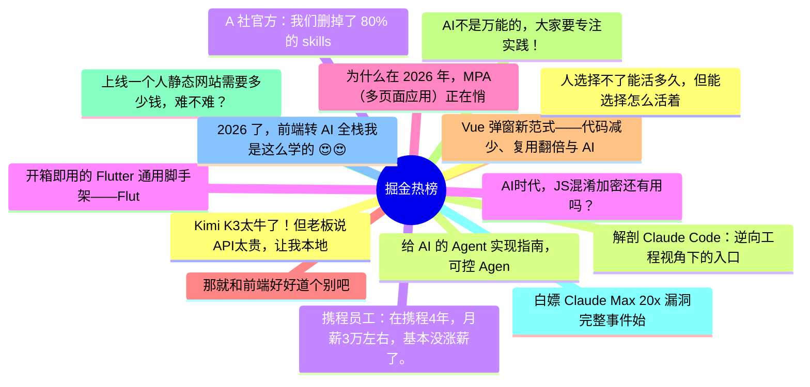

# 掘金热榜 Top 15 (2026-07-30)

## 思维导图

## 列表（15 条）

### 1. Kimi K3太牛了！但老板说API太贵，让我本地化部署，我算完成本，他涨红脸沉默不语了！其实成本不高，三千万足矣。
- **链接**: [https://juejin.cn/post/7666482995197722630](https://juejin.cn/post/7666482995197722630)
- **作者**: 李剑一
- **热度**: 3267 | **浏览**: 6185 | **点赞**: 30 | **评论**: 25

### 2. 解剖 Claude Code：逆向工程视角下的入口架构分析
- **链接**: [https://juejin.cn/post/7667096004731846682](https://juejin.cn/post/7667096004731846682)
- **作者**: 老王以为
- **热度**: 1827 | **浏览**: 3930 | **点赞**: 7 | **评论**: 0

### 3. 携程员工：在携程4年，月薪3万左右，基本没涨薪了。不过挺满足的，毕竟稳定，福利也不错（附Agent面试题）
- **链接**: [https://juejin.cn/post/7667495083470471177](https://juejin.cn/post/7667495083470471177)
- **作者**: 沉默王二
- **热度**: 1098 | **浏览**: 2003 | **点赞**: 19 | **评论**: 4

### 4. 开箱即用的 Flutter 通用脚手架——FlutterKit
- **链接**: [https://juejin.cn/post/7666446436604739611](https://juejin.cn/post/7666446436604739611)
- **作者**: JokerX
- **热度**: 891 | **浏览**: 1116 | **点赞**: 32 | **评论**: 12

### 5. 为什么在 2026 年，MPA（多页面应用）正在悄悄复辟？
- **链接**: [https://juejin.cn/post/7667127162155581449](https://juejin.cn/post/7667127162155581449)
- **作者**: ErpanOmer
- **热度**: 801 | **浏览**: 1447 | **点赞**: 12 | **评论**: 5

### 6. 那就和前端好好道个别吧
- **链接**: [https://juejin.cn/post/7667757814613934143](https://juejin.cn/post/7667757814613934143)
- **作者**: 吃饺子不吃馅
- **热度**: 729 | **浏览**: 1254 | **点赞**: 9 | **评论**: 10

### 7. Vue 弹窗新范式——代码减少、复用翻倍与 AI 时代的前端基建
- **链接**: [https://juejin.cn/post/7666771393113767982](https://juejin.cn/post/7666771393113767982)
- **作者**: 阿懂在掘金
- **热度**: 702 | **浏览**: 799 | **点赞**: 9 | **评论**: 30

### 8. AI不是万能的，大家要专注实践！
- **链接**: [https://juejin.cn/post/7666700111079292943](https://juejin.cn/post/7666700111079292943)
- **作者**: 程序员飞鱼
- **热度**: 558 | **浏览**: 781 | **点赞**: 22 | **评论**: 1

### 9. 上线一个人静态网站需要多少钱，难不难？
- **链接**: [https://juejin.cn/post/7666490925375815718](https://juejin.cn/post/7666490925375815718)
- **作者**: 五阳
- **热度**: 495 | **浏览**: 809 | **点赞**: 6 | **评论**: 9

### 10. 白嫖 Claude Max 20x 漏洞完整事件始末
- **链接**: [https://juejin.cn/post/7666793612337152041](https://juejin.cn/post/7666793612337152041)
- **作者**: cxuanAI
- **热度**: 495 | **浏览**: 881 | **点赞**: 9 | **评论**: 2

### 11. 2026 了，前端转 AI 全栈我是这么学的 😍😍😍
- **链接**: [https://juejin.cn/post/7667503991685857290](https://juejin.cn/post/7667503991685857290)
- **作者**: Moment
- **热度**: 423 | **浏览**: 523 | **点赞**: 20 | **评论**: 2

### 12. 人选择不了能活多久，但能选择怎么活着
- **链接**: [https://juejin.cn/post/7667140974343880714](https://juejin.cn/post/7667140974343880714)
- **作者**: 勇宝趣学前端
- **热度**: 405 | **浏览**: 510 | **点赞**: 11 | **评论**: 9

### 13. 给 AI 的 Agent 实现指南，可控 Agent 的关键
- **链接**: [https://juejin.cn/post/7667103725047431174](https://juejin.cn/post/7667103725047431174)
- **作者**: 恋猫de小郭
- **热度**: 396 | **浏览**: 628 | **点赞**: 12 | **评论**: 1

### 14. A 社官方：我们删掉了 80% 的 skills
- **链接**: [https://juejin.cn/post/7667756207138848819](https://juejin.cn/post/7667756207138848819)
- **作者**: cxuanAI
- **热度**: 378 | **浏览**: 703 | **点赞**: 8 | **评论**: 0

### 15. AI时代，JS混淆加密还有用吗？
- **链接**: [https://juejin.cn/post/7666842496224477184](https://juejin.cn/post/7666842496224477184)
- **作者**: w2sfot
- **热度**: 378 | **浏览**: 684 | **点赞**: 5 | **评论**: 3
