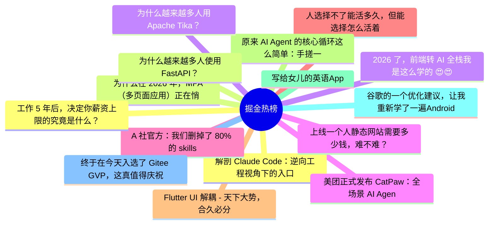

# 掘金热榜 Top 15 (2026-07-31)

## 思维导图

## 列表（15 条）

### 1. 解剖 Claude Code：逆向工程视角下的入口架构分析
- **链接**: [https://juejin.cn/post/7667096004731846682](https://juejin.cn/post/7667096004731846682)
- **作者**: 老王以为
- **热度**: 2133 | **浏览**: 4482 | **点赞**: 14 | **评论**: 0

### 2. 为什么在 2026 年，MPA（多页面应用）正在悄悄复辟？
- **链接**: [https://juejin.cn/post/7667127162155581449](https://juejin.cn/post/7667127162155581449)
- **作者**: ErpanOmer
- **热度**: 1089 | **浏览**: 1935 | **点赞**: 17 | **评论**: 8

### 3. 2026 了，前端转 AI 全栈我是这么学的 😍😍😍
- **链接**: [https://juejin.cn/post/7667503991685857290](https://juejin.cn/post/7667503991685857290)
- **作者**: Moment
- **热度**: 1071 | **浏览**: 1443 | **点赞**: 44 | **评论**: 4

### 4. 上线一个人静态网站需要多少钱，难不难？
- **链接**: [https://juejin.cn/post/7666490925375815718](https://juejin.cn/post/7666490925375815718)
- **作者**: 五阳
- **热度**: 792 | **浏览**: 1319 | **点赞**: 10 | **评论**: 13

### 5. A 社官方：我们删掉了 80% 的 skills
- **链接**: [https://juejin.cn/post/7667756207138848819](https://juejin.cn/post/7667756207138848819)
- **作者**: cxuanAI
- **热度**: 675 | **浏览**: 1202 | **点赞**: 13 | **评论**: 2

### 6. 人选择不了能活多久，但能选择怎么活着
- **链接**: [https://juejin.cn/post/7667140974343880714](https://juejin.cn/post/7667140974343880714)
- **作者**: 勇宝趣学前端
- **热度**: 540 | **浏览**: 685 | **点赞**: 13 | **评论**: 13

### 7. Flutter UI 解耦 - 天下大势，合久必分， 分久必合
- **链接**: [https://juejin.cn/post/7667440437864300544](https://juejin.cn/post/7667440437864300544)
- **作者**: 张风捷特烈
- **热度**: 486 | **浏览**: 822 | **点赞**: 10 | **评论**: 4

### 8. 原来 AI Agent 的核心循环这么简单：手搓一个 Agent Loop
- **链接**: [https://juejin.cn/post/7666403249923473459](https://juejin.cn/post/7666403249923473459)
- **作者**: 不一样的少年_
- **热度**: 477 | **浏览**: 789 | **点赞**: 12 | **评论**: 2

### 9. 写给女儿的英语App
- **链接**: [https://juejin.cn/post/7667204879517941811](https://juejin.cn/post/7667204879517941811)
- **作者**: jason_yang
- **热度**: 369 | **浏览**: 553 | **点赞**: 8 | **评论**: 6

### 10. 谷歌的一个优化建议，让我重新学了一遍Android里面如何正确处理位图
- **链接**: [https://juejin.cn/post/7667097178154319912](https://juejin.cn/post/7667097178154319912)
- **作者**: Coffeeee
- **热度**: 351 | **浏览**: 577 | **点赞**: 11 | **评论**: 0

### 11. 终于在今天入选了 Gitee GVP，这真值得庆祝~
- **链接**: [https://juejin.cn/post/7667399814504202275](https://juejin.cn/post/7667399814504202275)
- **作者**: 前端梦工厂
- **热度**: 342 | **浏览**: 518 | **点赞**: 6 | **评论**: 7

### 12. 工作 5 年后，决定你薪资上限的究竟是什么？
- **链接**: [https://juejin.cn/post/7667750500683120675](https://juejin.cn/post/7667750500683120675)
- **作者**: ErpanOmer
- **热度**: 306 | **浏览**: 535 | **点赞**: 7 | **评论**: 1

### 13. 为什么越来越多人使用FastAPI？
- **链接**: [https://juejin.cn/post/7667412478401822730](https://juejin.cn/post/7667412478401822730)
- **作者**: 苏三说技术
- **热度**: 306 | **浏览**: 591 | **点赞**: 5 | **评论**: 0

### 14. 为什么越来越多人用Apache Tika？
- **链接**: [https://juejin.cn/post/7667853684410302490](https://juejin.cn/post/7667853684410302490)
- **作者**: 苏三说技术
- **热度**: 288 | **浏览**: 404 | **点赞**: 9 | **评论**: 3

### 15. 美团正式发布 CatPaw：全场景 AI Agent，从个人提效到企业智能化
- **链接**: [https://juejin.cn/post/7667140623372697610](https://juejin.cn/post/7667140623372697610)
- **作者**: 美团技术团队
- **热度**: 288 | **浏览**: 497 | **点赞**: 4 | **评论**: 4
