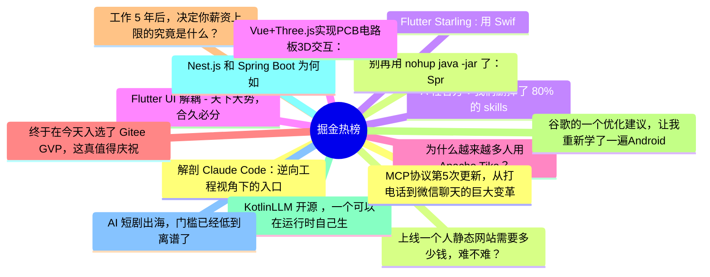

# 掘金热榜 Top 15 (2026-08-01)

## 思维导图

## 列表（15 条）

### 1. 解剖 Claude Code：逆向工程视角下的入口架构分析
- **链接**: [https://juejin.cn/post/7667096004731846682](https://juejin.cn/post/7667096004731846682)
- **作者**: 老王以为
- **热度**: 2403 | **浏览**: 5016 | **点赞**: 17 | **评论**: 0

### 2. 上线一个人静态网站需要多少钱，难不难？
- **链接**: [https://juejin.cn/post/7666490925375815718](https://juejin.cn/post/7666490925375815718)
- **作者**: 五阳
- **热度**: 1107 | **浏览**: 1810 | **点赞**: 15 | **评论**: 18

### 3. A 社官方：我们删掉了 80% 的 skills
- **链接**: [https://juejin.cn/post/7667756207138848819](https://juejin.cn/post/7667756207138848819)
- **作者**: cxuanAI
- **热度**: 972 | **浏览**: 1784 | **点赞**: 17 | **评论**: 2

### 4. Flutter UI 解耦 - 天下大势，合久必分， 分久必合
- **链接**: [https://juejin.cn/post/7667440437864300544](https://juejin.cn/post/7667440437864300544)
- **作者**: 张风捷特烈
- **热度**: 648 | **浏览**: 1041 | **点赞**: 15 | **评论**: 5

### 5. 为什么越来越多人用Apache Tika？
- **链接**: [https://juejin.cn/post/7667853684410302490](https://juejin.cn/post/7667853684410302490)
- **作者**: 苏三说技术
- **热度**: 504 | **浏览**: 777 | **点赞**: 15 | **评论**: 3

### 6. 终于在今天入选了 Gitee GVP，这真值得庆祝~
- **链接**: [https://juejin.cn/post/7667399814504202275](https://juejin.cn/post/7667399814504202275)
- **作者**: 前端梦工厂
- **热度**: 495 | **浏览**: 725 | **点赞**: 12 | **评论**: 7

### 7. 工作 5 年后，决定你薪资上限的究竟是什么？
- **链接**: [https://juejin.cn/post/7667750500683120675](https://juejin.cn/post/7667750500683120675)
- **作者**: ErpanOmer
- **热度**: 450 | **浏览**: 849 | **点赞**: 7 | **评论**: 1

### 8. 谷歌的一个优化建议，让我重新学了一遍Android里面如何正确处理位图
- **链接**: [https://juejin.cn/post/7667097178154319912](https://juejin.cn/post/7667097178154319912)
- **作者**: Coffeeee
- **热度**: 414 | **浏览**: 693 | **点赞**: 12 | **评论**: 0

### 9. KotlinLLM 开源 ，一个可以在运行时自己生成永久 Kotlin 代码的 Agent 库
- **链接**: [https://juejin.cn/post/7667863898348126271](https://juejin.cn/post/7667863898348126271)
- **作者**: 恋猫de小郭
- **热度**: 378 | **浏览**: 620 | **点赞**: 11 | **评论**: 1

### 10. Nest.js 和 Spring Boot 为何如此像？写给前端转 Java 的同学
- **链接**: [https://juejin.cn/post/7667863898348093503](https://juejin.cn/post/7667863898348093503)
- **作者**: 双越AI_club
- **热度**: 369 | **浏览**: 569 | **点赞**: 13 | **评论**: 0

### 11. AI 短剧出海，门槛已经低到离谱了
- **链接**: [https://juejin.cn/post/7667552613815959598](https://juejin.cn/post/7667552613815959598)
- **作者**: 苍何
- **热度**: 369 | **浏览**: 799 | **点赞**: 2 | **评论**: 0

### 12. MCP协议第5次更新，从打电话到微信聊天的巨大变革
- **链接**: [https://juejin.cn/post/7668204673984135178](https://juejin.cn/post/7668204673984135178)
- **作者**: 前端之虎陈随易
- **热度**: 351 | **浏览**: 662 | **点赞**: 6 | **评论**: 0

### 13. 别再用 nohup java -jar 了：Spring Boot 生产环境该怎么守护？
- **链接**: [https://juejin.cn/post/7667762010876936192](https://juejin.cn/post/7667762010876936192)
- **作者**: 神奇小汤圆
- **热度**: 342 | **浏览**: 537 | **点赞**: 11 | **评论**: 1

### 14. Flutter Starling : 用 Swift和 Flutter 写了一个 Linux 桌面系统，震惊我一整年
- **链接**: [https://juejin.cn/post/7668191994554073142](https://juejin.cn/post/7668191994554073142)
- **作者**: 恋猫de小郭
- **热度**: 342 | **浏览**: 461 | **点赞**: 13 | **评论**: 2

### 15. Vue+Three.js实现PCB电路板3D交互：元器件点击高亮、部件显隐、模型自动旋转
- **链接**: [https://juejin.cn/post/7667105307927494708](https://juejin.cn/post/7667105307927494708)
- **作者**: Tony费
- **热度**: 315 | **浏览**: 518 | **点赞**: 8 | **评论**: 2
